# MYDEVSOP

> 完整軟體開發 SOP v2.4：從構想到上線，全程 AI 驅動、自動 Review、雙層輸出。

## 理念

MYDEVSOP 把整個開發 SOP 串成閉環——從最初的產品構想（BRD）到程式碼上線、PR 建立。
每個 Review 都是 Loop：Claude subagent 找問題 → Claude 修文件/程式碼 → 重複直到 0 findings。
每一步同時輸出技術摘要與 **[白話說明]**，讓非技術人員也能追蹤進度。

---

## 完整 SOP 流程圖與說明

### 全流程鳥瞰

```mermaid
flowchart TD
    A["💡 構想"] -->|"/devsop-idea"| B[/"BRD Review Loop"/]
    B --> BRD[("📄 docs/BRD.md\n📝 docs/IDEA.md")]
    BRD -->|"自動銜接\n/devsop-autodev"| CFG["⚙️ Session Config\n執行模式 × Review 策略"]
    CFG --> P1

    subgraph P1 ["📄 STEP 01–08：需求與設計文件"]
        direction TB
        S01["01  BRD Review Loop ✅"] -->
        S02["02  語言/框架選型"] -->
        S03["03  PRD 生成"] -->
        S04["04  PRD Review Loop ✅"] -->
        S05["05  PDD 生成（Client 設計文件）"] -->
        S06["06  PDD Review Loop ✅"] -->
        S07["07  EDD 生成"] -->
        S08["08  EDD Review Loop ✅"]
    end

    subgraph P2 ["🏗️ STEP 09–12：架構設計"]
        direction TB
        S09["09  並行生成 ARCH / API / Schema"] -->
        S10["10  ARCH Review Loop ✅"] -->
        S11["11  API Review Loop ✅"] -->
        S12["12  Schema Review Loop ✅"]
    end

    subgraph P3 ["🧪 STEP 13–19：測試規劃與實作"]
        direction TB
        S13["13  Mermaid 圖表生成"] -->
        S14["14  Test Plan 生成"] -->
        S15["15  BDD Feature 生成"] -->
        S16["16  Client BDD Feature 生成"] -->
        S17["17  TDD 循環（RED → GREEN → REFACTOR）"] -->
        S18["18  Client TDD 骨架生成"] -->
        S19["19  效能測試生成"]
    end

    subgraph P4 ["🔍 STEP 20–26：品質驗證"]
        direction TB
        S20["20  Code Review Loop ✅"] -->
        S21["21  Test Review Loop ✅（覆蓋率 ≥80%）"] -->
        S22["22  對齊掃描（align-check）"] -->
        S23["23  RPA 自動化測試（Playwright）"] -->
        S24["24  Smoke Test Gate"] -->
        S25["25  假測試稽核（Test Audit）"] -->
        S26["26  假實作稽核（Impl Audit）"]
    end

    subgraph P5 ["🚀 STEP 27–31：基礎設施與輸出"]
        direction TB
        S27["27  K8s 基礎設施 + 本機部署手冊"] -->
        S28["28  CI/CD Pipeline 生成"] -->
        S29["29  Secrets 管理腳本生成"] -->
        S30["30  HTML 文件站生成"] -->
        S31["31  GitHub Pages + git push + PR 🚀"]
    end

    P1 --> P2
    P2 --> P3
    P3 --> P4
    P4 --> P5
```



---

### 文件上下游依賴鏈

整個 pipeline 的文件與程式碼有嚴格的上下游關係。**上游存在 = 下游必須全部覆蓋**，缺漏由 `/devsop-align-check` 掃出、`/devsop-align-fix` 自動補齊。

```
BRD（最上游，產品設計文件）
 └─► PRD（User Story + Acceptance Criteria）
      └─► EDD（Engineering Design Document，技術設計）
           ├─► ARCH.md（架構設計：元件拆解、分層、Mermaid 圖）
           ├─► API.md（所有 Endpoint 定義：Method、Path、Schema、Error Code）
           └─► SCHEMA.md（資料模型：ER 圖 + CREATE TABLE SQL）
                └─► features/（BDD Gherkin Scenario：正常路徑 + 錯誤路徑 + 邊界）
                     └─► step definitions（呼叫真實業務邏輯）
                          └─► src/（實作：Controller / Service / Repository）
                               ├─► tests/unit/（每個 public function 必須有）
                               └─► tests/integration/（每個外部 I/O 必須有）
```

> 唯一合法跳過條件：功能明確列在 **BRD `## Out of Scope`** 章節。

---

### 圖例說明

| 符號 | 意義 |
|------|------|
| ✅ | 該 STEP 包含 **Review Loop**（subagent 掃問題 → 修 → 重掃，直到 finding=0 或達停止輪次）|
| — | 不含 Review Loop，原因如下：|

| 無 ✅ 的類型 | 涵蓋 STEP | 說明 |
|------------|----------|------|
| 決策/選型 | 02 | 是選擇題（語言/框架選型），沒有文件可 review |
| 純生成（靠後續驗收）| 03、05、07、09、13、14、15、16、17、18、19、27、28、29、30 | 由後面的 Review Loop 或 align-check 驗收 |
| 自帶品質機制 | 17 | TDD 本身是 RED→GREEN 迴圈，不需額外 review loop |
| 掃描/測試工具本身 | 22、23、24、25、26 | 對齊掃描、RPA、Smoke Test、Test Audit、Impl Audit 是驗收工具，不另設 review |
| 最終輸出 | 31 | git push + PR，沒有可 review 的產物 |

---

### Review Loop 機制

每個帶 ✅ 的 STEP 都執行 Review Loop，直到達停止條件才進下一 STEP：

```
生成文件 / 程式碼
       ↓
  subagent 掃描問題
       ↓
finding > 0 ──→ Claude 修復 ──→ 重新掃描
       ↓
finding = 0 或達停止條件
       ↓
    進入下一 STEP（每輪一 commit，git history 可追溯）
```

停止條件由 **Review 策略** 決定（`/devsop-config` 可隨時更換）：

| 策略 | 最大輪次 | 停止條件 |
|------|---------|---------|
| `rapid` | 3 輪 | 任一輪 finding=0 或第 3 輪後直接進下一 STEP |
| `standard`（預設）| 5 輪 | finding=0 或第 5 輪後 |
| `exhaustive` | 無上限 | finding=0 才停 |
| `tiered` | 無上限 | 前 5 輪 finding=0；第 6 輪起 CRITICAL+HIGH+MEDIUM=0 即可 |
| `custom` | 無上限 | 自訂條件 |

---

### 31 STEP 輸入 → 輸出對照

| STEP | 名稱 | 主要輸入 | 主要輸出 | Review |
|------|------|---------|---------|--------|
| 01 | BRD Review Loop | docs/BRD.md | BRD 修訂 | ✅ |
| 02 | 語言/框架選型 | BRD.md | lang_stack 寫入 state | — |
| 03 | PRD 生成 | BRD.md | docs/PRD.md | — |
| 04 | PRD Review Loop | PRD.md | PRD 修訂 | ✅ |
| 05 | PDD 生成（Client 設計文件） | PRD + BRD | docs/PDD.md | — |
| 06 | PDD Review Loop | PDD.md | PDD 修訂 | ✅ |
| 07 | EDD 生成 | PRD + BRD | docs/EDD.md | — |
| 08 | EDD Review Loop | EDD.md | EDD 修訂 | ✅ |
| 09 | 並行生成 ARCH / API / Schema | EDD.md | docs/ARCH.md + API.md + SCHEMA.md | — |
| 10 | ARCH Review Loop | ARCH.md | ARCH 修訂 | ✅ |
| 11 | API Review Loop | API.md | API 修訂 | ✅ |
| 12 | Schema Review Loop | SCHEMA.md | SCHEMA 修訂 + SQL 效能審查 | ✅ |
| 13 | Mermaid 圖表生成 | docs/*.md | docs/diagrams/*.md | — |
| 14 | Test Plan 生成 | PRD + EDD + ARCH | docs/test-plan.md | — |
| 15 | BDD Feature 生成 | PRD AC | features/*.feature | — |
| 16 | Client BDD Feature 生成 | PRD + PDD.md | features/client/*.feature | — |
| 17 | TDD 循環（RED→GREEN→REFACTOR）| BDD features | src/ 實作 + tests/ 測試 | — |
| 18 | Client TDD 骨架生成 | Client BDD | tests/client/ | — |
| 19 | 效能測試生成 | EDD SCALE | tests/performance/ + k6 腳本 | — |
| 20 | Code Review Loop | src/ + tests/ | 程式碼品質報告 + 修復 | ✅ |
| 21 | Test Review Loop | tests/ | 覆蓋率報告（≥80%）| ✅ |
| 22 | 對齊掃描（align-check）| docs/ + src/ + tests/ | docs/ALIGN_REPORT.md | — |
| 23 | RPA 自動化測試 | src/ + dev server | Playwright 截圖 + RPA_REPORT.md | — |
| 24 | Smoke Test Gate | 全部 | 通過/中止決策 | — |
| 25 | 假測試稽核（Test Audit）| tests/ 全部 | 假測試偵測報告 + 自動修正 | — |
| 26 | 假實作稽核（Impl Audit）| src/ 全部 | 假實作偵測報告 + 自動補全 | — |
| 27 | K8s 基礎設施 + 本機部署手冊 | EDD SCALE 設計 | k8s/*.yaml + docs/LOCAL_DEPLOY.md | — |
| 28 | CI/CD Pipeline 生成 | EDD + K8s | .github/workflows/*.yml | — |
| 29 | Secrets 管理腳本生成 | EDD | scripts/secrets-*.sh + .env.example | — |
| 30 | HTML 文件站生成 | docs/*.md | docs/pages/*.html | — |
| 31 | GitHub Pages + git push + PR | 全部 | GitHub PR 🚀 | — |

---

## 安裝

### 前置需求

| 工具 | 說明 |
|------|------|
| [Claude Code](https://claude.ai/code) | CLI 已安裝並登入（必要）|
| Git | 任意版本（必要）|
| Python 3 | 用於 JSON state file 讀寫（必要）|
| `gh` CLI | STEP 20 自動建立 PR 需要（可選）|

### macOS / Linux 安裝

```bash
git clone https://github.com/ibalasite/MYDEVSOP.git ~/projects/MYDEVSOP
cd ~/projects/MYDEVSOP
bash install.sh
```

### Windows 安裝（PowerShell，原生支援）

```powershell
git clone https://github.com/ibalasite/MYDEVSOP.git "$HOME\projects\MYDEVSOP"
cd "$HOME\projects\MYDEVSOP"
powershell -ExecutionPolicy Bypass -File install.ps1
```

重啟 Claude Code 後即可使用。

---

## 使用情境操作手冊

### 情境 A：全新專案，從構想開始

**適用：** 還沒有任何文件，只有一個想法。

```
/devsop-idea
```

**流程：**
1. 選擇輸入方式：
   - **多輪訪談**（推薦新手）：Claude 逐步提問，引導填寫 6 個面向
   - **Quick Start**：貼上一段文字描述，Claude 快速產生草稿後精修
   - **AI 自動填入**（Full-Auto 模式）：說出構想，Claude 全自動補全 + 網路研究
2. BRD Review Loop（最多 5 輪，可調整）
3. 生成 `docs/BRD.md`（產品設計文件）+ `docs/IDEA.md`（原始想法與澄清參數溯源）
4. **自動銜接 `/devsop-autodev`**，不需手動輸入指令

**需要準備：** 任何形式的產品構想描述即可。

---

### 情境 B：已有 BRD，開始全自動開發

**適用：** 已有 `docs/BRD.md`，要跑完整 31 STEP 開發流水線。

```
/devsop-autodev
```

**流程（Session Config 問一次）：**
1. 選擇執行模式：互動 / Full-Auto
2. 選擇 Review 策略：rapid / standard / exhaustive / tiered / custom
3. 自動執行 31 STEP：

| STEP | 內容 |
|------|------|
| 01 | BRD Review Loop ✅ |
| 02 | 語言/框架選型 |
| 03 | PRD 生成 |
| 04 | PRD Review Loop ✅ |
| 05 | PDD 生成（Client 設計文件）|
| 06 | PDD Review Loop ✅ |
| 07 | EDD 生成 |
| 08 | EDD Review Loop ✅ |
| 09 | 並行生成 ARCH / API / Schema |
| 10 | ARCH Review Loop ✅ |
| 11 | API Review Loop ✅ |
| 12 | Schema Review Loop ✅ |
| 13 | Mermaid 圖表生成 |
| 14 | Test Plan 生成 |
| 15 | BDD Feature 生成 |
| 16 | Client BDD Feature 生成 |
| 17 | TDD 循環（RED→GREEN→REFACTOR）|
| 18 | Client TDD 骨架生成 |
| 19 | 效能測試生成 |
| 20 | Code Review Loop ✅ |
| 21 | Test Review Loop ✅（覆蓋率 ≥80%）|
| 22 | 對齊掃描（align-check）|
| 23 | RPA 自動化測試（Playwright）|
| 24 | Smoke Test Gate |
| 25 | 假測試稽核（Test Audit）|
| 26 | 假實作稽核（Impl Audit）|
| 27 | K8s 基礎設施 + 本機部署手冊 |
| 28 | CI/CD Pipeline 生成 |
| 29 | Secrets 管理腳本生成 |
| 30 | HTML 文件站生成 |
| 31 | GitHub Pages + `git push` + `gh pr create` 🚀 |

**BRD 自動搜尋規則（三層）：**
1. `docs/BRD.md`（最優先）
2. 搜尋專案目錄下任何 `*brd*` 命名的 `.md` 檔案
3. 完全找不到 → 友善提示先執行 `/devsop-idea`，**中斷**

---

### 情境 C：修改既有功能

**適用：** 已有開發中或已上線的專案，需要新增功能或修改現有功能。

```
/devsop-change
```

**流程：**
1. 描述要變更的內容（功能、修改點）
2. AI 分析影響哪些 STEP（哪些文件/程式碼需要更新）
3. 選擇 Branch 模式：
   - **Feature Branch**（預設）：建立 `feature/xxx` 分支
   - **POC 模式**：跳過 branch 建立，直接在當前 branch 修改
4. 選擇 Pipeline 範圍：
   - **Affected Only**：只跑受影響的 STEP
   - **Full from First Affected**：從第一個受影響的 STEP 開始跑到底
   - Full-Auto：影響 ≤3 個 STEP → Affected Only；>3 個 → Full
5. 只重跑受影響的 STEP，確保文件與程式碼同步更新

---

### 情境 D：修復中途失敗的 STEP

**適用：** pipeline 某個 STEP 卡住、報錯，或之前跑一半中斷。

```
/devsop-repair
```

**流程：**
1. 自動掃描 `.devsop-state.json` 判斷哪個 STEP 失敗
2. 健康檢查：驗證每個 STEP 的通過標準
3. 依選擇的 repair 策略（rapid/standard/exhaustive）進行修復
4. 修復完成後可繼續剩餘的 STEP

---

### 情境 E：快速 3 分鐘體驗

**適用：** 第一次使用，想快速看到效果。

```
/devsop-demo
```

**流程：** 用內建 URL Shortener 範例 BRD，只跑 STEP 03（生成 PRD），3 分鐘看到完整輸出。

---

### 情境 F：只 Review 單一文件（不跑完整 pipeline）

**適用：** 已有現成文件，只需要 AI 審查品質。

| 文件類型 | 指令 |
|---------|------|
| 產品設計文件（BRD） | `/devsop-brd-review` |
| 產品需求文件（PRD） | `/devsop-prd-review` |
| 工程設計文件（EDD） | `/devsop-edd-review` |
| 架構設計（ARCH） | `/devsop-arch-review` |
| API 設計 | `/devsop-api-review` |
| DB Schema | `/devsop-schema-review` |
| UI/UX 設計文件 | `/devsop-pdd-review` |
| 程式碼 | `/devsop-code-review` |
| 測試品質 | `/devsop-test-review` |

每個 Review 都會執行 Loop，直到達到停止條件（依 Review 策略設定）。

---

### 情境 G：查看專案目前狀態

**適用：** 想知道 pipeline 跑到哪個 STEP、文件是否同步、測試是否通過。

```
/devsop-project-status
```

輸出健康摘要（文件狀態、測試結果、對齊率）並寫入 `docs/PROJECT_STATUS.md`。

---

### 情境 H：更新 MYDEVSOP 工具

```
/devsop-update
```

或直接執行：

```bash
# macOS / Linux
bash ~/projects/MYDEVSOP/check-update.sh
bash ~/projects/MYDEVSOP/update.sh

# Windows PowerShell
powershell -ExecutionPolicy Bypass -File "$HOME\projects\MYDEVSOP\check-update.ps1"
powershell -ExecutionPolicy Bypass -File "$HOME\projects\MYDEVSOP\update.ps1"
```

---

## Session Config（每次 session 問一次）

### 執行模式

| 選項 | 說明 |
|------|------|
| **互動模式** | 每個關鍵決策點詢問確認（語言選型、方案選擇、branch 名稱等）|
| **Full-Auto 模式** | Claude 自動做所有決策，全程不打斷 |

> Full-Auto 模式的自動決策：STEP 02 自動選語言/框架、STEP 16 HPA 自動推算、STEP 20 自動建 PR。

### Review 策略

| 策略 | 最大輪次 | 停止條件 |
|------|---------|---------|
| `rapid` | 3 輪 | 任一輪 finding=0 或第 3 輪 fix 完 |
| `standard`（預設）| 5 輪 | 任一輪 finding=0 或第 5 輪 fix 完 |
| `exhaustive` | 無上限 | finding=0 |
| `tiered` | 無上限 | 前 5 輪 finding=0；第 6 輪起 CRITICAL+HIGH+MEDIUM=0 |
| `custom` | 無上限 | 自訂條件 |

---

## Skills 完整一覽

### 主要入口 Skills

| 指令 | 說明 |
|------|------|
| `/devsop-autodev` | 全自動 AI 開發流水線，跑完整 31 STEP：文件生成、架構設計、程式開發、測試、k8s、CI/CD、HTML 文件站 |
| `/devsop-idea` | 概念需求入口：描述模糊想法，自動澄清需求、網路研究、生成 BRD + IDEA.md，**自動銜接 autodev** |
| `/devsop-change` | 變更管理：分析影響範圍，只重跑受影響的 STEP，建立 feature branch，確保文件與程式碼同步 |
| `/devsop-repair` | 健康檢查與補強：對中途中斷或有 bug 的 pipeline 進行診斷、修復、從斷點繼續 |
| `/devsop-demo` | 3 分鐘快速體驗：用內建 URL Shortener 範例 BRD 只跑 STEP 03，快速看到效果 |
| `/devsop-project-status` | 專案健康儀表板：分析 git log、文件狀態、測試結果，輸出白話健康摘要 |
| `/devsop-update` | 檢查是否有新版本並自動更新 MYDEVSOP |

### Review Skills（9 個）

| 指令 | 說明 |
|------|------|
| `/devsop-brd-review` | 審查 BRD 品質，Claude subagent 反覆 review→修復，通過後可觸發下游 PRD 流程 |
| `/devsop-prd-review` | 審查 PRD 品質，驗證與 BRD 的一致性，通過後可觸發 EDD 流程 |
| `/devsop-edd-review` | 審查 EDD 品質，驗證與 PRD 的一致性，通過後可觸發 ARCH/API/Schema 並行審查 |
| `/devsop-arch-review` | 審查 ARCH 架構設計：合理性、SPOF、安全邊界、可擴展性、外部依賴 |
| `/devsop-api-review` | 審查 API 設計文件：RESTful/gRPC 規範、冪等性、錯誤碼、安全性 |
| `/devsop-schema-review` | 審查 DB Schema：正規化、索引、約束、敏感資料保護、SQL 效能（N+1/OFFSET 等）|
| `/devsop-pdd-review` | 審查 UI/UX 設計文件，依 Client 類型（Web/Unity/Cocos/HTML5）執行 |
| `/devsop-code-review` | Claude subagent 程式碼審查：OWASP Top 10 完整審查、Anti-Fake 驗證、安全性 |
| `/devsop-test-review` | 審查測試品質：覆蓋率 ≥80%、BDD Scenario 覆蓋、Anti-Fake 測試原則 |

### 生成 Skills（17 個）

| 指令 | 說明 |
|------|------|
| `/devsop-gen-brd` | 依 IDEA.md 生成完整 BRD，含業務目標、使用者角色、功能範圍、成功指標 |
| `/devsop-gen-prd` | 依審查通過的 BRD 自動生成完整 PRD，含 User Story + 具體可測 AC |
| `/devsop-gen-pdd` | 讀取 PRD + BRD，偵測 Client 類型，生成 `docs/PDD.md`（UI/UX 設計文件）|
| `/devsop-gen-edd` | 依審查通過的 PRD 自動生成完整 EDD，含架構、Security、BDD/TDD/SCALE 設計 |
| `/devsop-gen-arch` | 依 EDD 生成 ARCH 架構設計文件，含元件拆解、分層設計、Mermaid 架構圖 |
| `/devsop-gen-api` | 依 EDD + PRD 生成完整 API 文件（RESTful 或 gRPC），含所有 Endpoint 與錯誤碼 |
| `/devsop-gen-schema` | 依 EDD 生成三合一 Schema 文件：ER 圖 + 說明文件 + CREATE TABLE SQL |
| `/devsop-gen-diagrams` | 依 EDD/ARCH/SCHEMA/API/CI 文件生成所有 Mermaid 圖表 `.md`，存於 `docs/diagrams/` |
| `/devsop-gen-test-plan` | 依 PRD + EDD + ARCH 生成完整測試計畫文件（`docs/test-plan.md`），含 RTM、測試金字塔、SLO 門檻 |
| `/devsop-gen-bdd` | 依 PRD AC 生成完整 BDD Feature Files（Gherkin 格式），每個 AC 含正常 + 錯誤路徑 |
| `/devsop-gen-client-bdd` | 讀取 PRD + PDD.md，依 Client 類型生成前端 BDD Feature Files（Playwright 等）|
| `/devsop-gen-client-tdd` | 讀取 PDD.md + Client BDD，依 Client 類型生成前端單元測試骨架並執行 RED→GREEN |
| `/devsop-gen-k8s` | 依 EDD SCALE 設計生成 K8s 配置：Dockerfile、Deployment/Service/HPA/Ingress，HPA 自動推算 |
| `/devsop-gen-cicd` | 自動生成 GitHub Actions CI/CD Pipeline：lint→test→build→deploy k8s→load test |
| `/devsop-gen-secrets` | 生成 Secrets 管理腳本（五層防護）：setup/verify/rotate 腳本 + `.env.example` + Vault 範本 |
| `/devsop-gen-html` | 將 `docs/*.md` 一對一轉換為 HTML 文件站（`docs/pages/`）；Mode full（預設）含 README 生成，Mode html-only 只重產 HTML |
| `/devsop-gen-readme` | 從 BRD/PRD/PDD/EDD/state 自動生成標準化 README.md；可獨立呼叫或由 gen-html Mode full 內部呼叫 |

### 工具 Skills（9 個）

| 指令 | 說明 |
|------|------|
| `/devsop-lang-select` | 分析 BRD 內容，AI 建議最佳語言/框架，顯示其他選項（含優缺點），5 秒無操作自動選預設 |
| `/devsop-tdd-cycle` | 完整 TDD 循環（RED→GREEN→REFACTOR），依 BDD Feature Files 撰寫測試後實作；RED/GREEN 各含語意自我檢查 |
| `/devsop-align-check` | 掃描文件↔文件、文件↔程式碼、程式碼↔測試所有對齊問題，輸出分層報告（只列問題）|
| `/devsop-align-fix` | 讀取 ALIGN_REPORT.md，依指定 layer（docs/doc-code/code-test/all）自動修復對齊問題 |
| `/devsop-align-report` | 讀取 ALIGN_REPORT.md，生成矩陣式對齊狀態儀表板 HTML（含對齊率熱力圖）|
| `/devsop-rpa-test` | 依 Client 類型啟動 dev server，透過 MCP Browser 執行 RPA：瀏覽 User Flow、截圖、Visual Regression |
| `/devsop-quality-loop` | 獨立品質急救工具：對現有文件或程式碼執行深度 review loop，與 pipeline 無關，可隨時手動呼叫 |
| `/devsop-product-review` | 對當前專案目錄做產品品質全面審查（BRD/PRD/PDD/EDD/代碼一致性/功能缺口），輸出可執行的產品改善報告 |
| `/devsop-config` | 互動式設定執行模式與審查強度，選擇從哪個 STEP 重跑，無需手動改任何文件 |

### 稽核 Skills（2 個）

| 指令 | 說明 |
|------|------|
| `/devsop-test-audit` | 掃描 tests/ 下所有測試，用 Python AST 偵測假測試（BROAD_GREP_C / NO_ASSERT / DEAD_VAR 等 7 種 Pattern），`check-and-fix` 模式自動修正 |
| `/devsop-impl-audit` | 掃描 src/ 下所有實作，用 Python AST 偵測假實作（EMPTY_BODY / TODO_STUB / HARDCODED_RETURN 等 5 種 Pattern），`check-and-fix` 模式依 EDD/API/Schema 補全 |

> `/devsop-shared` 是共用邏輯參考文件（不直接呼叫），提供所有 SKILL.md 使用的共用函式與格式規範。

---

## 文件存放位置

```
your-project/
└── docs/
    ├── BRD.md         ← 產品設計文件（autodev 入口）
    ├── IDEA.md        ← 原始想法 + 澄清參數 + 品質評分（/devsop-idea 自動保留）
    ├── PRD.md
    ├── EDD.md
    ├── ARCH.md
    ├── API.md
    ├── SCHEMA.md
    └── PDD.md
```

---

## 範例 BRD

`examples/` 目錄提供三個不同規模的 BRD 範例：

| 檔案 | 規模 | 說明 |
|------|------|------|
| `examples/brd-simple.md` | 小型 | CLI 密碼管理工具 |
| `examples/brd-medium.md` | 中型 | TaskFlow 團隊任務 SaaS（FastAPI + React + PostgreSQL）|
| `examples/brd-complex.md` | 大型 | ViralClip 短影音平台（微服務 + CDN）|

```bash
cp ~/projects/MYDEVSOP/examples/brd-simple.md ./docs/BRD.md
# 修改後執行：
# /devsop-autodev
```

---

## Review 設計原則

1. **Claude subagent only** — 不需要 CodeRabbit 或其他外部工具
2. **文件上下游一致性** — PRD 驗證 BRD、EDD 驗證 PRD，捕捉文件漂移
3. **雙層輸出** — 技術摘要 + `[白話說明]`，讓非技術人員追蹤進度
4. **修復範圍跟 finding 嚴重度走** — CRITICAL/HIGH 必須修或寫入 TODO[REVIEW-DEFERRED]，MEDIUM/LOW 盡力修
5. **Stubborn issue** — 同一問題連續出現 5 次 → 標記，不再自動修，報告特別列出
6. **每輪一 commit** — git history 可追溯每輪改了什麼
7. **Anti-Fake 原則** — 禁止 mock 在 production 路徑；測試必須有真實斷言

---

## 專案結構

```
MYDEVSOP/
├── skills/
│   ├── devsop-autodev/         # 主流水線（31 STEP）
│   ├── devsop-idea/            # 從構想生成 BRD
│   ├── devsop-change/          # 修改現有功能
│   ├── devsop-repair/          # 修復失敗 STEP
│   ├── devsop-demo/            # 3 分鐘體驗
│   ├── devsop-project-status/  # 專案健康儀表板
│   ├── devsop-shared/          # 共用邏輯參考（不直接呼叫）
│   ├── devsop-lang-select/     # 語言/框架選擇
│   ├── devsop-tdd-cycle/       # TDD 循環
│   ├── devsop-config/          # 執行模式與 Review 策略設定
│   ├── devsop-*-review/        # 9 個 Review Skills
│   ├── devsop-gen-*/           # 17 個生成 Skills
│   ├── devsop-align-*/         # 對齊相關 Skills
│   ├── devsop-test-audit/      # 假測試偵測與修正（STEP 25）
│   ├── devsop-impl-audit/      # 假實作偵測與補全（STEP 26）
│   ├── devsop-rpa-test/        # RPA 自動化測試（STEP 23）
│   ├── devsop-quality-loop/    # 獨立品質急救工具（非 pipeline）
│   ├── devsop-product-review/  # 當前專案產品品質審查（非 pipeline）
│   └── devsop-update/          # 工具更新
├── scripts/
│   ├── devsop-lib.sh           # 共用 Bash 函式庫（macOS/Linux；Windows 需 WSL）
│   └── devsop-lib.ps1          # 共用 PowerShell 函式庫（Windows 原生）
├── examples/
│   ├── brd-simple.md
│   ├── brd-medium.md
│   └── brd-complex.md
├── docs/
│   ├── SOLUTION_ROADMAP.md
│   ├── MIGRATION_TRACKER.md
│   └── PRODUCT_REVIEW.md
├── templates/                  # 12 個文件範本
│   ├── BRD.md
│   ├── PRD.md
│   ├── PDD.md
│   ├── EDD.md
│   ├── ARCH.md
│   ├── API.md
│   ├── SCHEMA.md
│   ├── BDD.md
│   ├── IDEA.md
│   ├── LOCAL_DEPLOY.md
│   ├── README.md
│   └── test-plan.md
├── tests/
│   ├── unit/                   # 9 個單元測試
│   │   ├── test_skill_schema.bats
│   │   ├── test_tty.bats
│   │   ├── test_devsop_lib.bats
│   │   ├── test_all_upstream_reads.bats
│   │   ├── test_impl_upstream_compliance.bats
│   │   ├── test_upstream_cascade.bats
│   │   ├── test_install.bats
│   │   ├── test_check_update.bats
│   │   └── test_update.bats
│   ├── integration/            # 3 個整合測試
│   │   ├── test_step_chain.bats
│   │   ├── test_state_lifecycle.bats
│   │   └── test_state_contract.bats
│   ├── smoke/                  # 2 個煙霧測試
│   │   ├── test_pipeline_smoke.bats
│   │   └── test_skill_contracts.bats
│   ├── test_skill_smoke.bats   # 技能快速驗證
│   ├── fixtures/               # 測試夾具
│   └── helpers/                # 共用測試輔助函式
├── install.sh          # macOS / Linux 安裝腳本
├── install.ps1         # Windows PowerShell 安裝腳本
├── update.sh           # macOS / Linux 更新腳本
├── update.ps1          # Windows PowerShell 更新腳本
├── check-update.sh     # macOS / Linux 版本檢查
├── check-update.ps1    # Windows PowerShell 版本檢查
└── README.md
```

---

## Windows 相容性

| 元件 | Windows 支援 |
|------|-------------|
| Skills（SKILL.md 執行）| ✅ 全平台（Claude Code 的 AI 執行，不依賴 Shell）|
| `install.ps1` | ✅ 原生 PowerShell 5.1+，無需額外工具 |
| `check-update.ps1` | ✅ 原生 PowerShell 5.1+ |
| `update.ps1` | ✅ 原生 PowerShell 5.1+ |
| `scripts/devsop-lib.ps1` | ✅ 原生 PowerShell 5.1+ |
| `install.sh` | ⚠️ 需要 WSL 或 Git Bash |
| `scripts/devsop-lib.sh` | ⚠️ 需要 WSL 或 Git Bash |
| `tests/*.bats` | ⚠️ 需要 bats-core（建議在 WSL 執行）|

### Windows 安裝步驟

```powershell
# 1. 確認 Git 已安裝（https://git-scm.com/download/win）
git --version

# 2. 複製 repo
git clone https://github.com/ibalasite/MYDEVSOP.git "$HOME\projects\MYDEVSOP"

# 3. 安裝 skills
powershell -ExecutionPolicy Bypass -File "$HOME\projects\MYDEVSOP\install.ps1"

# 4. 重啟 Claude Code 後即可使用
```

---

## License

MIT
