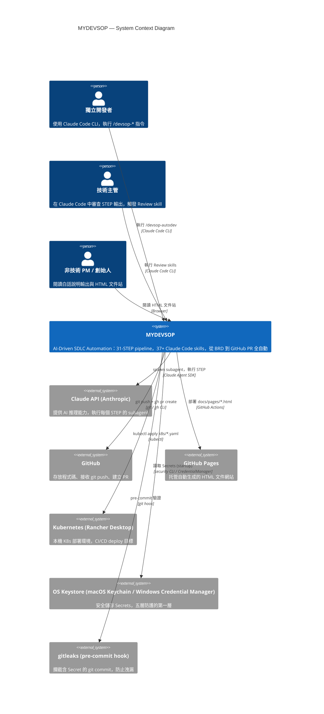
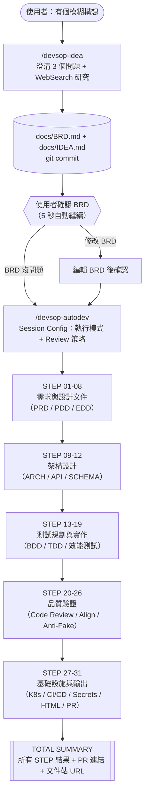
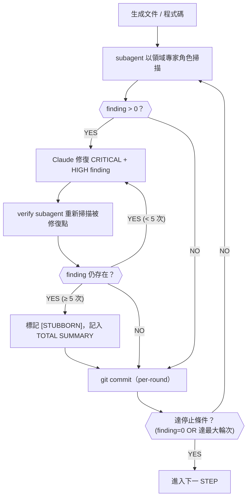
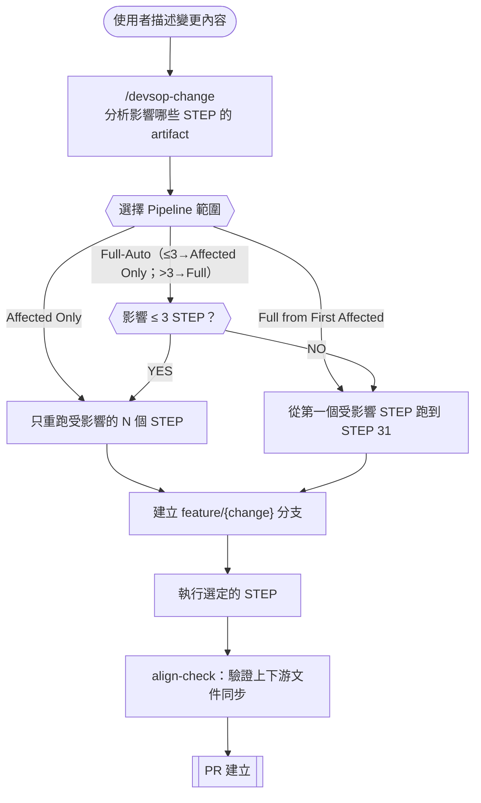
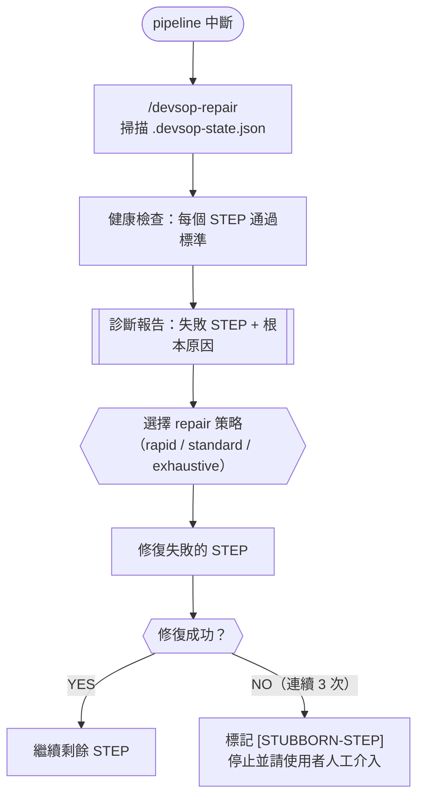
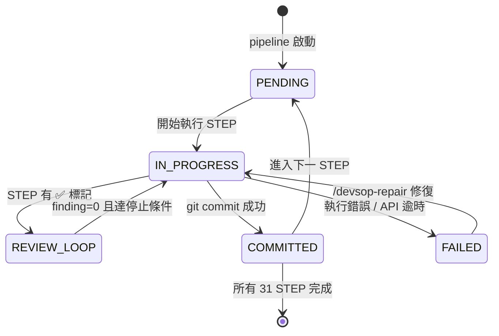

# PRD — Product Requirements Document
<!-- 對應學術標準：IEEE 830 (SRS)，對應業界：Google PRD / Amazon PRFAQ -->
<!-- Version: v2.4 | Status: IN_REVIEW | DOC-ID: PRD-MYDEVSOP-20260421 -->

---

## Document Control

| 欄位 | 內容 |
|------|------|
| **DOC-ID** | PRD-MYDEVSOP-20260421 |
| **產品名稱** | MYDEVSOP — AI-Driven Software Development SOP Automation |
| **文件版本** | v2.6 |
| **狀態** | IN_REVIEW |
| **作者（PM）** | Alex (Product Manager Agent) |
| **日期** | 2026-04-22 |
| **上游 BRD** | [README.md](../README.md)（產品設計文件） |
| **審閱者** | 技術架構師、QA Lead、跨職能 PM |
| **核准者** | 待定 |

---

## Change Log

| 版本 | 日期 | 作者 | 變更摘要 |
|------|------|------|---------|
| v2.6 | 2026-04-22 | PM Agent | 新增 devsop-gendoc（任意輸入入口）、devsop-autogen（純文件流水線）、devsop-gen-idea、devsop-idea-review；架構原則 template-driven；state file 動態命名（TF-05）；IDEA Review Loop 加入所有入口技能 |
| v2.5 | 2026-04-21 | PM Agent | 加入 devsop-migrate、全 gen-* 技能全上游讀取、IDEA.md Appendix C req/ 素材索引、autodev STEP 31 repo 公開化 |
| v2.4 | 2026-04-21 | PM Agent | 初版 PRD，涵蓋 31-STEP Pipeline 完整需求定義 |
| v2.3 | 2026-04-19 | PM Agent | 加入 Anti-Fake 原則、五層 Secrets 防護、Windows 支援 |
| v2.0 | 2026-04-18 | PM Agent | 全自動 AI Pipeline 架構升級，引入 Agent-per-STEP |
| v1.3 | 2026-04-15 | PM Agent | 加入 /devsop-idea skill 需求 |
| v1.0 | 2026-04-10 | PM Agent | 初稿 |

---

## 1. Executive Summary

MYDEVSOP 是一個基於 Claude Code skill 系統的 AI 驅動軟體開發 SOP 自動化工具，將完整軟體開發生命週期（SDLC）串成閉環——從最初的產品構想（BRD）到程式碼上線、GitHub PR 建立，全程 AI 驅動。

開發者只需撰寫一份 BRD（Business Requirements Document），執行一個指令（`/devsop-autodev`），系統自動執行 31 個 STEP，依序生成所有文件（PRD / PDD / EDD / ARCH / API / SCHEMA）、測試（BDD Gherkin / TDD 循環）、程式碼（RED→GREEN→REFACTOR）、基礎設施（Kubernetes manifests / HPA）、CI/CD pipeline（GitHub Actions）、Secrets 管理腳本（五層防護），以及完整的 HTML 文件網站，最終自動建立 GitHub PR。

每個帶有 Review 標記的 STEP 由對應領域專家型別的獨立 AI subagent 執行（Product Manager / Software Architect / Security Engineer / Database Optimizer 等），確保文件與程式碼品質達到業界標準，且每輪 Review finding 必須全數修復或明確標記 `TODO[REVIEW-DEFERRED]` 方可進入下一 STEP。

本工具定位為個人開發者和小型新創團隊的 AI 共同駕駛員，目標是讓「不會寫程式的人也能全程使用」，同時讓有經驗的工程師從重複性 SDLC 工作中解放，專注於架構決策與業務創新。

---

## 2. Problem Statement

### 2.1 現狀痛點

軟體開發團隊在 SDLC 中面臨以下系統性問題：

**問題一：文件與程式碼漂移（Drift）**
開發過程中，PRD 修改了但 EDD 沒更新，ARCH 改了但 API 規格沒同步，程式碼寫了但測試缺失。小型團隊往往沒有專職的 PM 或 Tech Writer，文件從一開始就被視為「nice to have」。

**問題二：Review 品質不一致**
Code review 取決於 reviewer 的個人知識、精力與時間，無法標準化。同樣的程式碼，有經驗的 reviewer 能找出 10 個問題，忙碌的 reviewer 可能只看到 2 個。沒有人能每次都完整執行 OWASP Top 10 審查。

**問題三：重複性工作耗時**
從 BRD 生成 PRD、從 PRD 生成 EDD、從 EDD 生成 API spec——這些工作高度結構化、有固定模板，卻每次都需要人工完成。一份中型系統的完整文件集需要 2-4 週人工撰寫。

**問題四：跨職能溝通成本**
PM 寫的 User Story 工程師看不懂，工程師的架構圖 PM 無法追蹤，非技術創始人完全無法評估進度。「雙層輸出」（技術摘要 + 白話說明）從來不是標準實踐。

**問題五：小型團隊缺乏完整 SDLC 執行能力**
一個 2-3 人的新創公司，無法同時配備 PM、架構師、QA、DevOps。他們要麼跳過大量 SDLC 步驟（累積技術債），要麼花過多時間在流程管理而非產品開發。

### 2.2 根本原因分析

**根本原因一：SDLC 的 artifact 相互依存，人工維護導致上下游文件不同步**
BRD → PRD → EDD → ARCH → API → SCHEMA → BDD → TDD 是嚴格的依賴鏈。任何一個環節的修改，如果沒有觸發下游 artifact 的同步更新，就產生漂移。人工維護這條依賴鏈的成本，隨著 artifact 數量呈指數增長。

**根本原因二：Review 品質取決於個人知識與精力，無法標準化**
人類 reviewer 有認知負荷上限。OWASP Top 10 有 10 個攻擊向量，N+1 Query 問題需要理解 ORM 的執行計畫，Cursor-based 分頁需要記得 OFFSET 的效能陷阱——沒有一個 reviewer 能在疲憊時可靠地記起所有這些。

**根本原因三：文件生成高度結構化，人工執行效率低**
PRD 有固定的 User Story 格式，EDD 有固定的 Security 設計章節，ARCH 有固定的 Mermaid 圖表要求。這些工作對 AI 而言是天然適合的任務，卻佔據工程師 20-40% 的非核心時間。

### 2.3 機會假設

- **假設 H-1**：若 AI agent 能可靠執行多步驟、可審查的 pipeline，小型團隊的 SDLC 完整度將從平均 40% 提升至 90% 以上，且不增加人力成本。
- **假設 H-2**：若每個 Review STEP 由對應領域專家型別的 AI subagent 執行並強制清零 findings，文件品質將達到與資深人類 reviewer 相當的水準。
- **假設 H-3**：若提供「白話說明」輸出層，非技術 PM 和創始人能有效追蹤開發進度，減少跨職能溝通成本 50% 以上。
- **假設 H-4**：若完整 31-STEP pipeline 能在 60-90 分鐘內完成，「從構想到 PR」的週期將縮短 80% 以上（從 2-4 週人工工作縮短為 90 分鐘 AI 輸出）。

### 2.4 System Context Diagram



**SDLC 文件層次（本文件定位）：**

| 文件層次 | 文件 | 核心問題 |
|---------|------|---------|
| BRD / Strategy | README.md（上游設計文件） | Why — 市場機會與商業價值 |
| **PRD（本文件）** | **docs/PRD.md** | **What — 功能範圍與需求定義** |
| PDD | docs/PDD.md（由 /devsop-gen-pdd 生成） | How it works — 使用流程與體驗設計 |
| EDD / Tech Spec | docs/EDD.md（由 /devsop-gen-edd 生成） | How to build — 系統架構與實作方式 |

---

## 3. Stakeholders & Users

### 3.1 Stakeholder Map

| 角色 | 關係 | 主要關切 | 溝通頻率 |
|------|------|---------|---------|
| 獨立開發者 | 主要使用者 | 從構想到 PR 的速度、文件品質 | 每次使用 |
| 新創技術主管 | 次要使用者 | 流程一致性、team review 品質 | 每 sprint |
| 非技術創始人 / PM | 次要使用者 | 白話說明輸出、進度可追蹤性 | 每個 milestone |
| Anthropic（Claude API 供應商） | 技術依賴 | API 穩定性、計費模型 | 合約週期 |
| GitHub | 基礎設施依賴 | Pages 服務可用性、PR API | 服務條款週期 |

### 3.2 User Personas

#### Persona A：獨立開發者 / Indie Developer

| 欄位 | 內容 |
|------|------|
| **背景** | 25-40 歲，全端工程師，solo 或 2 人小團隊，想快速驗證 SaaS / 工具想法 |
| **目標** | 從構想到可展示的 demo，快速、低成本，同時有完整的文件給早期客戶或投資人看 |
| **痛點** | 需要同時扮演 PM、架構師、工程師、QA，難以兼顧文件品質；花 2 週寫文件不如直接寫程式碼 |
| **技術熟悉度** | 高（熟悉 git、CLI、AI 工具） |
| **使用頻率** | 每個新專案啟動時；有新功能想法時 |
| **成功樣貌** | 輸入一段構想描述，90 分鐘後有完整 PRD + EDD + 可運行的 code + GitHub PR，文件品質讓他引以為豪 |

#### Persona B：新創公司技術主管

| 欄位 | 內容 |
|------|------|
| **背景** | 30-45 歲，CTO 或 Tech Lead，帶領 3-10 人工程團隊，有 Series A 以前的資源限制 |
| **目標** | 建立可重複的 SDLC 流程，確保不同工程師寫出的文件格式和品質一致；縮短 onboarding 時間 |
| **痛點** | 團隊規模小，無專職 PM；每個人寫文件的格式和品質差異大；review 品質參差不齊 |
| **技術熟悉度** | 高（熟悉系統架構、CI/CD、DevOps） |
| **使用頻率** | 每個 sprint 啟動時；每個新功能迭代時 |
| **成功樣貌** | 所有工程師使用相同的 SDLC 工具鏈，文件品質標準化，Review finding 有紀錄可追溯 |

#### Persona C：非技術創始人 / PM

| 欄位 | 內容 |
|------|------|
| **背景** | 28-50 歲，產品或業務背景，主導產品方向但不寫程式碼，需要與工程師溝通技術決策 |
| **目標** | 能理解系統設計決策的業務影響；有專業文件給投資人、合作夥伴看；追蹤開發進度 |
| **痛點** | 不懂技術，但需要理解架構圖和 API 設計是否符合業務需求；工程師的文件太技術導向，無法閱讀 |
| **技術熟悉度** | 低（只用 Claude Code 的 /devsop-idea 和閱讀 HTML 文件站） |
| **使用頻率** | 產品初期設計與重大功能迭代時 |
| **成功樣貌** | 能閱讀 HTML 文件站的「白話說明」層，理解每個 STEP 做了什麼；能用 BRD 的語言驗證 PRD 的方向是否正確 |

---

## 4. Scope

### 4.1 In Scope（v2.6 本版本交付）

**主要入口 Skills（9 個）：**
- [x] `/devsop-autodev`：全自動 31-STEP AI 開發流水線（BRD → 程式碼 → K8s → CI/CD → PR）
- [x] `/devsop-autogen`：純文件生成流水線（BRD → PRD → PDD → EDD → ARCH → API → SCHEMA → BDD → HTML Pages，不含程式碼）
- [x] `/devsop-idea`：文字構想入口（模糊想法 → IDEA.md + BRD.md，自動銜接 autodev）
- [x] `/devsop-gendoc`：任意輸入入口（圖片 / URL / 文件 / GitHub repo / 本地 Codebase → IDEA.md + BRD.md，自動銜接 autogen）
- [x] `/devsop-change`：變更管理（分析影響範圍，只重跑受影響的 STEP）
- [x] `/devsop-repair`：健康修復（診斷中斷的 pipeline，從 state file 斷點繼續）
- [x] `/devsop-demo`：3 分鐘快速體驗（URL Shortener 範例 BRD，只跑 STEP 03）
- [x] `/devsop-project-status`：專案健康儀表板（分析 git log、文件狀態、測試結果）
- [x] `/devsop-update`：MYDEVSOP 工具更新

**遷移 Skills（1 個）：**
- [x] `/devsop-migrate`：舊專案遷移（legacy / PDD-based → BRD-based pipeline），自動整理 `docs/req/` 並生成 IDEA.md Appendix C 素材索引

**生成 Skills（18 個）：**
- [x] **gen-idea**（新增）：讀取 `templates/IDEA.md` + Q1-Q5 + 研究摘要 → 生成 `docs/IDEA.md`
- [x] gen-brd, gen-prd, gen-pdd, gen-edd, gen-arch, gen-api, gen-schema
- [x] gen-diagrams, gen-test-plan, gen-bdd, gen-client-bdd, gen-client-tdd
- [x] gen-k8s, gen-cicd, gen-secrets, gen-html, gen-readme
- 全部 gen-* 技能均讀取**完整上游文件鏈**；**template-driven 架構：文件結構由 `templates/*.md` 決定，gen-* 執行時讀取 template，改 template 自動適應，無需修改 skill**

**Review Skills（10 個，各由對應領域專家 subagent 執行）：**
- [x] **idea-review**（新增）：審查 IDEA.md 章節完整性、Q1-Q5 一致性，通過後寫入 `idea_review_passed: true`
- [x] brd-review（Product Manager）, prd-review（Product Manager）
- [x] pdd-review（UI Designer）, edd-review（Backend Architect）
- [x] arch-review（Software Architect）, api-review（API Tester）
- [x] schema-review（Database Optimizer）
- [x] code-review（Security Engineer）, test-review（Model QA Specialist）

**工具 Skills（9 個）：**
- [x] lang-select, tdd-cycle, align-check, align-fix, align-report
- [x] rpa-test, quality-loop, product-review, config

**稽核 Skills（2 個）：**
- [x] test-audit（7 種假測試 Pattern 偵測）, impl-audit（5 種假實作 Pattern 偵測）

**平台支援：**
- [x] macOS / Linux：bash 腳本（install.sh / update.sh / check-update.sh）
- [x] Windows：PowerShell 5.1+ 原生腳本（install.ps1 / update.ps1 / check-update.ps1）
- [x] Skills 執行：全平台（Claude Code AI 執行，不依賴 Shell）

**品質機制：**
- [x] Anti-Fake 原則：禁止 mock 在 production 路徑；測試必須有真實斷言
- [x] 五層 Secrets 防護（gitleaks / pre-commit / env.example / fail-fast / log 遮罩）
- [x] Review Loop：每個 ✅ STEP 反覆掃描直到 finding = 0 或達停止條件
- [x] State file 動態命名（TF-05）：`.devsop-state-{git_user}-{branch}.json`，無 symlink，支援多分支並行
- [x] `skill_source` 欄位：防止跨 skill 誤用 state file
- [x] IDEA Review Loop：所有入口技能（idea / gendoc）均在 BRD 前執行 IDEA Review
- [x] Handoff State：idea / gendoc 完成後寫入 `idea_review_passed` / `brd_review_passed` / `handoff_source`，下游 autogen / autodev 據此跳過已完成的 Review
- [x] IDEA.md Appendix C：`docs/req/` 素材索引（結構化表格），讓所有 gen-* 技能可繼承 legacy 文件知識
- [x] STEP 31 自動將 GitHub Repo 從 private 改為 public，確保 GitHub Pages 部署成功

### 4.2 Out of Scope（明確排除）

- 多使用者協作 / 團隊管理功能（原因：個人工具定位，多人協作需要獨立的權限與衝突解決設計，後續有需求再設計）
- 自架伺服器部署模式（原因：MYDEVSOP 深度整合 Claude Code CLI 執行環境，非獨立服務；自架版本需重新設計 skill 執行機制）
- IDE 外掛（原因：Claude Code 已有 VS Code / JetBrains 擴充套件，重複投入無增量價值）
- 非 Claude AI 模型（原因：工具深度整合 Claude Agent SDK 的 subagent 機制，GPT / Gemini 無相同原生 skill 系統）
- GUI 介面（原因：CLI 是目標用戶的天然環境；GUI 開發成本高且 Claude Code 本身提供視覺輸出）
- 即時協作編輯（如 Google Docs 風格）（原因：不在個人工具定位的核心使用情境中）

### 4.3 Future Scope（下一版本候選）

- 多人協作 workflow / PR review 整合（需求信號：多個 Persona B 使用者要求）
- 自訂 skill template 市場（社群貢獻的 skill 模板）
- 與 Linear / Jira ticket 自動同步（PM 工具整合）
- 支援更多 K8s 平台（AWS EKS / GKE，目前只支援 Rancher Desktop）
- 漸進式 pipeline 執行（只重跑 dirty 的 STEP，基於 content hash 變更偵測）

---

## 5. User Stories & Acceptance Criteria

### 5.1 US-IDEA-001：從模糊構想生成 BRD

**User Story：**
> 作為 **Persona C（非技術創始人）**，
> 我希望能 **描述一個模糊的產品構想，系統自動澄清需求並生成結構化 BRD**，
> 以便 **不需要 PM 背景也能啟動 AI 開發流水線**。

**REQ-ID：** US-IDEA-001（對應 README.md 情境 A）
**優先度：** P0（Must Have）
**關聯需求：** REQUIREMENTS.md §19 /devsop-idea 規格

**Acceptance Criteria：**

| REQ-ID / AC# | Given（前提） | When（行動） | Then（結果） | 測試類型 |
|--------------|-------------|------------|------------|---------|
| US-IDEA-001 / AC-1 | 使用者說出任何形式的產品構想（「我想做一個 URL 縮短器」） | 執行 `/devsop-idea` | 系統透過最多 3 個澄清問題（AskUserQuestion tool）引導使用者，5 秒無回應自動選預設選項 | Integration |
| US-IDEA-001 / AC-2 | 使用者完成 3 個澄清問題（或接受預設值） | 系統執行 WebSearch | 競品、技術可行性、已知風險的研究結果寫入 docs/BRD.md §0 背景研究章節 | Integration |
| US-IDEA-001 / AC-3 | /devsop-idea 完成 BRD 生成 | 系統詢問使用者確認 | 若選擇「BRD 沒問題，開始 autodev」，系統提示使用者輸入 `/devsop-autodev` 繼續流程（5 秒後自動繼續） | E2E |
| US-IDEA-001 / AC-4 | 任何使用情境 | BRD 生成後 | docs/BRD.md 存在且包含：§產品目標、§使用者、§核心功能（P0/P1/P2）、§限制、§成功指標；同時生成 docs/IDEA.md（原始想法 + 澄清參數溯源） | Unit |

**邊界條件：**
- 使用者在 STEP 3 選擇「重新整理 BRD」：回到澄清問題，不重新執行 WebSearch
- 使用者在 STEP 3 選擇「我要修改 BRD」：輸出 BRD 全文供編輯，不重新生成
- WebSearch 失敗（網路問題）：繼續流程，在 BRD §0 標記「背景研究暫缺，建議手動補充」

---

### 5.1b US-GENDOC-001：任意輸入 → 文件集 + autogen

**User Story：**
> 作為 **Persona C（非技術創始人）**，
> 我希望能 **提供任何形式的輸入（文字描述、圖片截圖、GitHub URL、本地 codebase），系統自動分析並生成完整文件集**，
> 以便 **不限輸入格式也能啟動 AI 文件流水線**。

**REQ-ID：** US-GENDOC-001（對應 README.md 情境 A2）
**優先度：** P0（Must Have）
**關聯需求：** REQUIREMENTS.md devsop-gendoc 規格

**驗收條件：**

| REQ-ID / AC# | Given（前提） | When（行動） | Then（結果） | 測試類型 |
|--------------|-------------|------------|------------|---------|
| US-GENDOC-001 / AC-1 | 使用者提供任一格式的輸入（text / image URL / GitHub URL / 本地路徑） | 執行 `/devsop-gendoc <輸入>` | 系統自動偵測輸入類型（`_INPUT_TYPE`），依類型路由至對應的素材擷取流程 | Integration |
| US-GENDOC-001 / AC-2 | 輸入類型偵測完成 | 系統處理輸入 | 所有輸入素材保存至 `docs/req/`；GitHub / 本地路徑來源為唯讀，不修改原始檔案 | Integration |
| US-GENDOC-001 / AC-3 | 素材收集完成 | 系統執行 Q1-Q5 澄清 + WebSearch | 在 interactive 模式下提問；在 full-auto 模式下 AI 自動推斷；3 次 WebSearch 完成後生成 docs/IDEA.md | Integration |
| US-GENDOC-001 / AC-4 | IDEA.md 生成完成 | 系統執行 IDEA Review Loop | `idea_review_passed: true` 寫入 state file；之後生成 docs/BRD.md 並執行 BRD Review Loop | Integration |
| US-GENDOC-001 / AC-5 | BRD Review 完成 | 系統移交 autogen | state file 包含 `handoff: true`、`handoff_source: devsop-gendoc`、`brd_review_passed: true`；自動呼叫 `/devsop-autogen` | E2E |

**邊界條件：**
- `codebase_git` / `codebase_local` 輸入：素材唯讀複製至 `docs/req/`，原始目錄不得有任何寫入操作
- GitHub repo 名稱衝突：interactive 模式詢問後綴策略；full-auto 模式自動加日期後綴
- state file `skill_source != devsop-gendoc`：偵測到跨 skill 誤用，立即中止並提示

---

### 5.2 US-AUTO-001：全自動 31-STEP 開發流水線

**User Story：**
> 作為 **Persona A（獨立開發者）**，
> 我希望能 **執行一個指令，系統自動完成從 BRD 到 GitHub PR 的所有步驟**，
> 以便 **在 90 分鐘內得到完整的文件集、測試、程式碼、K8s 配置與 PR**。

**REQ-ID：** US-AUTO-001（對應 README.md 情境 B）
**優先度：** P0（Must Have）
**關聯需求：** REQUIREMENTS.md §2 完整流水線

**Acceptance Criteria：**

| REQ-ID / AC# | Given（前提） | When（行動） | Then（結果） | 測試類型 |
|--------------|-------------|------------|------------|---------|
| US-AUTO-001 / AC-1 | `docs/BRD.md` 存在於專案目錄 | 執行 `/devsop-autodev` | Session Config 詢問執行模式（互動 / Full-Auto）與 Review 策略（rapid / standard / exhaustive / tiered / custom），只問一次 | Integration |
| US-AUTO-001 / AC-2 | Session Config 完成 | 系統開始執行 31 STEP | 每個 STEP 完成後輸出 Step Summary 框（含 commit hash、修改/新增檔案、本步驟重點） | E2E |
| US-AUTO-001 / AC-3 | 所有 31 STEP 完成 | 系統輸出 TOTAL SUMMARY | TOTAL SUMMARY 包含：每個 STEP 結果、所有 commit 時序、文件網站 URL、剩餘未解問題、PR 連結 | E2E |
| US-AUTO-001 / AC-4 | Full-Auto 模式選定 | 任何決策點（語言選型、分支名稱等） | 系統自動選第一選項（AI 推薦預設），不等待使用者輸入 | Unit |
| US-AUTO-001 / AC-5 | 任何執行模式 | STEP 02 語言/框架選型 | 系統分析 BRD 內容，提供帶優缺點的選單；5 秒無回應自動選第一選項（AI 推薦） | Integration |

**邊界條件：**
- BRD 找不到（三層搜尋規則）：友善提示先執行 `/devsop-idea`，中斷
- STEP 執行時 Claude API 逾時：寫入 .devsop-state.json 後中斷，提示執行 `/devsop-repair` 繼續
- Full-Auto 模式下 STEP 06 PDD Review（client_type = none）：自動跳過，不影響後續 STEP 編號

---

### 5.3 US-AUTO-002：Pipeline 中斷後從斷點繼續

**User Story：**
> 作為 **Persona A（獨立開發者）**，
> 我希望能 **在 pipeline 中斷後，從中斷的 STEP 繼續執行，而不是從頭重跑**，
> 以便 **不因為網路問題或 API 逾時而損失已完成的工作**。

**REQ-ID：** US-AUTO-002（對應 R-01，.devsop-state.json 斷點機制）
**優先度：** P0（Must Have）
**關聯需求：** REQUIREMENTS.md REQ-2.1 State File 規格

**Acceptance Criteria：**

| REQ-ID / AC# | Given（前提） | When（行動） | Then（結果） | 測試類型 |
|--------------|-------------|------------|------------|---------|
| US-AUTO-002 / AC-1 | Pipeline 在 STEP N 中斷，.devsop-state.json 存在 | 重新執行 `/devsop-autodev` | 系統偵測 state file，顯示「偵測到 STEP N 中斷，是否從此繼續？」（5 秒自動選是） | Integration |
| US-AUTO-002 / AC-2 | 從 STEP N 繼續執行 | 系統執行 STEP N | STEP N 之前已完成的 STEP 不會重新執行；STEP N 重新從頭執行 | Integration |
| US-AUTO-002 / AC-3 | .devsop-state.json 中有未知欄位（舊版本 state） | 載入 state file | 系統採用 merge 策略，保留所有未知欄位，不刪除不報錯 | Unit |
| US-AUTO-002 / AC-4 | 手動執行 `/devsop-repair` | 系統啟動健康檢查 | 掃描每個 STEP 的通過標準（git commit 存在 + 輸出文件存在 + 測試通過），列出需要修復的 STEP | Integration |

**邊界條件：**
- state file 損壞（JSON 解析失敗）：顯示錯誤，建議從 STEP 01 重跑或手動修復 state file
- 使用者選擇「從頭重跑」：備份現有 state file 為 .devsop-state.json.bak，清空 state 重跑

---

### 5.4 US-REVIEW-001：每個 Review STEP 由領域專家 subagent 執行

**User Story：**
> 作為 **Persona B（新創技術主管）**，
> 我希望能 **每個 Review STEP 由對應領域的 AI 專家執行，而非通用 AI**，
> 以便 **確保架構 review 有架構師視角、程式碼 review 有安全工程師視角，品質更有深度**。

**REQ-ID：** US-REVIEW-001（對應 R-29，subagent_type 規格）
**優先度：** P0（Must Have）
**關聯需求：** REQUIREMENTS.md §16 Review Skills，各 skill 的 subagent_type

**Acceptance Criteria：**

| REQ-ID / AC# | Given（前提） | When（行動） | Then（結果） | 測試類型 |
|--------------|-------------|------------|------------|---------|
| US-REVIEW-001 / AC-1 | 任何帶 ✅ 的 STEP（01, 04, 06, 08, 10, 11, 12, 20, 21） | 該 STEP 的 Review 階段啟動 | subagent 以對應領域專家的角色執行 review（STEP 01/04 = Product Manager，STEP 08 = Backend Architect，STEP 20 = Security Engineer，等） | Unit |
| US-REVIEW-001 / AC-2 | Security Engineer subagent 執行 STEP 20 Code Review | Code Review 執行 | subagent 必須逐條審查 OWASP Top 10 攻擊向量（Injection / Broken Auth / XSS / Insecure Design 等），輸出每條是否通過 | Integration |
| US-REVIEW-001 / AC-3 | Database Optimizer subagent 執行 STEP 12 Schema Review | Schema Review 執行 | subagent 必須審查使用案例 SQL 的效能問題（Full Table Scan / OFFSET 分頁 / N+1 / GROUP BY）並提供具體改善建議 | Integration |
| US-REVIEW-001 / AC-4 | 任何 Review STEP | 一輪 Review 完成後 | 輸出格式必須包含：FINDINGS_COUNT、每個 finding 的嚴重度（CRITICAL/HIGH/MEDIUM/LOW）、位置、描述、建議修復方式 | Unit |

**邊界條件：**
- STEP 06 PDD Review 且 client_type = none：自動跳過，記錄「PDD Review skipped: client_type=none」
- Review subagent 回傳格式不符預期：主 Claude 重試一次，若仍不符，記錄 parse error 並繼續

---

### 5.5 US-REVIEW-002：Review finding 全數修復或標記 DEFERRED

**User Story：**
> 作為 **Persona A（獨立開發者）**，
> 我希望能 **確保每一個 Review finding 不是被修復就是被明確標記延後，不能靜默忽略**，
> 以便 **文件和程式碼品質有可追溯的保證，而不是看似通過但暗藏問題**。

**REQ-ID：** US-REVIEW-002（對應 REQUIREMENTS.md REQ-2.2）
**優先度：** P0（Must Have）

**Acceptance Criteria：**

| REQ-ID / AC# | Given（前提） | When（行動） | Then（結果） | 測試類型 |
|--------------|-------------|------------|------------|---------|
| US-REVIEW-002 / AC-1 | 一輪 Review 輸出 N 個 findings | 系統執行修復 | 所有 CRITICAL + HIGH findings 必須完全修復（FINDINGS_COUNT = 0）才能進入下一輪 | Integration |
| US-REVIEW-002 / AC-2 | 同一個 finding 連續出現 5 輪未解決 | 第 5 輪修復嘗試失敗 | 該 finding 標記為 [STUBBORN]，列入 TOTAL SUMMARY 的「剩餘未解問題」，帶著它繼續（需人工確認） | Integration |
| US-REVIEW-002 / AC-3 | MEDIUM / LOW finding 在 tiered 模式 第 6 輪後仍存在 | Review 達停止條件 | finding 標記為 `TODO[REVIEW-DEFERRED]`，寫入文件對應位置，不阻塞 pipeline | Unit |
| US-REVIEW-002 / AC-4 | 任何 Review STEP 完成 | 進入下一 STEP 前 | 每輪執行一次 git commit（「review(devsop)[STEP-NN]: round N，fixed=M todo=K」），git history 可追溯每輪改了什麼 | Unit |

**邊界條件：**
- exhaustive 模式：無輪次上限，finding = 0 才停止（可能執行數十輪）
- rapid 模式：最多 3 輪，第 3 輪後仍有 findings 帶著走，但在 TOTAL SUMMARY 標記

---

### 5.6 US-CHANGE-001：修改現有功能，只重跑受影響的 STEP

**User Story：**
> 作為 **Persona B（新創技術主管）**，
> 我希望能 **描述要變更的功能，系統只重跑受影響的 STEP，而不是從頭重跑全部 31 STEP**，
> 以便 **功能迭代週期縮短，不因為小改動而浪費大量 AI 資源**。

**REQ-ID：** US-CHANGE-001（對應 README.md 情境 C）
**優先度：** P1（Should Have）

**Acceptance Criteria：**

| REQ-ID / AC# | Given（前提） | When（行動） | Then（結果） | 測試類型 |
|--------------|-------------|------------|------------|---------|
| US-CHANGE-001 / AC-1 | 已有開發中的專案（docs/ + src/ + tests/ 存在） | 執行 `/devsop-change` 並描述變更內容 | 系統分析影響範圍，列出需要重跑的 STEP 清單（例：修改 API 設計 → 影響 STEP 09, 11, 15, 17, 20） | Integration |
| US-CHANGE-001 / AC-2 | 影響範圍分析完成 | 使用者選擇 Pipeline 範圍 | 提供三個選項：Affected Only / Full from First Affected / Full-Auto（≤3 STEP → Affected Only；>3 → Full） | Integration |
| US-CHANGE-001 / AC-3 | 使用者選擇 Feature Branch 模式（預設） | 執行受影響的 STEP | 系統建立 `feature/{change-description}` 分支後執行，確保 main branch 不受影響 | Integration |
| US-CHANGE-001 / AC-4 | 重跑 STEP 完成 | 文件與程式碼更新後 | 對齊掃描（align-check）自動執行，確認上下游文件同步更新 | Integration |

**邊界條件：**
- POC 模式：跳過 branch 建立，直接在當前 branch 修改（適合快速實驗）
- 影響範圍無法判斷：建議使用 Full 模式

---

### 5.7 US-REPAIR-001：修復中途失敗的 STEP

**User Story：**
> 作為 **Persona A（獨立開發者）**，
> 我希望能 **對中途卡住或報錯的 STEP 執行診斷與修復，而不是手動逐一檢查每個 STEP**，
> 以便 **快速恢復被中斷的 pipeline，繼續完成剩餘工作**。

**REQ-ID：** US-REPAIR-001（對應 README.md 情境 D）
**優先度：** P1（Should Have）

**Acceptance Criteria：**

| REQ-ID / AC# | Given（前提） | When（行動） | Then（結果） | 測試類型 |
|--------------|-------------|------------|------------|---------|
| US-REPAIR-001 / AC-1 | pipeline 在某個 STEP 失敗，state file 存在 | 執行 `/devsop-repair` | 系統自動掃描 .devsop-state.json，判斷哪個 STEP 失敗，列出失敗原因 | Integration |
| US-REPAIR-001 / AC-2 | 健康檢查完成 | 系統顯示診斷報告 | 報告包含：每個 STEP 的通過/失敗狀態、失敗的根本原因（文件缺失 / 測試失敗 / git commit 缺失） | Integration |
| US-REPAIR-001 / AC-3 | 使用者選擇 repair 策略 | 系統執行修復 | 修復完成後自動繼續剩餘的 STEP，無需使用者手動輸入繼續指令 | E2E |

**邊界條件：**
- state file 不存在：建議從 STEP 01 重跑，或手動指定從哪個 STEP 開始
- 修復失敗（同一 STEP 修復 3 次仍失敗）：標記 [STUBBORN-STEP]，停止並請使用者人工介入

---

### 5.8 US-QUALITY-001：Anti-Fake 驗證，禁止假測試與假實作

**User Story：**
> 作為 **Persona B（新創技術主管）**，
> 我希望能 **確保所有測試和實作都是真實的，而不是為了通過 pipeline 而偽造的**，
> 以便 **測試覆蓋率數字有真實意義，不是虛假的安全感**。

**REQ-ID：** US-QUALITY-001（對應 REQUIREMENTS.md §14 Anti-Fake 原則，STEP 25/26）
**優先度：** P0（Must Have）

**Acceptance Criteria：**

| REQ-ID / AC# | Given（前提） | When（行動） | Then（結果） | 測試類型 |
|--------------|-------------|------------|------------|---------|
| US-QUALITY-001 / AC-1 | STEP 25 Test Audit 執行 | 系統用 Python AST 掃描 tests/ | 偵測 7 種假測試 Pattern（BROAD_GREP_C / NO_ASSERT / DEAD_VAR / TRIVIAL_ASSERT / MOCK_ALL / EMPTY_TEST / SKIP_ALL），每個 Pattern 有具體的程式碼 Pattern 定義 | Unit |
| US-QUALITY-001 / AC-2 | 偵測到假測試 | check-and-fix 模式啟動 | 自動修正可修復的假測試（如補上有意義的 assert）；無法自動修復的列出清單，標記 [FAKE-TEST-DEFERRED] | Unit |
| US-QUALITY-001 / AC-3 | STEP 26 Impl Audit 執行 | 系統用 Python AST 掃描 src/ | 偵測 5 種假實作 Pattern（EMPTY_BODY / TODO_STUB / HARDCODED_RETURN / MOCK_IN_PROD / PASS_ALL_VALIDATION），依 EDD/API/Schema 補全 | Unit |
| US-QUALITY-001 / AC-4 | 任何 production 路徑的程式碼 | 任何時候 | 禁止出現 `return mock_data`、`assert True`、Integration test 用假回應通過等反模式；repr/str 覆寫必須遮罩敏感欄位 | Unit |

**邊界條件：**
- AST 解析失敗（語法錯誤的測試檔）：標記該檔案為 parse error，繼續掃描其他檔案
- 自動修復後測試 RED：退出修復，要求手動審查

---

### 5.9 US-SECRETS-001：五層 Secrets 防護，零洩漏設計

**User Story：**
> 作為 **Persona A（獨立開發者）**，
> 我希望能 **確保 API Keys 和密碼永遠不會出現在 git commit 或 log 中**，
> 以便 **避免因 secrets 洩漏造成的安全事故和帳號被盜**。

**REQ-ID：** US-SECRETS-001（對應 REQUIREMENTS.md §13 Secrets 管理）
**優先度：** P0（Must Have）

**Acceptance Criteria：**

| REQ-ID / AC# | Given（前提） | When（行動） | Then（結果） | 測試類型 |
|--------------|-------------|------------|------------|---------|
| US-SECRETS-001 / AC-1 | 開發者嘗試 git commit 含真實 API Key 的檔案 | pre-commit hook 執行 | gitleaks 偵測到 secret pattern → 強制中斷 commit，顯示警告訊息 | Integration |
| US-SECRETS-001 / AC-2 | 應用程式啟動 | 讀取環境變數 | 若必要的 SECRET 缺失：exit(1) 並顯示「請執行 scripts/setup_secrets.sh」（fail-fast 原則） | Unit |
| US-SECRETS-001 / AC-3 | 應用程式 log 任何含 API Key 的物件 | log 輸出 | Key 值顯示為遮罩格式（前 4 + 後 2：`abcd...xy`），原始值不出現在 log | Unit |
| US-SECRETS-001 / AC-4 | .env.example 存在 | 任何時候 | .env.example 只含佔位符（如 `OPENAI_API_KEY=your_key_here`），禁止填入真實值 | Unit |

**邊界條件：**
- macOS：Secrets 存放在 macOS Keychain（security add-generic-password）
- Windows：Secrets 存放在 Windows Credential Manager（CredentialManager PowerShell module）
- K8s 環境：secrets 從 OS Keystore 讀出後建立 K8s Secret 物件（scripts/setup_k8s_secrets.sh）

---

### 5.10 US-HTML-001：自動生成圖文並茂的 HTML 文件網站

**User Story：**
> 作為 **Persona C（非技術創始人）**，
> 我希望能 **瀏覽一個美觀的 HTML 文件網站，看到所有 Mermaid 圖表直接渲染，而不是閱讀原始 Markdown**，
> 以便 **能向投資人或合作夥伴展示專業的技術文件，不需要技術背景就能閱讀**。

**REQ-ID：** US-HTML-001（對應 REQUIREMENTS.md §9 HTML 文件網站，STEP 30/31）
**優先度：** P1（Should Have）

**Acceptance Criteria：**

| REQ-ID / AC# | Given（前提） | When（行動） | Then（結果） | 測試類型 |
|--------------|-------------|------------|------------|---------|
| US-HTML-001 / AC-1 | docs/*.md 存在 | 執行 STEP 30 | docs/pages/ 下生成對應的 *.html，一對一映射（BRD.md → brd.html，PRD.md → prd.html，等），包含 index.html 首頁 | Integration |
| US-HTML-001 / AC-2 | prd.html 等頁面載入 | 瀏覽器渲染 | 所有 ` ```mermaid ` 程式碼塊正確渲染為 SVG 圖表（使用 mermaid.js CDN），圖表點擊可放大（Lightbox） | E2E |
| US-HTML-001 / AC-3 | 任何 HTML 頁面 | 使用者互動 | 左側 Sidebar 列出當前文件所有 ## 章節錨點，點擊可跳轉；Client-side 搜尋功能可搜尋標題與摘要 | E2E |
| US-HTML-001 / AC-4 | 執行 STEP 31 | git push + GitHub Actions 觸發 | docs/pages/*.html 部署至 GitHub Pages，URL 為 `https://<user>.github.io/<repo>/`，24 小時內可訪問 | E2E |

**邊界條件：**
- docs/*.md 新增了新文件：STEP 30 重新生成所有頁面（不只更新部分）確保導覽一致性
- Mermaid 語法錯誤：頁面仍正常載入，錯誤的 diagram 顯示錯誤訊息而非破壞整個頁面

---

## 6. User Flows

### 6.1 主流程（Happy Path）：全新專案



### 6.2 Review Loop 流程（每個帶 ✅ 的 STEP）



### 6.3 變更流程



### 6.4 修復流程



### 6.5 Pipeline STEP 狀態機



---

## 7. Non-Functional Requirements (NFR)

### 7.1 效能（Performance）

| 指標 | 目標值 | 量測方式 | 降級策略 |
|------|--------|---------|---------|
| 每個 Gen STEP 完成時間 | < 5 分鐘 | STEP Summary 的 commit timestamp | 重試一次，若仍超過標記 SLOW-STEP |
| 每個 Review STEP 每輪時間 | < 3 分鐘 | per-round commit timestamp 差值 | 縮短 Review prompt 長度 |
| 完整 31-STEP pipeline | 60-90 分鐘 | TOTAL SUMMARY 執行時間 | 使用 rapid Review 策略 |
| 任何 STEP 最大允許時間 | 15 分鐘 | state file last_updated 間隔 | 超過 → 視為卡住，標記 TIMEOUT，觸發修復 |
| HTML 頁面載入時間 | < 2 秒 | Browser 開發工具 | CSS / JS 最小化，Mermaid CDN 預載 |

### 7.2 可靠性（Reliability）

| 指標 | 要求 |
|------|------|
| Pipeline 從斷點繼續 | 100%（任意 STEP 中斷後必須可繼續） |
| state file merge 策略 | 未知欄位保留，不刪除，不報錯 |
| Review finding 修復驗證 | 修復後必須 verify subagent 重新掃描確認 |
| git history 可追溯性 | 每輪 commit 一次，commit message 包含 round 數和 finding 數量 |
| Anti-Fake 違規數 | = 0（Test Audit + Impl Audit 偵測到的假實作數量） |

### 7.3 安全性（Security）

| 機制 | 規格 |
|------|------|
| 五層 Secrets 防護 | .gitignore + gitleaks pre-commit + .env.example + fail-fast + log 遮罩 |
| Secrets 儲存 | macOS Keychain / Windows Credential Manager，不存入任何檔案 |
| OWASP Top 10 審查 | STEP 20 Code Review 必須逐條審查，不可跳過 |
| Anti-Fake 原則 | 禁止 mock 在 production 路徑（production code 打真實依賴） |
| log 遮罩格式 | 前 4 + 後 2 字元（`abcd...xy`），物件 repr/str 覆寫 |

### 7.4 可維護性（Maintainability）

| 指標 | 要求 |
|------|------|
| MYDEVSOP 自身測試 | 9 unit + 3 integration + 2 smoke + 1 skill_smoke（bats-core 框架） |
| 測試覆蓋率 | ≥ 80%（unit + integration） |
| skill 文件完整性 | 每個 skill 有獨立 SKILL.md（name / description / allowed-tools 完整） |
| 程式碼行數限制 | 每個 SKILL.md < 800 行（超過需分拆） |
| 共用邏輯 | devsop-shared skill 提供所有 skill 使用的共用函式與格式規範 |

### 7.5 平台相容性（Compatibility）

| 元件 | macOS / Linux | Windows |
|------|-------------|---------|
| Skills 執行 | 全平台（Claude Code AI 執行） | 全平台（Claude Code AI 執行） |
| install 腳本 | install.sh（bash） | install.ps1（PowerShell 5.1+，原生） |
| update 腳本 | update.sh（bash） | update.ps1（PowerShell 5.1+，原生） |
| check-update 腳本 | check-update.sh（bash） | check-update.ps1（PowerShell 5.1+，原生） |
| devsop-lib | devsop-lib.sh（bash，需 WSL on Windows） | devsop-lib.ps1（PowerShell，原生） |
| 測試（bats） | 原生執行 | 需要 bats-core（建議在 WSL 執行） |

### 7.6 可觀測性（Observability）

| 機制 | 規格 |
|------|------|
| STEP Summary | 每個 STEP 完成後輸出框格式摘要（commit hash + 修改檔案 + 重點） |
| TOTAL SUMMARY | 所有 STEP 完成後輸出全局摘要（ASCII art 框格式） |
| .devsop-state.json | 持久化 pipeline 狀態（version / project_dir / current_step / lang_stack / last_updated） |
| git history | 每輪每個 commit 包含 STEP 編號、動作類型、輸出摘要 |
| /devsop-project-status | 隨時可執行，輸出 PROJECT_STATUS.md（文件狀態 + 測試結果 + 對齊率） |
| ALIGN_REPORT.md | docs/ALIGN_REPORT.md，記錄文件↔文件、文件↔程式碼、程式碼↔測試的對齊問題 |

### 7.7 Analytics Event Instrumentation Map

| 功能 | Event Name | 觸發時機 | 關聯指標 |
|------|-----------|---------|---------|
| pipeline 啟動 | `pipeline_started` | 執行 /devsop-autodev | pipeline 完成率 |
| STEP 完成 | `step_completed` | 每個 STEP git commit | STEP 完成率、平均耗時 |
| Review finding 偵測 | `review_finding_detected` | Review subagent 回傳 | 平均 finding 數/STEP |
| 假測試偵測 | `fake_test_detected` | STEP 25 Test Audit | Anti-Fake 違規率 |
| pipeline 完成 | `pipeline_completed` | TOTAL SUMMARY 輸出 | 完整完成率、總耗時 |
| PR 建立 | `pr_created` | STEP 31 gh pr create | PR 建立成功率 |

> 注意：上述 Analytics 為概念性定義，MYDEVSOP 本身為 CLI 工具，無後端 analytics 基礎設施。實際追蹤依賴 git history 分析和 state file。

---

## 8. Constraints & Dependencies

### 8.1 技術限制

- 必須使用 Claude Code CLI（核心 AI 執行環境，skill 機制依賴 Claude Code Agent SDK）
- 必須有 Git（版本控制，每個 STEP 依賴 git commit 做狀態追蹤）
- 必須有 Python 3（state file JSON 讀寫，Python AST 用於 Anti-Fake 稽核）
- 不得引入非 Claude 的 AI 模型（原因：工具深度整合 Claude Agent SDK 的 subagent 機制）
- Skills 不得超過 800 行（原因：可維護性限制，超過需分拆成多個 skill）

### 8.2 業務限制

- 個人工具定位：不設計多使用者協作功能（後續有需求再設計）
- 依賴 Anthropic 計費：長 pipeline（31 STEP）有較高的 Claude API token 消耗，使用者需有有效的 Claude Pro / Team 帳號
- GitHub 依賴：STEP 31 的自動 PR 建立需要安裝 gh CLI 並完成 GitHub 身份驗證

### 8.3 外部依賴

| 依賴項 | 類型 | 負責方 | 風險等級 | 備援方案 |
|--------|------|--------|---------|---------|
| Claude API | 外部 AI 服務 | Anthropic | HIGH | 無法繞過，核心依賴；Anthropic API 中斷時 pipeline 完全無法執行 |
| GitHub | 外部版本控制 | GitHub | MEDIUM | 可手動 git push 到其他 remote；PR 建立需降級為手動操作 |
| GitHub Pages | 外部靜態托管 | GitHub | LOW | 本機 docs/pages/ 可用 `python -m http.server` 預覽 |
| Rancher Desktop | 本機 K8s | SUSE | LOW | STEP 27/28 K8s 相關 STEP 可跳過，不影響其他 STEP |
| gitleaks | pre-commit 安全工具 | gitleaks 開源社群 | LOW | 若未安裝，五層防護降至四層；建議必裝 |
| bats-core | 測試框架 | bats 開源社群 | LOW | 僅用於 MYDEVSOP 自身測試，不影響被生成的專案測試 |

### 8.4 關鍵假設（Assumptions）

| # | 假設內容 | 若假設錯誤的風險等級 | 驗證方式 | 驗證截止日 | 負責人 |
|---|---------|-------------------|---------|-----------|--------|
| A-1 | Claude Code skill 機制（SKILL.md + allowed-tools）在 Anthropic 未來版本中保持向後相容 | HIGH | 每次 Claude Code 版本更新後執行 `/devsop-demo` smoke test | 每次 Claude Code 版本更新 | MYDEVSOP 維護者 |
| A-2 | 使用者的工作目錄有 git 初始化，且 Claude Code 有讀寫該目錄的權限 | HIGH | install.sh 前置需求檢查 | 安裝時即時驗證 | install 腳本 |
| A-3 | Python 3 在目標機器上已安裝且在 PATH 中（用於 AST 稽核腳本） | MEDIUM | install.sh 前置需求檢查（`python3 --version`） | 安裝時即時驗證 | install 腳本 |
| A-4 | 完整 31-STEP pipeline 的 Claude API token 消耗在使用者的 Claude Pro 限額內 | MEDIUM | 對 3 個不同規模的 BRD 範例執行完整 pipeline 並記錄 token 消耗 | 2026-05-31 | PM Agent |
| A-5 | Mermaid.js CDN（cdn.jsdelivr.net）在目標使用者環境可訪問 | LOW | HTML 文件站增加 CDN 可用性說明，提供本地版備援方案 | 2026-05-31 | 前端負責人 |

### 8.5 向後相容性宣告

| 欄位 | 內容 |
|------|------|
| **本版本是否有 Breaking Change** | 否（v2.4 相對 v2.3 向後相容） |
| **受影響的 API 版本** | 不適用（CLI 工具，無對外 API） |
| **Breaking Change 清單** | 無 |
| **向下相容保障** | .devsop-state.json merge 策略確保舊版 state file 在新版 pipeline 下仍可繼續執行 |

---

## 9. Success Metrics & Launch Criteria

### 9.1 成功指標（KPIs）

| 指標 | Baseline（初始） | 目標（上線後 30 天） | 量測工具 |
|------|----------------|---------------------|---------|
| Pipeline 完成率（STEP 01 → STEP 31 不中斷） | 待測量 | ≥ 90% | git history 分析（TOTAL SUMMARY commit 存在） |
| 每個 Review STEP 初次 finding 數量 | 待測量 | < 5 個 / STEP | STEP Summary finding 計數 |
| Review STEP 通過後 finding 數量 | 待測量 | = 0（或只有 STUBBORN 標記） | STEP Summary finding 計數 |
| Anti-Fake 違規偵測數 | 待測量 | = 0 | STEP 25 + STEP 26 報告 |
| 完整 pipeline 執行時間 | 待測量 | 60-90 分鐘 | TOTAL SUMMARY 時間戳 |
| 3 個範例 BRD 測試通過率 | 待測量 | 100%（simple / medium / complex 各一）| /devsop-demo + 手動測試 |

### 9.2 護欄指標（Guardrail Metrics）

| 指標 | 可接受下限 | 若跌破的處置 |
|------|-----------|------------|
| 任何 STEP 不得超過 15 分鐘 | < 15 分鐘 | 標記 TIMEOUT，觸發 /devsop-repair |
| Secrets 洩漏事件 | = 0 | gitleaks 攔截 + 立即旋轉所有相關 Secrets |
| STEP 25 假測試偵測後仍殘留假測試 | = 0 | 手動審查後修復，重新執行 STEP 25 |
| HTML 文件站生成失敗 | = 0 | 回退到純 Markdown 輸出 |

### 9.3 上線 Go / No-Go 清單

**Go 條件（全部必須通過）：**
- [x] 所有 P0 AC 通過 bats 單元測試驗收
- [x] 測試覆蓋率 ≥ 80%（9 unit + 3 integration + 2 smoke + 1 skill_smoke）
- [x] 三個範例 BRD（simple / medium / complex）各執行 /devsop-demo 通過
- [x] Anti-Fake 稽核（STEP 25 + 26）對 MYDEVSOP 自身代碼執行後 = 0 違規
- [x] gitleaks pre-commit hook 安裝並驗證攔截有效
- [x] Windows PowerShell install.ps1 在 Windows 10/11 測試通過
- [x] HTML 文件站在 Chrome / Firefox / Safari 三個瀏覽器正確渲染 Mermaid 圖表

**No-Go 條件（任一存在就不上線）：**
- [ ] STEP 任何一個有已知 CRITICAL bug 未修復
- [ ] .devsop-state.json 斷點繼續機制有 data loss 風險
- [ ] gitleaks pre-commit hook 有已知繞過方法未修復

### 9.4 Definition of Done（完成定義）

**Product DoD：**

| 項目 | 驗收標準 |
|------|---------|
| User Story 覆蓋 | 所有 10 個 User Story 的 AC 均有對應 bats test case 並通過 |
| Anti-Fake 合規 | STEP 25 + 26 對所有 skills 掃描後 = 0 違規 |
| 文件完整性 | 所有 skill 有 SKILL.md（name / description / allowed-tools 完整） |
| Windows 相容性 | install.ps1 + update.ps1 + check-update.ps1 在 Windows 10/11 測試通過 |
| HTML 文件站 | /devsop-gen-html 生成的 docs/pages/*.html 通過跨瀏覽器 Mermaid 渲染測試 |

**Engineering DoD：**

| 項目 | 驗收標準 |
|------|---------|
| 單元測試 | 9 個 bats unit tests 全部通過，coverage ≥ 80% |
| 整合測試 | 3 個 bats integration tests 全部通過 |
| Smoke 測試 | 2 個 smoke tests + 1 skill_smoke 全部通過 |
| Secrets 防護 | 五層防護全部就位，gitleaks 攔截測試通過 |
| 平台測試 | macOS + Linux + Windows 安裝腳本測試通過 |

---

## 10. Rollout Plan

| 階段 | 對象 | 說明 | 觀察期 | 成功條件 |
|------|------|------|--------|---------|
| Alpha | MYDEVSOP 開發者自身 | 對 3 個範例 BRD 執行完整 pipeline，驗證所有 STEP 功能正確 | 1 週 | 所有 bats tests 通過，無 CRITICAL bug |
| Beta | 5-10 位早期採用者 | 在真實專案上執行，收集 pipeline 中斷點、效能問題、UX 改善建議 | 2 週 | pipeline 完成率 ≥ 80%，無 Secrets 洩漏事件 |
| GA | GitHub 公開發布 | push to GitHub，README 提供安裝指引，發布 Release Notes | 2 週 | pipeline 完成率 ≥ 90%，Anti-Fake 違規 = 0 |

### 10.2 Feature Flag 規格

MYDEVSOP 為 CLI 工具，不使用雲端 feature flag 服務。Feature flag 透過 `/devsop-config` 設定 Session Config 實現：

| 設定項 | 預設值 | 說明 |
|--------|--------|------|
| `auto_mode` | `standard`（互動模式） | full / interactive / key-decision |
| `review_mode` | `standard`（5 輪 MODE-C） | rapid / standard / exhaustive / tiered / custom |
| `skip_steps` | `[]` | 手動指定跳過的 STEP 列表（如跳過 STEP 23 RPA） |
| `client_type` | 自動偵測 | none / web / unity / cocos / html5 |

---

## 11. Data Requirements

### 11.1 .devsop-state.json Schema

`.devsop-state.json` 是 pipeline 的持久化狀態檔，存放於被開發專案的根目錄：

```json
{
  "version": "2.6",
  "skill_source": "devsop-autodev",
  "project_dir": "/path/to/project",
  "brd_path": "docs/BRD.md",
  "idea_path": "docs/IDEA.md",
  "req_dir": "docs/req",
  "input_type": "text_idea",
  "input_source": "",
  "execution_mode": "interactive",
  "current_step": 7,
  "completed_steps": [1, 2, 3, 4, 5, 6],
  "lang_stack": "Python FastAPI + pytest",
  "client_type": "web",
  "auto_mode": "full",
  "review_mode": "standard",
  "review_strategy": "tiered",
  "idea_generated": true,
  "idea_review_passed": true,
  "brd_generated": true,
  "brd_review_passed": true,
  "handoff": true,
  "handoff_source": "devsop-gendoc",
  "review_rounds": {
    "step_01": {"rounds": 3, "final_findings": 0, "stubborn": []},
    "step_04": {"rounds": 2, "final_findings": 0, "stubborn": []}
  },
  "step_summaries": {
    "step_01": "BRD Review Loop 完成，3 輪，fixed=5，todo=0",
    "step_02": "語言選型：Python FastAPI + pytest"
  },
  "last_updated": "2026-04-22T10:30:00Z",
  "pipeline_start_time": "2026-04-22T09:00:00Z",
  "errors": []
}
```

### 11.2 Data Dictionary

| 欄位名稱 | 型別 | 必填 | 說明 |
|---------|------|------|------|
| `version` | string | 是 | state file schema 版本，用於向後相容判斷 |
| `skill_source` | string | 是 | 建立此 state file 的 skill 名稱（防止跨 skill 誤用） |
| `project_dir` | string | 是 | 被開發專案的絕對路徑 |
| `brd_path` | string | 是 | BRD 文件相對路徑 |
| `idea_path` | string | 否 | IDEA.md 文件相對路徑（devsop-idea / devsop-gendoc 設定） |
| `req_dir` | string | 否 | 輸入素材目錄相對路徑（devsop-gendoc 設定，通常為 `docs/req`） |
| `input_type` | string | 否 | 輸入類型：text_idea / image_url / doc_url / doc_git / doc_local / codebase_local / codebase_git |
| `input_source` | string | 否 | 輸入來源 URL 或本地路徑（text_idea 時為空） |
| `execution_mode` | string | 是 | interactive / full-auto（Session Config 設定） |
| `current_step` | integer | 是 | 目前執行到的 STEP 編號（1-31） |
| `completed_steps` | array[integer/string] | 是 | 已完成的 STEP 編號或名稱列表 |
| `lang_stack` | string | 是（STEP 02 後） | 語言/框架選型結果 |
| `client_type` | string | 是（STEP 05 後） | none / web / unity / cocos / html5 |
| `auto_mode` | string | 是 | full / interactive / key-decision |
| `review_mode` | string | 是 | rapid / standard / exhaustive / tiered / custom |
| `idea_generated` | boolean | 否 | IDEA.md 是否已由 gen-idea 生成 |
| `idea_review_passed` | boolean | 否 | IDEA Review Loop 是否已通過（true = 下游可跳過）|
| `brd_generated` | boolean | 否 | BRD.md 是否已由 gen-brd 生成 |
| `brd_review_passed` | boolean | 否 | BRD Review Loop 是否已通過 |
| `handoff` | boolean | 否 | 上游入口技能是否已完成 Handoff（idea / gendoc 設定）|
| `handoff_source` | string | 否 | 執行 handoff 的入口技能名稱（devsop-idea / devsop-gendoc）|
| `review_rounds` | object | 否 | 各 Review STEP 的執行輪次記錄 |
| `step_summaries` | object | 否 | 各 STEP 的摘要文字 |
| `last_updated` | string (ISO 8601) | 是 | 最後更新時間（UTC） |
| `pipeline_start_time` | string (ISO 8601) | 是 | pipeline 啟動時間 |
| `errors` | array[object] | 否 | 執行中遇到的錯誤記錄 |

### 11.3 資料品質要求

| 要求項目 | 規格 |
|---------|------|
| 向後相容性 | 新版 pipeline 讀取舊版 state file 時，採 merge 策略，保留所有未知欄位，不刪除不報錯 |
| 原子性寫入 | state file 更新使用臨時檔案 + rename 方式，確保寫入過程中斷不會造成損壞 |
| JSON 合規 | 所有字串使用 UTF-8 編碼，timestamp 使用 ISO 8601 UTC 格式 |
| 大小限制 | state file 不得超過 10 MB（如果 step_summaries 過大，截斷到 500 字元 / STEP） |

---

## 12. Open Questions

| # | 問題 | 負責人 | 截止日 | 狀態 |
|---|------|--------|--------|------|
| Q1 | 完整 31-STEP pipeline 的實際 Claude API token 消耗是多少？是否在 Claude Pro 限額內？ | PM Agent | 2026-05-31 | OPEN |
| Q2 | 多人同時使用同一個 GitHub repo 執行 /devsop-autodev，是否有 state file 衝突問題？ | 技術架構師 | 2026-05-31 | OPEN（已在 Out of Scope，記錄供 v3.0 設計參考） |
| Q3 | gitleaks pre-commit hook 在 Windows 原生（非 WSL）環境的安裝方式是否已文件化？ | DevOps 負責人 | 2026-04-30 | RESOLVED：install.ps1 包含 gitleaks Windows 安裝指引 |
| Q4 | Mermaid.js CDN 在中國大陸地區可能被封鎖，是否需要提供本地版備援？ | 前端負責人 | 2026-05-15 | OPEN |
| Q5 | STEP 19 效能測試生成的 k6 腳本，是否需要在 pipeline 中自動執行並驗證通過 EDD 門檻？ | QA Lead | 2026-04-30 | RESOLVED：k6 腳本生成但不自動執行，CI/CD pipeline 執行（STEP 28 的 GitHub Actions） |

---

## 13. Glossary

| 術語 | 定義 |
|------|------|
| BRD | Business Requirements Document，產品設計文件，MYDEVSOP pipeline 的最上游輸入 |
| PRD | Product Requirements Document（本文件），定義 What — 功能範圍與需求定義 |
| PDD | Product Design Document，UI/UX 設計文件，由 /devsop-gen-pdd 生成 |
| EDD | Engineering Design Document，工程設計文件，含架構、Security、BDD/TDD/SCALE 設計 |
| ARCH | Architecture Document，架構設計文件，含元件拆解、分層設計、Mermaid 架構圖 |
| SDLC | Software Development Life Cycle，軟體開發生命週期 |
| BDD | Behavior-Driven Development，行為驅動開發，使用 Gherkin 格式的 Feature File |
| TDD | Test-Driven Development，測試驅動開發，RED → GREEN → REFACTOR 循環 |
| AC | Acceptance Criteria，驗收條件，每個 User Story 必須有可驗證的 AC |
| STEP | MYDEVSOP pipeline 的執行步驟，共 31 個 |
| Review Loop | 帶 ✅ 的 STEP 的反覆審查機制：subagent 掃描 → 修復 → 重掃，直到 finding = 0 |
| Anti-Fake | MYDEVSOP 的核心品質原則：禁止假測試（NO_ASSERT 等）和假實作（EMPTY_BODY 等） |
| STUBBORN | 同一個 finding 連續出現 5 輪未解決後的標記，列入 TOTAL SUMMARY 請人工介入 |
| state file | `.devsop-state-{git_user}-{branch}.json`（TF-05 動態命名），記錄 pipeline 執行狀態，支援斷點繼續；`skill_source` 欄位防止跨 skill 誤用 |
| subagent | 由 /devsop-autodev 主 Claude 使用 Agent tool spawn 的獨立 Claude 實例，執行具體 STEP |
| skill | Claude Code 的 skill 機制，透過 SKILL.md 定義的可複用 AI 工作流 |
| TOTAL SUMMARY | pipeline 完成後輸出的全局摘要（ASCII art 框格式），包含所有 STEP 結果 |
| HPA | Horizontal Pod Autoscaler，K8s 的水平 Pod 自動擴縮容機制 |
| Drift | 文件與程式碼漂移，指上下游 artifact 因人工維護而產生的不一致 |
| Gherkin | BDD 的場景描述語言（Given / When / Then 格式） |
| RTM | Requirement Traceability Matrix，需求追蹤矩陣 |
| OWASP Top 10 | OWASP 定義的十大 Web 應用程式安全風險，STEP 20 Code Review 必須逐條審查 |
| Five-Layer Secrets | MYDEVSOP 的五層 Secrets 防護：.gitignore / gitleaks / .env.example / fail-fast / log 遮罩 |
| Cursor-based 分頁 | 基於 cursor（如 `WHERE created_at < $cursor`）的分頁方式，效能優於 OFFSET 分頁 |
| client_type | BRD 偵測到的 Client 端類型：none / web / unity / cocos / html5 |

---

## 14. References

- 產品設計文件（上游 BRD 等效）：[README.md](../README.md)
- 詳細技術需求規格：[REQUIREMENTS.md](REQUIREMENTS.md)（R-01 到 R-29 及設計決策記錄）
- PRD 範本結構：[templates/PRD.md](../templates/PRD.md)
- 範例 BRD（簡單）：[examples/brd-simple.md](../examples/brd-simple.md)
- 範例 BRD（中型）：[examples/brd-medium.md](../examples/brd-medium.md)
- 範例 BRD（複雜）：[examples/brd-complex.md](../examples/brd-complex.md)
- 產品審查報告：[docs/PRODUCT_REVIEW.md](PRODUCT_REVIEW.md)
- 解決方案路線圖：[docs/SOLUTION_ROADMAP.md](SOLUTION_ROADMAP.md)

---

## 15. Requirement Traceability Matrix (RTM)

| REQ-ID | 上游需求 | User Story 章節 | AC# | 對應 STEP | 對應 Skill | 測試案例 | 狀態 |
|--------|---------|----------------|-----|---------|-----------|---------|------|
| US-IDEA-001 | README 情境 A | §5.1 | AC-1, AC-2, AC-3, AC-4 | 前置流程 | /devsop-idea | test_skill_schema.bats | IN_REVIEW |
| US-GENDOC-001 | README 情境 A2 | §5.1b | AC-1, AC-2, AC-3, AC-4, AC-5 | 前置流程 | /devsop-gendoc | test_skill_schema.bats | IN_REVIEW |
| US-AUTO-001 | README 情境 B；REQUIREMENTS §2 | §5.2 | AC-1, AC-2, AC-3, AC-4, AC-5 | STEP 01-31 | /devsop-autodev | test_pipeline_smoke.bats, test_step_chain.bats | IN_REVIEW |
| US-AUTO-002 | REQUIREMENTS REQ-2.1 | §5.3 | AC-1, AC-2, AC-3, AC-4 | 所有 STEP | /devsop-repair, state file | test_state_lifecycle.bats, test_state_contract.bats | IN_REVIEW |
| US-REVIEW-001 | REQUIREMENTS §16 Review Skills | §5.4 | AC-1, AC-2, AC-3, AC-4 | STEP 01, 04, 06, 08, 10, 11, 12, 20, 21 | 9 個 *-review skills | test_skill_contracts.bats | IN_REVIEW |
| US-REVIEW-002 | REQUIREMENTS REQ-2.2 | §5.5 | AC-1, AC-2, AC-3, AC-4 | 所有帶 ✅ 的 STEP | /devsop-autodev Review Loop | test_step_chain.bats | IN_REVIEW |
| US-CHANGE-001 | README 情境 C | §5.6 | AC-1, AC-2, AC-3, AC-4 | 受影響的 STEP（動態） | /devsop-change | test_skill_schema.bats | IN_REVIEW |
| US-REPAIR-001 | README 情境 D | §5.7 | AC-1, AC-2, AC-3 | 失敗的 STEP | /devsop-repair | test_state_lifecycle.bats | IN_REVIEW |
| US-QUALITY-001 | REQUIREMENTS §14 Anti-Fake | §5.8 | AC-1, AC-2, AC-3, AC-4 | STEP 25, STEP 26 | /devsop-test-audit, /devsop-impl-audit | test_impl_upstream_compliance.bats | IN_REVIEW |
| US-SECRETS-001 | REQUIREMENTS §13 Secrets | §5.9 | AC-1, AC-2, AC-3, AC-4 | STEP 29 | /devsop-gen-secrets | test_devsop_lib.bats | IN_REVIEW |
| US-HTML-001 | REQUIREMENTS §9 HTML 文件網站 | §5.10 | AC-1, AC-2, AC-3, AC-4 | STEP 30, STEP 31 | /devsop-gen-html, /devsop-gen-readme | test_skill_smoke.bats | IN_REVIEW |

---

## 16. Approval Sign-off

| 角色 | 姓名 | 簽核日期 | 意見 |
|------|------|---------|------|
| PM | Alex (PM Agent) | 2026-04-21 | 初稿提交 IN_REVIEW |
| Engineering Lead | 待指定 | — | 待審閱 |
| QA Lead | 待指定 | — | 待審閱 |
| Tech Architect | 待指定 | — | 待審閱 |

---

## 17. Privacy by Design & Data Protection

### 17.1 Privacy by Design 合規檢查

MYDEVSOP 為個人使用的 CLI 工具，不收集任何使用者個人資料（PII）。所有操作均在使用者本機執行。

| # | 原則 | 本產品實作方式 | 合規狀態 |
|---|------|------------|---------|
| 1 | Proactive not Reactive | 設計階段即確保無 PII 收集 | 已合規 |
| 2 | Privacy as Default | 無使用者帳號系統，無資料收集 | 已合規 |
| 3 | Privacy Embedded into Design | 所有狀態（.devsop-state.json）存放在使用者本機 | 已合規 |
| 4 | Full Functionality | 無 Privacy / 功能的零和取捨 | 不適用 |
| 5 | End-to-End Security | Secrets 五層防護，不存入任何檔案 | 已合規 |
| 6 | Visibility and Transparency | 開源，所有 skill 邏輯可讀 | 已合規 |
| 7 | Respect for User Privacy | 使用者完全控制本機的所有數據 | 已合規 |

### 17.2 個人資料盤點（PII Inventory）

MYDEVSOP 不收集任何 PII。以下為零 PII 宣告：

| 資料類別 | 是否收集 | 說明 |
|---------|---------|------|
| 姓名 | 否 | 無使用者帳號系統 |
| Email | 否 | 無通訊功能 |
| 使用行為 | 否 | 無 analytics 後端 |
| git commit 記錄 | 本機 | 存放在使用者自己的 git repo，MYDEVSOP 不傳送到任何服務 |

> **例外**：使用者使用 `/devsop-idea` 中的 WebSearch 功能時，搜尋關鍵字傳送給搜尋引擎 API，受搜尋引擎供應商的隱私政策約束。

---

## 18. Accessibility Requirements（無障礙需求）

MYDEVSOP 為 CLI 工具，主要與 Claude Code 的 terminal 介面互動，適用的無障礙需求如下：

### 18.1 CLI 無障礙

| 需求 | 實作方式 |
|------|---------|
| 螢幕閱讀器相容 | 所有輸出使用純文字，避免僅靠顏色傳遞資訊 |
| 鍵盤完整可操作 | 所有 AskUserQuestion 互動支援鍵盤輸入，5 秒自動選預設確保不需滑鼠 |
| 高對比模式 | STEP Summary 框格使用 ASCII art，不依賴終端顏色渲染 |
| 多語言支援 | 輸出優先使用繁體中文（台灣用語），英文 skill 指令保持一致 |

### 18.2 HTML 文件站無障礙（WCAG 2.1 Level AA 目標）

| # | 需求 | WCAG 基準 | 優先級 |
|---|------|---------|-------|
| A11y-01 | 所有 Mermaid 圖表有替代文字說明（alt + aria-label） | 1.1.1 | P1 |
| A11y-02 | 文字色彩對比度 ≥ 4.5:1 | 1.4.3 | P0 |
| A11y-03 | Sidebar 導覽可用鍵盤操作（Tab / Enter） | 2.1.1 | P1 |
| A11y-04 | 搜尋輸入框有明確 Label | 1.3.1 | P0 |
| A11y-05 | 頁面可縮放至 200% 不破版 | 1.4.4 | P1 |
| A11y-06 | Lightbox 可用 Esc 鍵關閉 | 2.1.1 | P1 |
