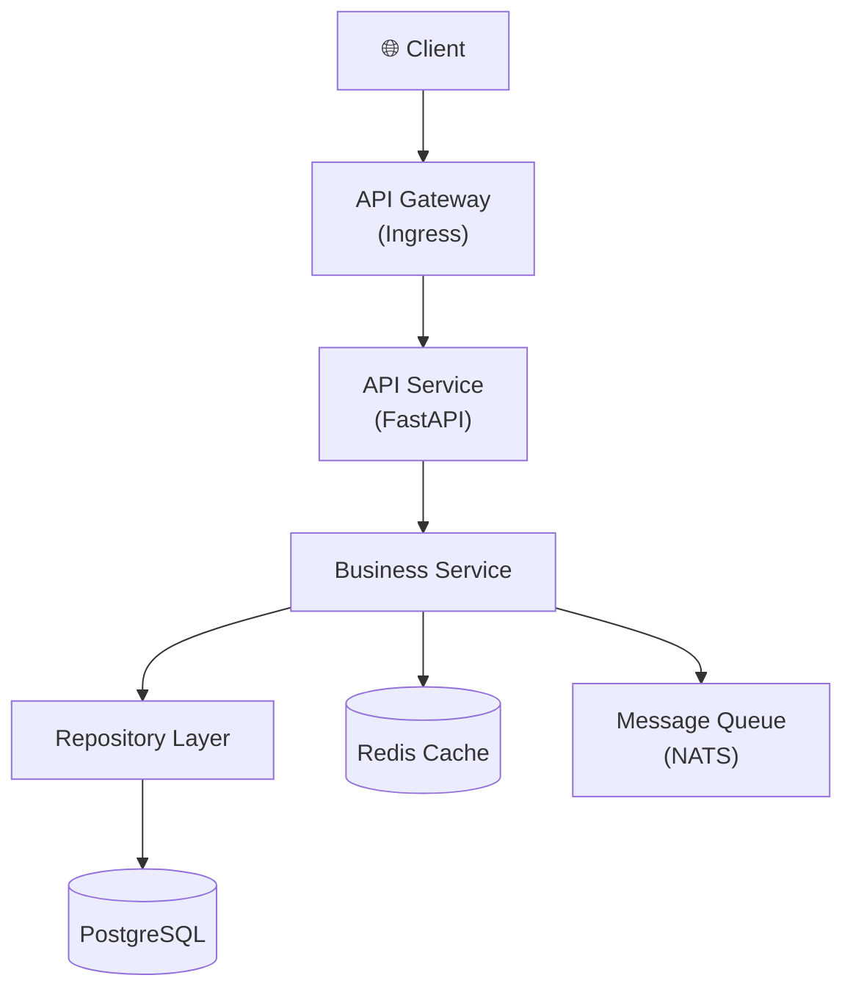
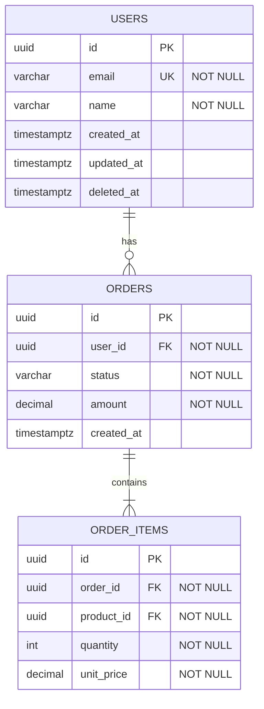

# MYDEVSOP AutoDev — 完整專案需求規格

> 版本：v2.4  
> 日期：2026-04-21  
> 狀態：已實作（31-STEP Pipeline）

---

## 1. 專案目標

將 MYDEVSOP 從「文件 Review 工具」升級為**全自動 AI 軟體開發流水線**。

使用者只需撰寫一份 BRD，執行一個指令，後續的文件生成、架構設計、程式開發、測試、基礎設施配置、**專業 HTML 文件網站**，全部由 AI 自動完成。

**目標使用者**：不會寫程式的人也能全程使用。

---

## 2. 完整流水線（31 STEP）

### 2.1 觸發

```
使用者撰寫 BRD（存放於 docs/BRD.md 或指定路徑）
         ↓
執行 /devsop-autodev
```

### 2.2 流水線各步驟

```
STEP 01  BRD Review Loop（獨立 Reviewer Agent，領域專家型別：Product Manager）
         ↓ [per-round commit + Step Summary]
STEP 02  語言/框架選型（AI 建議 + 使用者確認，5 秒自動）
         ↓ [commit + Step Summary]
STEP 03  自動生成 PRD（依 BRD）
         ↓ [commit + Step Summary]
STEP 04  PRD Review Loop（領域專家：Product Manager）
         ↓ [per-round commit + Step Summary]
STEP 05  自動生成 PDD（Client 設計文件，依 PRD + BRD，偵測 Client 類型）
         ↓ [commit + Step Summary]
STEP 06  PDD Review Loop（領域專家：UI Designer；client_type=none 自動跳過）
         ↓ [per-round commit + Step Summary]
STEP 07  自動生成 EDD（依 PRD + BRD，含架構圖 Mermaid）
         ↓ [commit + Step Summary]
STEP 08  EDD Review Loop（領域專家：Backend Architect）
         ↓ [per-round commit + Step Summary]
STEP 09  並行生成 ARCH / API / Schema（含 ER 圖、CREATE TABLE、使用案例 SQL）
         ↓ [各自 commit + Step Summary]
STEP 10  ARCH Review Loop（領域專家：Software Architect）
         ↓ [per-round commit + Step Summary]
STEP 11  API Review Loop（領域專家：API Tester）
         ↓ [per-round commit + Step Summary]
STEP 12  Schema Review Loop（含 SQL 效能審查；領域專家：Database Optimizer）
         ↓ [per-round commit + Step Summary]
STEP 13  自動生成所有 Mermaid 圖表（.md 格式，存放 docs/diagrams/）
         ↓ [commit + Step Summary]
STEP 14  自動生成 Test Plan（依 PRD + EDD + ARCH；含 RTM、測試金字塔、SLO 門檻）
         ↓ [commit + Step Summary]
STEP 15  自動生成 BDD Feature Files（Gherkin，依 PRD AC）
         ↓ [commit + Step Summary]
STEP 16  自動生成 Client BDD Feature Files（Playwright 等，依 PRD + PDD；client_type=none 跳過）
         ↓ [commit + Step Summary]
STEP 17  TDD 循環：RED → GREEN → Refactor（依 BDD，含 Gap Discovery）
         ↓ [commit + Step Summary]
STEP 18  Client TDD 骨架生成（依 Client BDD；client_type=none 跳過）
         ↓ [commit + Step Summary]
STEP 19  效能測試生成（依 EDD SCALE 設計；tests/performance/ + k6 腳本）
         ↓ [commit + Step Summary]
STEP 20  Code Review Loop（領域專家：Security Engineer；審查 src/ + tests/）
         ↓ [per-round commit + Step Summary]
STEP 21  Test Review Loop（領域專家：Model QA Specialist；覆蓋率 ≥80%）
         ↓ [per-round commit + Step Summary]
STEP 22  對齊掃描（align-check）：docs↔docs、docs↔code、code↔tests
         ↓ [commit + Step Summary]
STEP 23  RPA 自動化測試（Playwright；client_type=none 跳過）
         ↓ [commit + Step Summary]
STEP 24  Smoke Test Gate（通過/中止決策）
         ↓ [commit + Step Summary]
STEP 25  假測試稽核（Test Audit）：AST 靜態偵測 7 種假測試 Pattern
         ↓ [commit + Step Summary]
STEP 26  假實作稽核（Impl Audit）：AST 靜態偵測 5 種假實作 Pattern
         ↓ [commit + Step Summary]
STEP 27  生成 K8s 基礎設施（Dockerfile + manifests + HPA + Ingress + k6）
         ↓ [commit + Step Summary]
STEP 28  生成 CI/CD Pipeline（GitHub Actions，local k8s + GitHub Pages）
         ↓ [commit + Step Summary]
STEP 29  生成 Secrets 管理腳本（五層防護：setup/verify/rotate + .env.example）
         ↓ [commit + Step Summary]
STEP 30  生成 HTML 文件網站（docs/pages，文圖並茂，含 Mermaid 渲染）
         ↓ [commit + Step Summary]
STEP 31  GitHub Pages 設定 + git push + gh pr create
         ↓ [commit + Step Summary]
         ↓
      TOTAL SUMMARY
      🚀 PR Ready
```

---

## 3. Commit 與 Summary 規範

### 3.1 每個 STEP 結束時

```
1. git add（只加本 STEP 相關檔案）
2. git commit 格式：
   <type>(devsop)[STEP-NN]: <動作> — <簡述>

   type：
   docs   → 文件生成/修改
   feat   → 程式碼生成/修改
   test   → 測試生成/修改
   fix    → 安全修復
   refactor → 重構
   chore  → 基礎設施、CI/CD、Secrets 腳本
   style  → 風格

   範例：
   docs(devsop)[STEP-05]: gen - EDD 生成，含系統架構/資料流/部署 Mermaid 圖
   chore(devsop)[STEP-11]: diagrams - 自動生成 6 個 Mermaid .md 圖表檔
   docs(devsop)[STEP-19]: html - 生成 HTML 文件網站，7 頁含圖表

3. 輸出 Step Summary：

   ┌─────────────────────────────────────────┐
   │  STEP NN 完成：<步驟名稱>               │
   ├─────────────────────────────────────────┤
   │  Commit：<hash>                         │
   │  修改/新增檔案：                         │
   │    + docs/EDD.md（新增，1200 字）       │
   │    + docs/diagrams/system-arch.md       │
   │  本步驟重點：                            │
   │    - 系統架構圖（Mermaid TD）           │
   │    - 資料流圖                           │
   └─────────────────────────────────────────┘
```

### 3.2 TOTAL SUMMARY（全部步驟完成後）

```
╔══════════════════════════════════════════════════════╗
║           MYDEVSOP AutoDev — TOTAL SUMMARY           ║
╠══════════════════════════════════════════════════════╣
║  專案名稱：<來自 BRD 標題>                            ║
║  執行時間：開始 HH:MM → 結束 HH:MM                   ║
║  語言/框架：<AI 選型結果>                             ║
║  文件網站：https://<user>.github.io/<repo>/          ║
╠══════════════════════════════════════════════════════╣
║  步驟執行結果：                                       ║
║    STEP 01  BRD Review      ✅ 3 輪，fixed=5 todo=0   ║
║    STEP 02  語言選型        ✅ Python FastAPI + pytest ║
║    STEP 03  生成 PRD        ✅ 8 User Stories         ║
║    STEP 04  PRD Review      ✅ 2 輪，fixed=3 todo=0   ║
║    STEP 05  生成 PDD        ✅ Web SaaS UI/UX 設計    ║
║    STEP 06  PDD Review      ✅ 2 輪，fixed=2 todo=0   ║
║    STEP 07  生成 EDD        ✅ 含 4 個架構圖（Mermaid）║
║    STEP 08  EDD Review      ✅ 2 輪，fixed=4 todo=0   ║
║    STEP 09  生成文件        ✅ ARCH / API / Schema     ║
║    STEP 10  ARCH Review     ✅ 1 輪，fixed=2 todo=0   ║
║    STEP 11  API Review      ✅ 2 輪，fixed=3 todo=0   ║
║    STEP 12  Schema Review   ✅ 含 SQL 效能審查，0 issues║
║    STEP 13  Mermaid 圖表    ✅ 8 個圖表 .md 生成      ║
║    STEP 14  Test Plan       ✅ RTM 覆蓋 100% AC       ║
║    STEP 15  生成 BDD        ✅ 24 個 Scenario         ║
║    STEP 16  Client BDD      ✅ 18 個 Scenario         ║
║    STEP 17  TDD 循環        ✅ 58 tests pass          ║
║    STEP 18  Client TDD      ✅ 骨架已生成             ║
║    STEP 19  效能測試        ✅ k6 腳本已生成           ║
║    STEP 20  Code Review     ✅ 2 輪，fixed=6 todo=0   ║
║    STEP 21  Test Review     ✅ 覆蓋率 87%             ║
║    STEP 22  對齊掃描        ✅ 對齊率 100%             ║
║    STEP 23  RPA 測試        ✅ Playwright 截圖通過     ║
║    STEP 24  Smoke Gate      ✅ 所有 Smoke Tests 通過  ║
║    STEP 25  Test Audit      ✅ 無假測試               ║
║    STEP 26  Impl Audit      ✅ 無假實作               ║
║    STEP 27  K8s 基礎設施   ✅ Dockerfile + manifests ║
║    STEP 28  CI/CD Pipeline  ✅ GitHub Actions         ║
║    STEP 29  Secrets 腳本   ✅ 五層防護               ║
║    STEP 30  HTML 文件       ✅ 9 頁，含所有圖表        ║
║    STEP 31  GitHub Pages    ✅ PR 已建立 🚀            ║
╠══════════════════════════════════════════════════════╣
║  全部 Commits（時序）：                               ║
║    abc1234  docs(devsop)[STEP-01]: review - ...      ║
║    ...                                               ║
╠══════════════════════════════════════════════════════╣
║  剩餘未解問題（若有）：                               ║
║    🔁 stubborn: [描述]（需人工確認）                  ║
║    📌 TODO[REVIEW-DEFERRED]: [描述]（已標記延後）     ║
╠══════════════════════════════════════════════════════╣
║  文件網站：https://<user>.github.io/<repo>/          ║
║  專案結構：docs/ src/ tests/ features/ k8s/ ...      ║
║  下一步：git push → 自動觸發 CI/CD + GitHub Pages    ║
╚══════════════════════════════════════════════════════╝
```

---

## 4. 語言與框架選型（STEP 02）

### 4.1 選型互動流程

1. AI 分析 BRD，判斷最佳 stack
2. `AskUserQuestion` with options：
   - 第一個：**AI 推薦**（標示「預設」）
   - 後續 2～3 個：其他適合選項，各附優缺點
   - 最後一個：「其他（自行輸入）」
3. **5 秒內光棒未移動 → 自動選預設**

### 4.2 選單格式範例

```
AI 分析 BRD 後推薦：

▶ Python + FastAPI + pytest（預設，5 秒無操作自動選此項）
  優點：開發速度快、生態豐富、AI/ML 友善、pydantic 型別安全
  缺點：GIL 限制 CPU-bound 高並發（I/O-bound 仍適用）

  Go + Gin + testify
  優點：原生高並發、編譯型效能、單一 binary 部署
  缺點：框架生態較小、泛型尚在成熟中

  Node.js + TypeScript + Fastify + Jest
  優點：前後端統一語言、async 天然支援、npm 生態最大
  缺點：需要嚴格 tsconfig 才能確保型別安全

  其他（自行輸入語言/框架）
```

### 4.3 AI 選型參考基準

| 系統性質 | 預設推薦 | BDD 工具 | 測試框架 |
|---------|---------|---------|---------|
| Web API / 後端 | Python FastAPI | Behave / pytest-bdd | pytest |
| 高吞吐量 / 高並發 | Go + Gin | Godog | go test |
| 資料密集 | Python + Polars | pytest-bdd | pytest |
| 企業級 | Java Spring Boot | Cucumber-Java | JUnit 5 |
| 前端 | TypeScript + Next.js | Playwright BDD | Vitest |
| 全端 | TypeScript + Next.js + tRPC | Playwright BDD | Vitest + Playwright |

---

## 5. EDD 必須涵蓋的內容（STEP 07）

### 5.1 Clean Code 架構

- SOLID 原則明確對應到每個模組
- 分層設計：Controller / Service / Repository
- 依賴注入（DI）
- 每個 public interface 有明確的責任邊界

### 5.2 Security 設計

- OWASP Top 10 逐條對應
- 認證/授權方案（JWT / OAuth2 / API Key）
- 輸入驗證（schema validation、sanitize）
- Secret 管理（對應第 9 節）
- HTTP 回應大小限制（防 OOM）
- 物件 repr/str 遮罩

### 5.3 BDD 設計

- 依 PRD 每個 AC 拆解出 Gherkin Scenario
- Given / When / Then 結構完整
- Scenario Outline 用於多組輸入

### 5.4 TDD 設計

- 測試金字塔：Unit 60% / Integration 30% / E2E 10%
- Mock 邊界明確：只 mock 外部 I/O
- **GREEN 保證原則**（見 §7）

### 5.5 SCALE 設計

- 依 BRD 推算 QPS、並發數、資料量/日
- HPA 規則（min/max replicas、CPU/Memory trigger）
- 無狀態設計，Load Test 門檻定義

### 5.6 CI/CD 設計

- GitHub Actions（local k8s + GitHub Pages）
- Pipeline：lint → test → build → deploy k8s → load test → build docs → deploy pages

### 5.7 EDD 架構圖（Mermaid 格式）

EDD 中所有架構圖必須以 **Mermaid** 撰寫，並遵守以下規範：

**方向規範**：一律使用 `TD`（Top-Down，由上往下）→ 產出**長大於寬**的圖，方便垂直閱讀

必要圖表（最少 4 張，依實際系統可增加）：

| 圖表名稱 | Mermaid 類型 | 說明 |
|---------|------------|------|
| 系統架構圖 | `graph TD` | 服務元件與依賴關係 |
| 資料流圖 | `sequenceDiagram` | 主要請求的完整流程 |
| 部署架構圖 | `graph TD` | k8s pods、services、ingress |
| 狀態機圖（若有） | `stateDiagram-v2` | 業務狀態流轉 |

**EDD Mermaid 範例（系統架構）：**



---

## 6. Schema 文件規範（STEP 09/12）

Schema 文件（`docs/SCHEMA.md`）必須包含以下三個部分：

### 6.1 ER 圖（Mermaid erDiagram）

使用 Mermaid `erDiagram` 語法，**由上往下排列**（主表在上，關聯表往下展開）：



### 6.2 資料表說明文件

每張資料表包含：

```markdown
### `table_name` — 說明這張表的業務用途

| 欄位 | 型別 | Nullable | 預設值 | 說明 |
|------|------|---------|--------|------|
| id | UUID | NO | gen_random_uuid() | 主鍵 |
| user_id | UUID | NO | — | 關聯 users(id)，ON DELETE CASCADE |
| status | VARCHAR(50) | NO | 'active' | CHECK: active/inactive/deleted |
| created_at | TIMESTAMPTZ | NO | NOW() | 建立時間（UTC）|
| deleted_at | TIMESTAMPTZ | YES | NULL | 軟刪除時間戳 |

**索引：**
- `idx_table_user_id`：`(user_id)` WHERE deleted_at IS NULL
- `idx_table_status`：`(status, created_at DESC)`

**注意事項：**
- `status` 欄位使用 CHECK constraint，禁止 application-level 驗證代替 DB constraint
- 敏感欄位：`email` 需加密儲存（AES-256）
```

### 6.3 CREATE TABLE SQL

每張表提供完整的標準 SQL：

```sql
-- ============================================================
-- Table: users
-- Purpose: 系統使用者基本資料
-- ============================================================
CREATE TABLE users (
    id              UUID PRIMARY KEY DEFAULT gen_random_uuid(),
    email           VARCHAR(255)  NOT NULL,
    name            VARCHAR(100)  NOT NULL,
    password_hash   VARCHAR(255),                    -- bcrypt hash，非明文
    status          VARCHAR(20)   NOT NULL DEFAULT 'active'
                    CHECK (status IN ('active', 'inactive', 'suspended')),
    created_at      TIMESTAMPTZ   NOT NULL DEFAULT NOW(),
    updated_at      TIMESTAMPTZ   NOT NULL DEFAULT NOW(),
    deleted_at      TIMESTAMPTZ
);

-- Indexes
CREATE UNIQUE INDEX idx_users_email
    ON users (LOWER(email))
    WHERE deleted_at IS NULL;

CREATE INDEX idx_users_status_created
    ON users (status, created_at DESC)
    WHERE deleted_at IS NULL;

-- Trigger: auto-update updated_at
CREATE OR REPLACE FUNCTION update_updated_at()
RETURNS TRIGGER AS $$
BEGIN
    NEW.updated_at = NOW();
    RETURN NEW;
END;
$$ LANGUAGE plpgsql;

CREATE TRIGGER trg_users_updated_at
    BEFORE UPDATE ON users
    FOR EACH ROW EXECUTE FUNCTION update_updated_at();
```

---

## 7. Schema Review 強化（STEP 12）

Schema Review 除原有設計審查外，**必須**加入 SQL 效能審查：

### 7.1 使用案例 SQL 效能審查

依 PRD 的使用情境，撰寫代表性的使用案例 SQL，並以 subagent 審查是否有**資料量增大後的效能問題**：

**使用案例 SQL 範例：**

```sql
-- Use Case 1: 分頁查詢使用者訂單（高頻查詢）
SELECT o.id, o.status, o.amount, o.created_at
FROM orders o
WHERE o.user_id = $1
  AND o.deleted_at IS NULL
ORDER BY o.created_at DESC
LIMIT 20 OFFSET $2;

-- Use Case 2: 統計各狀態訂單數（Dashboard）
SELECT status, COUNT(*) as count, SUM(amount) as total
FROM orders
WHERE created_at >= $1 AND created_at < $2
GROUP BY status;

-- Use Case 3: 跨表查詢（JOIN）
SELECT u.name, u.email, COUNT(o.id) as order_count
FROM users u
LEFT JOIN orders o ON o.user_id = u.id AND o.deleted_at IS NULL
WHERE u.status = 'active'
GROUP BY u.id, u.name, u.email
ORDER BY order_count DESC
LIMIT 100;
```

### 7.2 SQL 效能審查 Checklist

subagent 針對每個使用案例 SQL 審查：

| 審查項目 | 說明 |
|---------|------|
| **Full Table Scan 風險** | WHERE 條件是否有對應索引？OFFSET 分頁是否會在大資料量時拖垮效能？ |
| **JOIN 效能** | JOIN 欄位是否有索引？多層 JOIN 是否有替代方案？ |
| **N+1 Query 風險** | ORM 使用模式是否暗示 N+1？ |
| **GROUP BY / COUNT 效能** | 大量 GROUP BY 是否需要 Materialized View 或預聚合？ |
| **OFFSET 分頁問題** | 高頁碼 OFFSET 效能差，建議改 Cursor-based 分頁 |
| **索引覆蓋率** | 高頻 SELECT 是否能由 Covering Index 完整服務？ |
| **統計查詢** | 即時 COUNT(*)、SUM() 是否需要改為 Approximate Count 或快取？ |

### 7.3 Schema Review 輸出格式

```
--- Schema Review Round N ---

設計審查：[P1/P2/P3] 問題 ...
SQL 效能審查：
  Use Case 1（分頁查詢）：
    ⚠️ [P2] OFFSET 分頁在資料超過 10 萬筆後效能劣化
       建議：改用 Cursor-based 分頁（WHERE created_at < $cursor）
  Use Case 2（統計查詢）：
    ❗ [P1] GROUP BY + SUM 無索引輔助，百萬資料時全表掃描
       建議：增加 (status, created_at) 複合索引，或使用 Materialized View
  Use Case 3（JOIN 查詢）：
    ✅ 已有適當索引，EXPLAIN 預估使用 Index Scan

FINDINGS_COUNT: 3
```

---

## 8. Mermaid 圖表自動生成（STEP 13）

### 8.1 圖表清單

依各文件自動產生對應的 Mermaid `.md` 圖表檔，存放於 `docs/diagrams/`：

| 檔案 | 來源文件 | 圖表類型 | 說明 |
|------|---------|---------|------|
| `system-context.md` | EDD | `graph TD` | 系統邊界與外部服務 |
| `system-arch.md` | EDD / ARCH | `graph TD` | 服務元件與依賴 |
| `data-flow.md` | EDD | `sequenceDiagram` | 主要請求流程 |
| `deployment.md` | EDD / k8s | `graph TD` | k8s 部署架構 |
| `er-diagram.md` | Schema | `erDiagram` | 資料庫 ER 圖 |
| `cicd-pipeline.md` | CI/CD | `graph TD` | CI/CD 流水線 |
| `state-machine.md` | EDD（若有狀態機）| `stateDiagram-v2` | 業務狀態流轉 |
| `api-flow.md` | API | `sequenceDiagram` | API 呼叫序列圖 |

### 8.2 圖表 .md 格式規範

每個圖表 `.md` 檔格式：

```markdown
---
diagram: system-arch
source: EDD.md
generated: 2026-04-18T10:00:00Z
direction: TD
---

# 系統架構圖

> 自動生成自 EDD §2 — 系統架構

\`\`\`mermaid
graph TD
    ...（Mermaid 語法，TD 方向）...
\`\`\`
```

### 8.3 方向規範（必須遵守）

- **所有架構圖**：`graph TD`（Top-Down，長大於寬）
- **序列圖**：`sequenceDiagram`（預設左右展開，符合時序閱讀習慣，為唯一例外）
- **ER 圖**：`erDiagram`（主表在上，外鍵表向下展開）
- **狀態機**：`stateDiagram-v2`（預設由上往下）
- **禁止使用** `LR`（Left-Right）方向，避免圖寬超出螢幕

---

## 9. HTML 文件網站（STEP 30）

### 9.1 架構

- 每個 MD 文件對應一個 HTML 頁面，一對一映射
- Mermaid 圖表在 HTML 中**直接渲染**（使用 `mermaid.js`）
- 專業設計，文圖並茂，非模板感

### 9.2 文件對應關係

| Markdown | HTML 輸出 | 說明 |
|---------|----------|------|
| `docs/BRD.md` | `pages/brd.html` | 產品設計文件 |
| `docs/PRD.md` | `pages/prd.html` | 產品需求文件 |
| `docs/EDD.md` | `pages/edd.html` | 工程設計文件（含所有架構圖）|
| `docs/ARCH.md` | `pages/arch.html` | 架構設計文件 |
| `docs/API.md` | `pages/api.html` | API 文件（含互動範例）|
| `docs/SCHEMA.md` | `pages/schema.html` | Schema 文件（含 ER 圖、表格說明、SQL）|
| `docs/diagrams/*.md` | 嵌入各頁面 | Mermaid 圖表（不單獨成頁）|
| `features/*.feature` | `pages/bdd.html` | BDD Scenario 列表 |
| `README.md` | `pages/index.html` | 首頁（含導覽）|

### 9.3 HTML 設計規格

**必達的設計品質（至少符合 4 項）：**

- 清晰的層次結構（標題對比、section 分隔）
- 左側固定導覽欄（Sidebar），可展開各文件章節
- Syntax highlighting（程式碼區塊）
- 深色/淺色模式切換（Dark/Light Mode Toggle）
- Mermaid 圖表點擊可放大（Lightbox）
- 響應式設計（RWD），手機/平板/桌面均可閱讀
- 搜尋功能（Client-side，不需後端）

**禁止：**
- Generic Bootstrap / Tailwind 模板感
- 灰底白字的無聊預設樣式
- 圖表無法在頁面內直接看到（不能只有連結）

### 9.4 Mermaid 在 HTML 的渲染規範

```html
<!-- 每個 HTML 頁面引入 mermaid.js -->
<script type="module">
  import mermaid from 'https://cdn.jsdelivr.net/npm/mermaid@11/dist/mermaid.esm.min.mjs';
  mermaid.initialize({
    startOnLoad: true,
    theme: 'default',       // 或 'dark'（配合頁面主題）
    flowchart: { curve: 'basis' },
    er: { layoutDirection: 'TD', minEntityWidth: 100 }
  });
</script>

<!-- Mermaid 圖表區塊 -->
<div class="diagram-container">
  <pre class="mermaid">
    graph TD
      ...
  </pre>
</div>
```

### 9.5 生成工具

AI 使用以下任一方式生成 HTML（依語言選型決定）：

| 語言 | 工具選項 |
|------|---------|
| Python | `mkdocs` + Material theme / 自定義 Jinja2 template |
| Node.js | `vitepress` / `docusaurus` / 自定義 Vite |
| 任何語言 | 純 HTML+CSS+JS（無框架依賴，最輕量）|

> **原則**：優先選最輕量、無額外運行時依賴的方式。若 MD 內容單純，直接生成靜態 HTML 即可，不需要 SSG 框架。

---

## 10. GitHub Pages 部署（STEP 31）

### 10.1 目標

- `git push origin main` → 自動觸發 GitHub Actions → 自動部署至 GitHub Pages
- 部署完成後：`https://<user>.github.io/<repo>/`

### 10.2 GitHub Actions 工作流程（docs 部署）

```yaml
# .github/workflows/docs.yml（自動生成）
name: Deploy Docs to GitHub Pages

on:
  push:
    branches: [main]
    paths:
      - 'docs/**'
      - 'docs/diagrams/**'
      - 'features/**'
      - 'pages/**'

permissions:
  contents: read
  pages: write
  id-token: write

jobs:
  build-docs:
    runs-on: ubuntu-latest
    steps:
      - uses: actions/checkout@v4
      - name: Generate HTML from MD
        run: <依語言選型決定的建構指令>
      - name: Upload Pages artifact
        uses: actions/upload-pages-artifact@v3
        with:
          path: pages/

  deploy:
    needs: build-docs
    runs-on: ubuntu-latest
    environment:
      name: github-pages
      url: ${{ steps.deployment.outputs.page_url }}
    steps:
      - name: Deploy to GitHub Pages
        id: deployment
        uses: actions/deploy-pages@v4
```

### 10.3 與 CI Pipeline 的整合（完整 .github/workflows/ci.yml）

```
push to main / PR 觸發：
  job: lint         → 程式碼風格
  job: test         → Unit + Integration（含 coverage 報告）
  job: build-image  → docker build
  job: deploy-k8s   → kubectl apply（Rancher Desktop local）
  job: load-test    → k6（通過 EDD 門檻）
  job: build-docs   → 生成 HTML 文件
  job: deploy-pages → GitHub Pages（僅 push to main）
```

### 10.4 首次設定步驟（自動生成到 README）

```bash
# GitHub Pages 一次性設定（由使用者在 GitHub 上操作）
# 1. Repo Settings → Pages → Source: GitHub Actions
# 2. 第一次 push 後即自動部署

# 本機驗證（Rancher Desktop）
kubectl port-forward svc/<app>-service 8080:80
open http://localhost:8080

# 查看 GitHub Pages 網址
gh api repos/:owner/:repo/pages --jq '.html_url'
```

---

## 11. TDD GREEN 保證機制（STEP 17）

**原則：GREEN 是必達目標，無法 GREEN 表示 EDD 有問題，需回頭修正。**

### 11.1 無法 GREEN 時的處理流程

```
連續 2 輪 Refactor 後仍 RED
         ↓
診斷根本原因：
  A. 測試本身寫錯    → 修正測試
  B. 實作邏輯有誤    → 修正實作
  C. EDD 設計不可行  → 進入 EDD 修正流程
         ↓（若 C）
  標記 [EDD-ISSUE]，輸出問題報告
  → 回到 STEP 07（修正 EDD）
  → EDD Review 重跑
  → 重新生成受影響的 BDD / TDD
  → 再次嘗試 GREEN
```

### 11.2 迴圈保護

- 同一問題最多回頭修正 EDD 2 次
- 第 3 次仍無法 GREEN → [STUBBORN-EDD]，列入 TOTAL SUMMARY，請使用者人工介入

---

## 12. 基礎設施（k8s on Rancher Desktop）

### 12.1 適用平台

- **macOS / Windows**：Rancher Desktop（k3s + nerdctl）
- 指令相容：`kubectl`、`helm`

### 12.2 自動生成的基礎設施檔案

```
<project>/
├── Dockerfile                    # multi-stage build，distroless runtime
├── .dockerignore
└── k8s/
    ├── namespace.yaml
    ├── deployment.yaml           # replicas / resources / liveness + readiness probes
    ├── service.yaml
    ├── configmap.yaml            # 非敏感設定
    ├── hpa.yaml                  # 依 EDD SCALE 設計
    ├── ingress.yaml              # Traefik（Rancher Desktop 內建）
    └── README.md                 # 本地啟動步驟
```

---

## 13. Secrets 管理（零洩漏設計）

**核心原則：KEY 絕對不能寫入任何檔案，連機會都不能有。**

### 13.1 儲存位置

| 平台 | 儲存位置 | 一次性設定 |
|------|---------|-----------|
| **macOS** | macOS Keychain | `security add-generic-password -s <app> -a <KEY_NAME> -w "<value>"` |
| **Windows** | Windows Credential Manager | `cmdkey /add:<app>_<KEY_NAME> /user:<KEY_NAME> /pass:"<value>"` |

> Windows 前提：`Install-Module -Name CredentialManager -Scope CurrentUser`

### 13.2 執行時取出（env var 優先，fallback OS Keystore）

**macOS：**
```bash
if [ -z "${API_KEY:-}" ]; then
  API_KEY=$(security find-generic-password -s <app> -a API_KEY -w 2>/dev/null || true)
fi
[ -z "${API_KEY:-}" ] && { echo "請執行 scripts/setup_secrets.sh"; exit 1; }
```

**Windows：**
```powershell
$env:API_KEY = (Get-StoredCredential -Target "<app>_API_KEY").Password
if (-not $env:API_KEY) { Write-Error "請執行 scripts/setup_secrets.ps1"; exit 1 }
```

### 13.3 五層防護

| 層次 | 機制 |
|-----|------|
| 1 | `.gitignore`：`.env`、`.env.*`、`k8s/secret.yaml` 全 ignore |
| 2 | **pre-commit hook（gitleaks）**：偵測 secret pattern → 強制中斷 commit |
| 3 | `.env.example`：只含佔位符，禁止填真實值 |
| 4 | 程式啟動 fail-fast：缺少 KEY → exit(1) + 顯示 setup 步驟 |
| 5 | Log 遮罩：前 4 + 後 2 字元（`abcd...xy`），物件覆寫 repr/str |

### 13.4 自動生成腳本

| 檔案 | 用途 |
|------|------|
| `scripts/setup_secrets.sh` | macOS：互動式設定所有 KEY 進 Keychain |
| `scripts/setup_secrets.ps1` | Windows：設定 Credential Manager |
| `scripts/verify_secrets.sh` | 驗證 KEY 已設定（不顯示值）|
| `scripts/verify_secrets.ps1` | 同上 |
| `scripts/setup_k8s_secrets.sh` | 從 OS Keystore 建立 k8s Secret 物件 |

---

## 14. 「不幻想」原則（Anti-Fake）

| 禁止 | 要求 |
|------|------|
| `return mock_data` 在 non-test 路徑 | production code 打真實依賴 |
| Integration test 用假回應通過 | testcontainers 或真實 endpoint |
| `assert True` 等無意義斷言 | 斷言必須因錯誤實作而 FAIL |
| 覆蓋率灌水 | 測試驗證業務行為，非執行到即可 |
| repr/str 暴露 KEY | 覆寫 repr/str，遮罩敏感欄位 |

---

## 15. 互動模式

- **預設 AUTO**：5 秒無回應自動繼續（第一個選項 = 預設）
- 使用者可隨時手動執行各 skill
- 暫停後重新執行 `/devsop-autodev` → 偵測已有 STEP commits → 從中斷處繼續

---

## 16. Skills 清單（完整）

### 16.1 Skills 完整清單

**主要入口 Skills（7 個）**

| Skill | 指令 | 功能 |
|-------|------|------|
| AutoDev Orchestrator | `/devsop-autodev` | 主流水線，31 個 STEP |
| 概念需求入口 | `/devsop-idea` | 模糊構想 → BRD + IDEA.md，自動銜接 autodev |
| 變更管理 | `/devsop-change` | 分析影響範圍，只重跑受影響的 STEP |
| 健康修復 | `/devsop-repair` | 診斷中斷的 pipeline，從斷點繼續 |
| 快速體驗 | `/devsop-demo` | 3 分鐘快速看到效果 |
| 專案狀態 | `/devsop-project-status` | 健康儀表板，輸出 PROJECT_STATUS.md |
| 工具更新 | `/devsop-update` | 檢查並自動更新 MYDEVSOP |

**生成 Skills（17 個）**

| Skill | 指令 | 功能 |
|-------|------|------|
| 生成 BRD | `/devsop-gen-brd` | 依 IDEA.md 產出完整 BRD |
| 生成 PRD | `/devsop-gen-prd` | 依 BRD 產出 PRD |
| 生成 PDD | `/devsop-gen-pdd` | 依 PRD + BRD，偵測 Client 類型，產出 PDD |
| 生成 EDD | `/devsop-gen-edd` | 依 PRD 產出 EDD（含 Mermaid 架構圖）|
| 生成 ARCH | `/devsop-gen-arch` | 依 EDD 產出 ARCH |
| 生成 API | `/devsop-gen-api` | 依 EDD 產出 API 文件 |
| 生成 Schema | `/devsop-gen-schema` | 依 EDD 產出 Schema（ER圖 + 表說明 + SQL）|
| 生成 Mermaid 圖表 | `/devsop-gen-diagrams` | 自動生成所有 diagrams/*.md |
| 生成 Test Plan | `/devsop-gen-test-plan` | 依 PRD + EDD + ARCH 產出 test-plan.md（含 RTM）|
| 生成 BDD | `/devsop-gen-bdd` | 從 PRD AC 產出 Gherkin Feature Files |
| 生成 Client BDD | `/devsop-gen-client-bdd` | 依 PRD + PDD 產出前端 BDD Feature Files |
| 生成 Client TDD | `/devsop-gen-client-tdd` | 依 Client BDD 產出前端測試骨架 |
| TDD 循環 | `/devsop-tdd-cycle` | RED → GREEN → Refactor（含 Gap Discovery）|
| 生成 K8s | `/devsop-gen-k8s` | Dockerfile + K8s manifests + k6 + LOCAL_DEPLOY |
| 生成 CI/CD | `/devsop-gen-cicd` | GitHub Actions（CI + Pages 部署）|
| 生成 Secrets | `/devsop-gen-secrets` | setup/verify/rotate 腳本 + .env.example（五層防護）|
| 生成 HTML 文件 | `/devsop-gen-html` | MD → HTML 文件網站（含 README 生成 + Mermaid 渲染）|

**Review Skills（9 個）**

| Skill | 指令 | REVIEW_STEP_CONFIG 位置 | 領域專家 subagent_type |
|-------|------|------------------------|----------------------|
| BRD 審查 | `/devsop-brd-review` | STEP 01 | Product Manager |
| PRD 審查 | `/devsop-prd-review` | STEP 04 | Product Manager |
| PDD 審查 | `/devsop-pdd-review` | STEP 06 | UI Designer |
| EDD 審查 | `/devsop-edd-review` | STEP 08 | Backend Architect |
| ARCH 審查 | `/devsop-arch-review` | STEP 10 | Software Architect |
| API 審查 | `/devsop-api-review` | STEP 11 | API Tester |
| Schema 審查 | `/devsop-schema-review` | STEP 12 | Database Optimizer |
| Code 審查 | `/devsop-code-review` | STEP 20 | Security Engineer |
| Test 審查 | `/devsop-test-review` | STEP 21 | Model QA Specialist |

**工具 Skills（9 個）**

| Skill | 指令 | 觸發時機 |
|-------|------|---------|
| 語言選型 | `/devsop-lang-select` | STEP 02 |
| 對齊掃描 | `/devsop-align-check` | STEP 22 |
| 對齊修復 | `/devsop-align-fix` | 手動 |
| 對齊報告 | `/devsop-align-report` | 手動 |
| RPA 測試 | `/devsop-rpa-test` | STEP 23 |
| 品質急救 | `/devsop-quality-loop` | 手動（非 pipeline）|
| 產品審查 | `/devsop-product-review` | 手動（非 pipeline）|
| Session 設定 | `/devsop-config` | 手動，可覆蓋執行模式與策略 |

**稽核 Skills（2 個）**

| Skill | 指令 | 觸發時機 |
|-------|------|---------|
| 假測試稽核 | `/devsop-test-audit` | STEP 25 |
| 假實作稽核 | `/devsop-impl-audit` | STEP 26 |


---

## 17. 生成的專案最終結構

```
<project-name>/
├── docs/
│   ├── BRD.md
│   ├── PRD.md
│   ├── EDD.md                  # 含內嵌 Mermaid 架構圖
│   ├── ARCH.md
│   ├── API.md
│   └── SCHEMA.md               # 含 ER圖 + 表說明 + CREATE TABLE SQL
├── docs/diagrams/              # STEP 11：自動生成的 Mermaid .md 圖表
│   ├── system-context.md
│   ├── system-arch.md
│   ├── data-flow.md
│   ├── deployment.md
│   ├── er-diagram.md
│   ├── cicd-pipeline.md
│   ├── state-machine.md        # 若有狀態機
│   └── api-flow.md
├── pages/                      # STEP 19：HTML 文件網站
│   ├── index.html              # 首頁（導覽）
│   ├── brd.html
│   ├── prd.html
│   ├── edd.html                # 含所有架構圖（Mermaid 渲染）
│   ├── arch.html
│   ├── api.html
│   ├── schema.html             # 含 ER 圖、表格說明、CREATE TABLE
│   ├── bdd.html
│   ├── assets/
│   │   ├── style.css           # 自定義專業樣式
│   │   └── app.js              # 搜尋、Dark mode、Lightbox
│   └── _config.yml             # GitHub Pages 設定
├── features/                   # BDD feature files
│   └── *.feature
├── src/                        # 實作程式碼
├── tests/
│   ├── unit/
│   ├── integration/
│   └── e2e/
├── k8s/
│   ├── namespace.yaml
│   ├── deployment.yaml
│   ├── service.yaml
│   ├── configmap.yaml
│   ├── hpa.yaml
│   └── ingress.yaml
├── .github/
│   └── workflows/
│       ├── ci.yml              # lint + test + build + deploy k8s + load test
│       └── docs.yml            # build HTML docs + deploy GitHub Pages
├── scripts/
│   ├── load_test.js
│   ├── run_load_test.sh
│   ├── run_load_test.ps1
│   ├── setup_secrets.sh
│   ├── setup_secrets.ps1
│   ├── verify_secrets.sh
│   ├── verify_secrets.ps1
│   └── setup_k8s_secrets.sh
├── Dockerfile
├── .dockerignore
├── .env.example
├── .gitignore
├── .pre-commit-config.yaml     # gitleaks
└── README.md                   # 快速開始（第一步：setup_secrets）
```

---

## 18. 已關閉的 Open Questions

| # | 問題 | 決定 |
|---|------|------|
| 1 | 使用者想換語言？ | ✅ 選單含 AI 推薦 + 其他選項（優缺點）+ 自行輸入，5秒自動選預設 |
| 2 | TDD 無法 GREEN？ | ✅ 回頭修 EDD（最多 2 次），第 3 次 → [STUBBORN-EDD] 人工介入 |
| 3 | CI/CD？ | ✅ GitHub Actions：CI pipeline + GitHub Pages 自動部署 |
| 4 | 多人協作？ | ✅ 目前個人專案，後續有需求再設計 |

---

## 19. `/devsop-idea` — 概念需求入口

### 19.1 目的

使用者只需口述一個模糊的概念性需求，skill 自動完成：
專案目錄建立 → 澄清問題 → 網路研究 → BRD 生成 → 啟動 autodev。

### 19.2 技術規格

- **Skill 名稱**：`/devsop-idea`
- **allowed-tools**：`Read`, `Write`, `Bash`, `WebSearch`, `AskUserQuestion`
- **觸發方式**：使用者說「我有個想法...」「幫我建一個 xxx 系統」等概念描述

### 19.3 八步驟流程

#### STEP 1：偵測專案目錄偏好

```bash
# 偵測慣用目錄
git config --global core.repositoryformatversion 2>/dev/null  # 檢查 gitconfig
ls ~/projects/ 2>/dev/null | head -20  # 掃描 ~/projects/
```

- 分析使用者慣用根目錄（~/projects/ / ~/workspace/ / ~/code/ 等）
- 若無法判斷，預設 `~/projects/<project-name>/`
- 使用 `AskUserQuestion` tool，**5 秒不回應自動選第一選項**：

```
question: "專案將建立在哪裡？（5 秒後自動選預設）"
options:
  - "~/projects/<project-name>/（自動偵測預設）"
  - "~/projects/<project-name>/（官方預設）"
  - "手動指定路徑"
```

#### STEP 2：釐清需求（互動式提問）

- 針對使用者描述，AI 自行推斷 2-3 個最關鍵的澄清問題
- **每個問題各自用 `AskUserQuestion` tool 詢問**，帶 AI 推薦選項 + 「其他（自行輸入）」
- 5 秒不回應自動選第一選項（AI 推薦預設）

**典型問題範例**：

```
Q1: "主要使用者是誰？"
options:
  - "內部營運人員（預設）"
  - "一般消費者"
  - "企業 B2B 客戶"
  - "其他（自行輸入）"

Q2: "核心痛點是什麼？"
options:
  - "流程太慢，需要自動化（預設）"
  - "資料分散，需要整合"
  - "缺少可視化報表"
  - "其他（自行輸入）"

Q3: "技術限制或偏好？"
options:
  - "無特殊限制，讓 AI 建議（預設）"
  - "必須用 Python"
  - "必須整合現有系統（請說明）"
  - "其他（自行輸入）"
```

#### STEP 3：網路背景研究

使用 `WebSearch` tool 搜尋：
1. 類似工具/競品（`{需求關鍵字} open source github`）
2. 技術可行性（`{核心技術} best practices 2024`）
3. 已知問題/坑（`{需求關鍵字} pitfalls challenges`）

研究結果整理成：
- 競品列表（含 GitHub star 數）
- 技術選型建議
- 已知風險清單

#### STEP 4：建立專案目錄

```bash
mkdir -p <project-dir>/docs
cd <project-dir>
git init
git add .gitkeep
git commit -m "chore: init project"
```

#### STEP 5：生成 BRD.md

使用 MYDEVSOP template（`$_REPO/templates/BRD.md`），填入：
- §0 背景研究（STEP 3 的研究結果）
- §1 產品目標（從 STEP 2 澄清問題推導）
- §2 使用者（STEP 2 Q1 結果）
- §3 核心功能（AI 根據需求描述推導 P0/P1/P2）
- §4 限制與約束（STEP 2 Q3 結果）
- §5 成功指標（AI 根據痛點推導）

寫入 `<project-dir>/docs/BRD.md`，git commit：
```
docs(devsop-idea): init BRD - <project-name>
```

#### STEP 6：展示 BRD 摘要

在對話中輸出關鍵摘要（不是全文，而是結構化要點）：

```
📋 BRD 已生成：<project-dir>/docs/BRD.md

【使用者】<Q1 結果>
【核心痛點】<Q2 結果>
【P0 功能】
  - <功能 1>
  - <功能 2>
  - <功能 3>
【技術限制】<Q3 結果>
【背景研究】找到 N 個參考資源，主要競品：<競品名>
```

#### STEP 7：使用者確認

使用 `AskUserQuestion` tool，**5 秒不回應自動選第一選項**：

```
question: "BRD 已生成 ✅\n\n請確認後決定下一步："
options:
  - "BRD 沒問題，開始 /devsop-autodev（預設）"
  - "我要修改 BRD（會開啟 BRD.md 供編輯）"
  - "重新整理 BRD（重新跑 STEP 2-5）"
```

#### STEP 8：啟動 autodev

若選「BRD 沒問題」：
- 切換工作目錄到 `<project-dir>`
- 提示使用者：「已切換至 `<project-dir>`，請輸入 `/devsop-brd-review` 開始正式 autodev 流程」
- （Claude Code 無法自動觸發另一個 skill，需使用者手動輸入）

若選「我要修改 BRD」：
- 輸出 BRD 全文到對話，使用者修改後說「完成」繼續 STEP 7

若選「重新整理 BRD」：
- 回到 STEP 2 重新提問

### 19.4 設計原則

- **5 秒自動選預設**：所有 AskUserQuestion 都有預設選項，5 秒無操作自動往下
- **不假設技術選型**：STEP 2 必問技術限制，讓使用者確認或讓 AI 建議
- **研究結果進 BRD**：WebSearch 結果直接寫入 §0 背景研究，不只是口頭描述
- **不重複研究**：若使用者 STEP 7 選「修改 BRD」，只編輯不重新搜尋

---

*版本 v1.3 — 實作中（已加入 /devsop-idea 需求）。*

---

# v2.0 需求（已實作）

> 版本：v2.0  
> 日期：2026-04-19  
> 狀態：**已實作**（以下為當初設計決策記錄）

---

## REQ-2.1：5秒自動往下 — 技術架構決策

### 問題根源

`AskUserQuestion` tool 沒有 timeout 機制，會無限期等待用戶回應，無法實現「5秒無操作自動繼續」。這是造成流程中斷、無法全自動的根本原因。

### 評估過的方案

| 方案 | 描述 | 可行性 | 問題 |
|------|------|--------|------|
| A. Claude A + `claude -p` 呼叫 Claude B | A控制流程，B執行STEP | 部分可行 | `claude -p` 是 single-turn，無法執行 skill context |
| B. `read -t 5` Bash timeout | 用 Bash 原生 5秒等待取代 AskUserQuestion | **可行** | 需改寫所有互動點 |
| C. 完全無互動自動模式 | 流程全自動，只在關鍵決策點（語言選型）暫停 | **最可行** | 使用者需事先設定偏好 |
| D. Agent tool + `read -t 5` 混合 | 主流程用 Agent spawn subagent，互動點用 Bash timeout | **最佳** | 實作複雜度中等 |

### 決定採用：方案 D（Agent + Bash timeout 混合）

#### 架構設計

```
devsop-autodev（Claude A，主流程控制者）
  │
  ├── 互動點（語言選型、確認繼續）
  │     └── Bash read -t 5（5秒 timeout，逾時自動選第一選項）
  │
  └── 各 STEP 執行
        └── Agent tool spawn subagent（Claude B，執行具體工作）
              - subagent 全自動，不問用戶
              - 結果回傳 Claude A
              - Claude A 解析後輸出 Step Summary
```

#### 5秒 Bash timeout 實現規範

所有原本用 `AskUserQuestion` 的互動點，改為：

```bash
# 5秒 timeout 互動模式
_prompt_with_timeout() {
  local question="$1"
  local default="$2"
  local timeout="${3:-5}"

  printf "\n%s\n" "$question"
  printf "  [預設: %s]（%s 秒後自動選預設）\n" "$default" "$timeout"
  printf "> "

  local input=""
  if IFS= read -r -t "$timeout" input 2>/dev/null; then
    echo "${input:-$default}"
  else
    printf "\n（逾時，自動選預設: %s）\n" "$default"
    echo "$default"
  fi
}
```

#### 允許用戶設定「完全自動模式」

在 Step 0 詢問（一次性）：

```
執行模式：
  1. 全自動模式 — 所有決策自動選預設，零人工介入（預設，5秒後自動選）
  2. 互動模式 — 每個 STEP 前 5 秒等待用戶確認
  3. 關鍵決策模式 — 只在語言選型、重大衝突時等待用戶
```

`AUTO_MODE` 變數存入工作環境，後續 STEP 依此決定是否呼叫 timeout prompt。

### 長流程持續性：Agent-per-STEP 架構

**問題**：bash 腳本是 OS 層機制，跨平台行為不同，且仍依賴外部 claude CLI。這不是 Claude 原生機制。

**正確解法：Agent-per-STEP 架構（Claude 原生）**

`Agent` tool 的關鍵特性：每個 subagent 有**完全獨立的 context window**，與主 Claude 隔離。
利用此特性，主 Claude 只需做輕量協調，每個 STEP 的繁重工作交給獨立 Agent 執行。

```
devsop-autodev（主流程，輕量協調者）
  context 只累積 20 個短摘要（每個約 50-100 字），永遠不會 overflow

  ├── Agent(STEP 01 完整指令 + state)  → 獨立 context，做完提交摘要
  ├── Agent(STEP 02 完整指令 + state)  → 獨立 context，做完提交摘要
  │   ...（每個 STEP 獨立執行，互不干擾）
  └── Agent(STEP 20 完整指令 + state)  → 獨立 context，做完提交摘要

所有 STEP 完成後 → _verify_pages() → TOTAL SUMMARY
```

| | bash 外部腳本（已棄用） | Agent-per-STEP（採用） |
|--|--|--|
| 跨平台 | ❌ macOS/Linux/Windows 不同 | ✅ 純 Claude 機制 |
| Context overflow | ❌ 主 Claude 仍會滿 | ✅ 每 STEP 獨立 context |
| 外部依賴 | ❌ 需要 claude CLI 可執行 | ✅ 內建 Agent tool |
| 使用方式 | `bash devsop-run.sh` | `/devsop-autodev`（不變）|

#### State File：`.devsop-state.json`

每個 STEP 的 Agent 完成工作後寫入，主 Claude 讀取做協調：

```json
{
  "version": "2.0",
  "project_dir": "/path/to/project",
  "brd_path": "docs/BRD.md",
  "current_step": 7,
  "lang_stack": "Python FastAPI + pytest",
  "auto_mode": "full",
  "review_mode": "MODE-C",
  "last_updated": "2026-04-19T10:30:00Z"
}
```

#### Agent Prompt 標準格式

主 Claude 對每個 STEP spawn Agent 時，prompt 包含：
1. 角色定義（STEP N 執行者）
2. 讀取 `.devsop-state.json` 取得所有狀態變數
3. 完整的 STEP 執行指令
4. 完成後的強制動作（git commit + 更新 state + 回傳摘要）

---

## REQ-2.2：FINDING 必須全 FIX 才能走下一輪

### 現狀問題

Review loop 有 `MAX_ROUNDS` 限制（預設 5），可能在仍有 findings 的狀態下跳出，帶著未修問題進入下一 STEP。

### 新規則

1. **每輪結束後**，必須驗證所有 findings 是否已修復（逐條 checksum）
2. **若有 finding 未修復** → 不允許進入下一輪，繼續嘗試修復同一批 findings
3. **只有當一輪的所有 findings 全部修復後**，才能進入下一輪（檢查是否有新 findings）
4. **STUBBORN finding 定義**：同一個 finding 經過 **5 輪**修復嘗試後仍未解決 → 標記為 `[STUBBORN]`，記入 TOTAL SUMMARY，允許帶著它繼續（但必須有人工確認）

### Finding 修復驗證機制

```
每輪 review 結束後：
  1. 提取本輪所有 findings（含位置、描述）
  2. 執行修復
  3. 啟動 verify subagent：針對每個修復點重新審查
  4. 若 verify 結果 = finding 仍存在 → 重試修復（最多 5 次）
  5. 若 verify 結果 = finding 已清除 → 記錄 ✅
  6. 全部 ✅ 後，才允許進入下一輪（檢查是否產生新 findings）
```

---

## REQ-2.3：Review 停止條件 — 三種模式

在流程開始時（Step 0），讓用戶選擇 Review 停止策略：

### 模式選項

| 模式 | 名稱 | 停止條件 |
|------|------|---------|
| **MODE-A**（現有） | 有限輪次 | 最多 N 輪，超過就停止（不論 findings 狀態） |
| **MODE-B** | 嚴格清零 | 所有 findings = 0 才停止，無輪次上限 |
| **MODE-C**（預設） | 漸進模式 | 前 5 輪：每輪所有 findings 必須全清才走下輪；第 6 輪起：CRITICAL+HIGH+MEDIUM findings = 0 即可停止（**LOW 可留存**）|

### 預設模式

**MODE-C（漸進模式）** 為預設推薦，兼顧品質與效率。

### 在 TOTAL SUMMARY 中標記

```
Review 停止模式：MODE-C（漸進模式）
各 Review STEP 結果：
  STEP 01 BRD Review：3 輪，findings = 0 ✅
  STEP 04 PRD Review：6 輪，CRITICAL+HIGH+MEDIUM = 0，LOW 留存 1 ⚠️
  STEP 08 ARCH Review：2 輪，findings = 0 ✅
  STEP 14 Code Review：STUBBORN [P2] 1 項（5 輪未解，已記錄）🔁
```

---

## REQ-2.4：Client 設計文件與 Review 體系

### 背景

現有流水線只覆蓋後端/API/Schema，缺少 Client 端（前端/遊戲客戶端）的設計文件體系。對於遊戲或 SaaS 產品，UI/UX/設計 Document 和 Review 是同等重要的環節。

### 新增 STEP（插入在 STEP 07 之後）

```
STEP 07   並行生成 ARCH / API / Schema
           ↓
STEP 07b  偵測 Client 類型 → 生成 Design Document   ← 新增
           ↓
STEP 07c  Design Document Review Loop               ← 新增
           ↓
STEP 08   ARCH Review Loop（現有）
```

### 新增 Skill 清單

| Skill 指令 | 功能 |
|-----------|------|
| `/devsop-gen-pdd` | 依 PRD + Client 類型生成設計文件（UI Spec / UX Flow / Component Design） |
| `/devsop-pdd-review` | Design Document 審查 loop（依平台規範） |
| `/devsop-gen-client-bdd` | 依 Client 類型生成 Client 端 BDD Feature Files |
| `/devsop-gen-client-tdd` | 依 Client 類型生成 Client 端 TDD 測試骨架 |

### Client 類型分類與設計規範

#### 2.4.1 Web SaaS / HTML5 前端

**設計文件內容**：
- UI Component Spec（組件清單、狀態、Props）
- UX Flow Diagram（Mermaid `stateDiagram-v2` 或 `flowchart TD`）
- Responsive Breakpoints 規範（320 / 768 / 1024 / 1440）
- Design Token（Color / Typography / Spacing）
- Accessibility 規範（WCAG 2.1 AA）

**Design Review 重點**：
- WCAG 2.1 AA 合規性
- 響應式設計完整性
- 組件 API 一致性
- Dark/Light Mode 雙主題支援

**Client BDD/TDD**：
- Playwright（E2E + Visual Regression）
- Vitest / Jest（Component Unit Test）
- Storybook（Component 隔離測試）

**RPA 方法**：
- Playwright 錄製回放
- 截圖比對（Percy / Playwright screenshot）

#### 2.4.2 遊戲 — Unity

**設計文件內容**：
- Scene Architecture Design（場景層次結構）
- UI Canvas 設計（Screen Space vs World Space 決策）
- Animation State Machine 設計（Animator Controller 規劃）
- Input System 設計（New Input System 的 Action Map）
- Performance Budget（Draw Call / Poly Count / Memory 上限）

**Design Review 重點**：
- UI Canvas 層次是否合理（Overlay / Camera / World）
- Animator Controller 是否有死鎖風險
- Asset Bundle 策略
- 行動裝置效能預算合規

**Client BDD/TDD**：
- Unity Test Framework（Edit Mode / Play Mode）
- NUnit assertion
- BDD：行為驗證（Player Input → State Change → Animation）

**RPA 方法**：
- Unity Automation（UI Toolkit Test）
- Appium（行動端整合測試）

#### 2.4.3 遊戲 — Cocos Creator

**設計文件內容**：
- Node Tree Architecture（場景 Node 組織規範）
- Component 設計（TypeScript Component 責任分離）
- 跨平台適配策略（Web / Android / iOS / WeChat 小遊戲）
- Asset Pipeline 規範（圖集 / 音效 / 字型打包）

**Design Review 重點**：
- Node Tree 深度控制（避免過深導致效能問題）
- TypeScript Component 是否符合 Cocos 生命週期規範
- 跨平台 API 差異處理
- 動態載入 / Bundle 策略

**Client BDD/TDD**：
- Cocos Creator Test 框架
- TypeScript Unit Test（Jest）
- 跨平台截圖比對

**RPA 方法**：
- Cocos 自動化 API（模擬觸控 / 截圖）
- Appium（打包後行動端測試）

#### 2.4.4 遊戲 — HTML5 / WebGL

**設計文件內容**：
- Canvas / WebGL 渲染架構
- 資源管理策略（Lazy Loading / Asset Preload）
- 行動端觸控事件設計
- 效能預算（FPS 目標 / Memory 上限 / 首次載入時間）

**Design Review 重點**：
- Canvas 渲染效能（避免 layout thrashing）
- 觸控事件與滑鼠事件統一處理
- 行動端 Safari / Chrome 相容性
- WebGL Context Lost 處理

**Client BDD/TDD**：
- Playwright（Browser E2E）
- Jest + jsdom（邏輯 Unit Test）
- WebGL Mock 測試

**RPA 方法**：
- Playwright 錄製回放
- Browser 自動化截圖比對

### 設計文件標準格式

每個平台的設計文件（`docs/PDD.md`）統一包含：

```markdown
# Design Document — <專案名稱>

## 1. Client 類型與技術棧
## 2. UX Flow（Mermaid stateDiagram-v2 / flowchart TD）
## 3. UI Component / Screen 清單
## 4. Design Token（Color / Typography / Spacing）
## 5. 平台特定規範（依上述 2.4.x）
## 6. 效能預算
## 7. Accessibility / 跨平台相容性要求
## 8. RPA 測試策略
```

### 流水線更新後的 STEP 順序（v2.0）

```
STEP 01   BRD Review Loop
STEP 02   語言/框架選型
STEP 03   自動生成 PRD
STEP 04   PRD Review Loop
STEP 05   自動生成 EDD
STEP 06   EDD Review Loop
STEP 07   並行生成 ARCH / API / Schema
           ↓
STEP 07b  偵測 Client 類型 → 生成 PDD.md           ← REQ-2.4 新增
           （Web SaaS / Unity / Cocos / HTML5 / None）
           client_type 存入 .devsop-state.json
           ↓
STEP 07c  Design Review Loop                          ← REQ-2.4 新增
           （依 client_type 選用對應審查規範，None 跳過）
           ↓
STEP 08   ARCH Review Loop
STEP 09   API Review Loop
STEP 10   Schema Review Loop
STEP 11   自動生成 Mermaid 圖表
STEP 12   自動生成 BDD Feature Files（後端）
           ↓
STEP 12b  自動生成 Client BDD Feature Files           ← REQ-2.4 新增
           （依 client_type，None 跳過）
           ↓
STEP 13   TDD 循環（後端 RED→GREEN→Refactor）
           ↓
STEP 13b  Client TDD 骨架生成 + 執行                  ← REQ-2.4 新增
           （依 client_type，None 跳過）
           ↓
STEP 14   Code Review Loop
STEP 15   Test Review Loop
           ↓
STEP 15b  對齊掃描（devsop-align-check）              ← REQ-2.8 新增
           （4 維度掃描：Doc→Doc / Doc→Code / Code→Test / Doc→Test）
           （只列問題，不阻塞流程）
           ↓
STEP 15c  RPA 自動化測試（devsop-rpa-test）           ← Q5 實作
           有 MCP Browser Plugin → MCP 模式（browser_navigate/screenshot）
           無 MCP → Playwright CLI fallback（三 project：mobile/tablet/desktop）
           Unity → Unity Play Mode batchmode
           Cocos → build web-mobile → MCP/CLI
           None 跳過
           ↓
STEP 16   生成 k8s 基礎設施
STEP 17   生成 CI/CD Pipeline
STEP 18   生成 Secrets 管理腳本
STEP 19   生成 HTML 文件網站（pages/）
STEP 20   GitHub Pages 部署驗證
```

**跳過邏輯**：STEP 07b / 07c / 12b / 13b，若偵測到 client_type = `none` 則自動跳過，不影響後續 STEP 編號。

---

## REQ-2.5：無法同時觸發多個 Skill — 解法

### 現狀

Claude Code 同一 session 只能順序執行 skill，無法並行觸發多個 skill。這導致：
1. 需要用戶手動一個一個輸入指令（如「依序執行以下三個 review skill...」）
2. 阻礙全自動化

### 解法（已在 REQ-2.1 設計中解決）

**`devsop-autodev` skill 必須內嵌所有 STEP 的完整邏輯**，不依賴「提示用戶手動執行另一個 skill」。

規範：
1. 所有 review/gen skill 的邏輯，在 `devsop-autodev` 的 SKILL.md 中以「等效流程」完整重複撰寫
2. 各個獨立 skill（如 `/devsop-brd-review`、`/devsop-gen-prd`）仍保留，供用戶手動單步執行
3. `devsop-autodev` 使用 `Agent` tool spawn subagent 執行各 STEP，**不呼叫 Skill tool**
4. 明確禁止在 autodev 流程中出現「請手動輸入 /xxx」的提示

---

## REQ-2.6：README 與 pages/ 完整結構強制完成

### 問題

1. STEP 19 實際只生成了一個 `page.html`，而非完整的多頁結構
2. 缺少 `index.html` 首頁
3. `docs/*.md` 與 `pages/*.html` 未建立一對一映射

### pages/ 完整目錄規格

輸出目錄為 `pages/`（專案根目錄），由 GitHub Actions 部署。

```
pages/
├── index.html       ← 首頁：列出所有文件導覽（必須存在）
├── brd.html         ← docs/BRD.md
├── prd.html         ← docs/PRD.md
├── edd.html         ← docs/EDD.md（含所有 Mermaid 圖渲染）
├── arch.html        ← docs/ARCH.md
├── api.html         ← docs/API.md（含程式碼高亮）
├── schema.html      ← docs/SCHEMA.md（含 ER 圖 + 表格說明 + SQL）
├── pdd.html      ← docs/PDD.md（若 Client 端存在）
├── bdd.html         ← features/*.feature（所有 Gherkin scenarios）
├── assets/
│   ├── style.css
│   └── app.js
└── _config.yml
```

### 一對一映射規則

- `docs/` 下每新增一個 `.md` 檔案，STEP 19 自動偵測並生成對應 `pages/*.html`
- 命名規則：`docs/FOO.md` → `pages/foo.html`（小寫）
- 每次執行 STEP 19 必須**重新生成所有頁面**（不能只更新部分，確保導覽一致性）

### 強制完成驗證（TOTAL SUMMARY 前執行）

```bash
# 動態驗證：docs/*.md 每個都有對應的 pages/*.html
missing=0
for md in docs/*.md; do
  base=$(basename "$md" .md | tr '[:upper:]' '[:lower:]')
  [[ -s "pages/${base}.html" ]] || { echo "[MISSING] pages/${base}.html"; missing=1; }
done
[[ -s "pages/index.html" ]] || { echo "[MISSING] pages/index.html"; missing=1; }
[[ -s "README.md" ]] || { echo "[MISSING] README.md"; missing=1; }
[[ "$missing" -eq 1 ]] && echo "STEP 19 未完成，補完後才能輸出 TOTAL SUMMARY"
```

若任何必要檔案缺失 → **不輸出 TOTAL SUMMARY**，重新執行 STEP 19 補完。

### README.md 必須包含

```markdown
# <專案名稱>
## 快速開始（最少 3 步可跑起來）
## 本地開發（Rancher Desktop / Docker）
## 文件網站：<GitHub Pages URL>
## 測試（Unit + Integration + E2E）
## Secrets 設定（指向 scripts/setup_secrets.sh）
## 架構概覽（簡短 + 連結到 docs/ARCH.md）
```

---

## REQ-2.7：核心設計原則 — 自動化最大化

### 原則聲明

> **人類只管 IDEA 或 BRD，其餘全由 AI 完成。**

### 具體要求

1. **零人工介入的預設路徑**：選擇「全自動模式」後，從 BRD 到 GitHub Pages 部署，不需要任何人工輸入
2. **技術細節全由 AI 決定**：語言選型、框架選擇、架構設計、測試策略，AI 有完整的決策能力
3. **人工介入是選項，不是必要**：
   - 「有技術的人」可以選「互動模式」或「關鍵決策模式」逐步確認
   - 「沒技術的人」選「全自動模式」，直接得到完整可用的專案
4. **失敗時 AI 自行修復**：TDD RED→GREEN、EDD 問題、Schema 問題，AI 都先嘗試自動修復，只有 STUBBORN 問題才需要人工
5. **流程不中斷**：任何 STEP 失敗，除非是 STUBBORN，否則 AI 必須自行找出替代方案繼續，不能停下來等人

### 衡量標準

| 指標 | 目標 |
|------|------|
| 全自動模式完成率 | 一個標準 BRD 能跑完全部 20+ STEP 的比率 ≥ 80% |
| 人工介入次數 | 全自動模式下，STUBBORN issues ≤ 2 個 |
| 流程中斷次數 | 0（context overflow 除外，需加 resume 機制）|

---

## REQ-2.8：文件對齊檢查與修復 Skill 組

### 需求描述

專案中存在多層文件與實作，需要一組 skill 可以：
1. 掃描所有對齊問題（只列問題，不修復）
2. 自動修復對齊問題（依 layer 分別修復）
3. 生成 HTML 視覺化對齊狀態儀表板

### 對齊維度（四個方向）

```
文件上下游層級：
BRD（Root）
 └── PRD（User Story + AC）
      └── EDD（Technical Design）
           ├── ARCH / API / SCHEMA
           └── BDD features/
                ├── src/（程式碼）
                └── tests/（測試）
```

| 維度 | 方向 | 說明 |
|------|------|------|
| Doc → Doc | 雙向 | 文件上下游完整性（BRD→PRD→PDD→EDD→API/SCHEMA/BDD） |
| Doc → Code | 雙向 | API.md endpoint 都有實作？src/ 都有文件？ |
| Code → Test | 雙向 | 每個 public function 都有 unit test？孤兒測試清理？ |
| Doc → Test | 雙向 | PRD AC 都有 BDD Scenario 和 test case？ |

### 實作 Skill 組

#### `devsop-align-check`（掃描，只列問題）
- 四個維度各 spawn 一個 Agent（角色：技術主管 / 資深工程師 / QA / BA+QA）
- 每個問題標記 CRITICAL / HIGH / MEDIUM / LOW
- 輸出 console 報告（╔══╗ 格式）+ 寫入 `docs/ALIGN_REPORT.md`
- Prompt Injection 防護：Agent 回傳掃描有無 shell 指令

#### `devsop-align-fix`（修復，依 layer）
- Layer 參數：`docs / doc-code / code-test / doc-test / all`（預設 all）
- 讀取 `docs/ALIGN_REPORT.md`，按 severity 排序後依序修復
- 每個 fix 都 verify 確認後才 commit
- STUBBORN 定義：同一問題 5 輪未解 → 標記人工確認
- Anti-Fake 原則：補充的測試斷言必須因錯誤實作而 FAIL
- 不自動刪除可能有用的程式碼（gold-plating 標記人工確認）
- 輸出 Fix Summary（✅ 已修 / 🔁 STUBBORN / ⚠️ 人工確認）

#### `devsop-align-report`（視覺化 HTML 儀表板）
- 讀取 `docs/ALIGN_REPORT.md` 生成 `pages/alignment.html`
- 對齊率計算：無問題 100%；CRITICAL 扣 4 分；HIGH 扣 2；MEDIUM 扣 1
- 顏色閾值：≥90% 綠色 / 70-89% 黃色 / <70% 紅色
- 必要區塊：
  - 頂部 4 張摘要卡片（各維度對齊率）
  - Mermaid 上下游關係圖（箭頭標注問題數）
  - 問題矩陣熱力表格（橫軸文件/模組，縱軸對齊類型）
  - 問題清單（4 個 Tab，支援 Severity 篩選）
  - 操作指引（align-fix / align-check 指令）
- 深色主題（oklch 色彩空間），Swiss 設計風格
- 同步更新 sidebar 和 `pages/index.html`

### 觸發時機

| 觸發 | 說明 |
|------|------|
| 手動獨立呼叫 | `/devsop-align-check` / `/devsop-align-fix all` / `/devsop-align-report` |
| autodev 流程自動觸發 | 建議在 STEP 15（測試審查）後自動執行 align-check |
| align-fix 前置 | align-fix 若無 ALIGN_REPORT.md 則自動執行 align-check |
| align-report 前置 | align-report 若無 ALIGN_REPORT.md 則提示先執行 align-check |

---

## 20. Open Questions（v2.0）

| # | 問題 | 現狀 |
|---|------|------|
| Q1 | `read -t 5` 在 Claude Code Bash tool 中是否能正確接收用戶輸入？ | 待驗證 |
| Q2 | Agent subagent 是否支援巢狀 Agent（subagent 再 spawn Agent）？review loop 中的 verify subagent 如何處理？ | 待確認 |
| Q3 | Client 端 BDD/TDD STEP 新增後，流水線 STEP 總數從 20 增至 ~24，BATCH_SIZE 如何分配？ | 待設計 |
| Q4 | Design Review 的 AI reviewer 需要哪些 Client 平台知識？是否需要專門 subagent prompt？ | ✅ 已在 devsop-pdd-review 四條平台路徑中定義 |
| Q5 | RPA 測試（Playwright 錄製）如何在 autodev 流程中自動執行？ | ✅ STEP 15c（devsop-rpa-test）：有 MCP Browser Plugin → MCP 模式；無 MCP → Playwright CLI fallback |
| Q6 | client_type 如何在跨 STEP 傳遞？（STEP 07b 偵測後，12b / 13b 需要讀取） | ✅ 透過 .devsop-state.json 的 client_type 欄位傳遞 |

---

*版本 v2.0 — 已實作。*

---

## 21. 實測問題需求（v2.1）

> 來源：2026-04-19 實測 `/devsop-autodev` 於 `~/projects/climb_stairs`，發現以下 7 個問題，需納入正式需求。

---

### R-01：執行模式選擇（取代 5 秒倒數）

**問題**：目前 5 秒自動選預設的機制分散在各 STEP，對初學者有摩擦，對進階使用者又不夠透明。

**需求**：
- `devsop-autodev` Step 0 新增**一次性模式選擇**：
  - **[1] Interactive — 互動引導模式**：在關鍵決策點顯示選項並等待使用者輸入（適合想掌控細節的開發者）
  - **[2] Full-Auto — 全自動模式**：全程不詢問任何問題，AI 根據 BRD 自動選所有預設（適合初學者或快速 POC）
- 模式選定後寫入 `.devsop-state.json`（`execution_mode: "interactive" | "full-auto"`），後續所有 STEP 讀取此欄位決定行為
- **全面移除**所有 SKILL.md 中的「5秒後自動選預設」、「（N 秒後自動選預設）」文字
- **Full-Auto 模式行為**：
  - 所有原本有 `_ask()` 的地方直接取用預設值
  - **必須顯示「正在使用預設值：{預設值內容}」**，讓使用者知道 AI 做了什麼選擇
  - 每個 Review Loop 輪次仍輸出 Per-Round Summary
  - 所有輪次結束仍輸出 Total Summary

---

### R-02：Review Loop 真實執行

**問題**：實測發現 review loop 並未真正迴圈執行，只有一次 commit，看不到 loop summary，finding 數量未顯示。

**需求**：

#### Step 0 新增 Review 策略選擇

Interactive 模式下提示使用者選擇；Full-Auto 模式自動使用 **[2] Standard**（並顯示「已選用預設 Review 策略：Standard」）：

| 選項 | 名稱 | 說明 |
|------|------|------|
| [1] | **Rapid** — 快速收斂 | 最多 3 輪；任一輪 finding=0 即提前結束；第 3 輪 fix 完所有 finding 後結束 |
| [2] | **Standard** — 標準品質（預設） | 最多 5 輪；任一輪 finding=0 即提前結束；第 5 輪 fix 完所有 finding 後結束 |
| [3] | **Exhaustive** — 徹底清零 | 無輪次上限；持續執行直到 finding=0 才結束 |
| [4] | **Tiered** — 分階收斂 | 前 5 輪需所有 finding=0 才停；第 6 輪起 CRITICAL+HIGH+MEDIUM=0 即可停止（LOW 殘留可接受） |
| [5] | **Custom** — 自訂條件 | 使用者自行輸入終止條件（例如：「最多 8 輪，CRITICAL=0 即停」） |

#### 所有策略的共同規則（不可繞過）

1. **每一 Round 必須把本輪所有 finding 都 fix 完**，才能進入下一 Round
2. 每 Round 結束輸出 **Per-Round Summary**，包含：
   - 本輪發現的 finding 逐項清單（標題 + 嚴重度）
   - 每項 finding 的解決方法說明
   - 本輪 fix 後剩餘 finding 數量（應為 0）
   - commit hash
3. 所有輪次結束後輸出 **Total Summary**，包含：
   - 各輪 finding 趨勢表格（Round 1 → N，finding 數量變化）
   - 最終狀態（所有 finding 清零 / 剩餘 LOW 清單）
   - 總 commit 數量與最後 commit hash

#### Review Loop 適用 STEP

01、04、06、08、09、10、11、12、12b、13、13b、15、15b

---

### R-03：本機部署操作手冊

**問題**：STEP 16 k8s deploy 完成後，非技術使用者不知道如何在本機啟動或操作產出的系統。

**需求**：
- STEP 16 結束後，必須生成以下文件：
  - `docs/LOCAL_DEPLOY.md` — 本機部署操作手冊（環境前置需求 + step-by-step 啟動流程）
  - `docs/USER_MANUAL.md` — 終端使用者操作說明（功能描述 + 操作步驟 + 截圖佔位）
  - `scripts/start.sh` — Mac/Linux 一鍵啟動腳本（含執行權限設置）
  - `scripts/start.bat` — Windows 一鍵啟動腳本
- 腳本須包含：依賴檢查、環境變數設置、服務啟動、健康確認、瀏覽器自動開啟
- 同步納入 `docs/pages/` HTML 版本（作為文件網站的一部分，見 R-05）

---

### R-04：Pipeline 執行日誌檔

**問題**：Pipeline 執行輸出僅在 console，使用者需分析問題時無法方便取得完整紀錄。

**需求**：
- Pipeline 啟動時於專案目錄建立日誌檔：`.devsop-run-YYYYMMDD-HHMMSS.log`
- 每個 STEP 的以下事件需寫入日誌：開始時間、結束時間、commit hash、finding 數量、錯誤訊息
- 每個 Review Loop Round 的 Per-Round Summary 也寫入日誌
- 格式：`[YYYY-MM-DD HH:MM:SS] [STEP-XX] [STATUS] message`
- Pipeline 結束時 console 輸出：`📋 完整執行日誌：.devsop-run-YYYYMMDD-HHMMSS.log`
- 日誌檔加入 `.gitignore`（不 commit 到 repo）

---

### R-05：pages/ HTML 文件網站完整產出（既有需求未落地）

**問題**：`docs/pages/` 是既有需求（REQUIREMENTS.md 已記載），實測發現完全未產出。需查明 STEP 19 為何未執行，並確保真實產出。

**需求**：
- 查明原因：讀取現有 `skills/devsop-gen-pages/SKILL.md`（或等效 STEP 19 SKILL），確認為何實測未產出任何 HTML 檔案
- STEP 19 必須真實產出以下檔案（用 Bash `test -f` 逐一驗證存在，否則 STEP_FAILED）：
  - `docs/pages/index.html` — 專案總覽頁（含所有文件連結）
  - `docs/pages/brd.html` — BRD 頁面
  - `docs/pages/prd.html` — PRD 頁面
  - `docs/pages/edd.html` — EDD 頁面（含 Mermaid 架構圖）
  - `docs/pages/api.html` — API 文件頁面
  - `docs/pages/local-deploy.html` — 本機部署手冊（來自 R-03）
  - `docs/pages/user-manual.html` — 使用者手冊（來自 R-03）
- 所有 Mermaid 圖表必須在 HTML 中正確渲染（使用 Mermaid.js CDN）
- 統一側邊欄導航（顯示所有文件頁面連結）
- 深色主題（oklch 色彩空間），Swiss 設計風格（與現有 align-report 一致）

---

### R-06：GitHub Repo 自動建立與 Pages 部署

**問題**：新專案無遠端 repo 需手動建立，GitHub Pages 未自動啟用，使用者需要自行完成這些步驟。

**需求**：
- STEP 0 偵測 `git remote get-url origin` 是否存在：
  - **無 remote**（新專案）：
    1. `gh repo create {project_name} --public --source=. --remote=origin` 建立 GitHub repo
    2. `git push -u origin {current_branch}` 推送程式碼
    3. `gh api repos/{owner}/{repo}/pages -X POST -f source.branch=main -f source.path=/docs/pages` 啟用 GitHub Pages
    4. 輸出 GitHub Pages URL：`https://{owner}.github.io/{repo}/`
  - **已有 remote**（現有專案加功能）：跳過建立步驟，STEP 20 結束後只做 push 和 Pages 啟用確認
- 若 `gh` CLI 未登入，在 STEP 0 立即提示：「請先執行 `gh auth login` 再重新執行 /devsop-autodev」，中止 pipeline

---

### R-07：Anti-Fake 強制驗證（最高優先）

**問題**：實測發現 WebSocket 功能未實作，但 E2E/RPA 測試聲稱 PASS。測試使用 stub 或空殼即標記通過，未對真實實作進行驗證。這是 pipeline 最根本的品質問題。

**需求**：

**Anti-Fake 原則**（強化既有原則）：
- 測試必須對錯誤/stub 實作**真正失敗**（exit code 非 0），不接受 skip、pending、stub-pass
- 每個 E2E/RPA 測試 Scenario 必須包含至少一個**真實 runtime 驗證**（實際呼叫 API、實際觸發 WebSocket、實際查詢資料庫）

**STEP 13（TDD GREEN）強化**：
- 執行測試前，spawn Anti-Fake Checker Agent 掃描所有被測試的 endpoint/feature：
  - 確認實作檔案存在（非空殼）
  - 確認實作程式碼非僅 `return {}` / `pass` / `TODO` / `raise NotImplementedError` / 空函式體
  - 若發現空殼實作，強制 STEP_FAILED，提示：「[{file}:{function}] 尚未實作，不得宣稱測試通過」
- WebSocket / 非同步功能的測試必須建立真實連線（不得 mock WebSocket handler 本身）

**STEP 15b（E2E）強化**：
- Playwright 測試必須包含完整用戶行為序列（輸入 → 提交 → 驗證回應），不接受僅截圖無互動
- 每個 Feature 至少一個負向測試（錯誤輸入 → 驗證錯誤訊息），確認驗證邏輯真實存在

**STEP 15c（RPA）強化**：
- RPA 必須在真實執行的 dev server 上跑（確認 HTTP 200 後才開始測試）
- 生成的 Playwright `.spec.ts` 必須實際執行一次，不得僅生成就宣稱完成

**Smoke Test Gate**（新增 STEP 15d）：
- 所有測試 STEP 完成後，spawn Smoke Test Agent 執行最終驗證：
  - 對 BRD 中描述的每個核心功能，執行一個真實 HTTP/WS 請求並驗證回應
  - 全部 PASS → 允許繼續 STEP 16（deploy）
  - 有任何 FAIL → pipeline 暫停，列出未實作功能清單，等待使用者確認或修復後才能繼續

---

*版本 v2.1 — 待用戶確認後開始實作。*

---

## 22. 入口覆蓋補強需求（v2.2）

> 來源：2026-04-19 審查 v2.1 實作範圍，發現 R-01 / R-02 僅在 `devsop-autodev` 實作，未覆蓋其他兩個入口及所有 review SKILL。

---

### R-08：全局 Session Config 機制 — execution_mode 與 review_strategy

**問題**：`execution_mode` 和 `review_strategy` 目前只在 `devsop-autodev` Step 0 詢問並寫入。但使用者可能從任何一個 SKILL 進入（idea、change、或直接呼叫單一 review SKILL），且 idea 呼叫 autodev 時不應重複詢問。

**設計原則**：這兩個設定是 **Session 級別的全域設定（Session Config）**，不屬於任何單一 SKILL。應套用「問一次，全域共用」模式。

**需求**：

#### 全局讀取規則（所有 SKILL 都適用）

每個 SKILL 的 Step 0 開頭，執行以下邏輯：

```bash
# 讀取 Session Config（每次 Bash 呼叫都要重新讀，不假設變數延續）
_EXEC_MODE=$(python3 -c "import json; d=json.load(open('.devsop-state.json')); print(d.get('execution_mode',''))" 2>/dev/null || echo "")
_REVIEW_STRATEGY=$(python3 -c "import json; d=json.load(open('.devsop-state.json')); print(d.get('review_strategy',''))" 2>/dev/null || echo "")
```

**若已有值（上一個 SKILL / 上一次執行已設定）**：
- 直接沿用，顯示：`[Session Config] 模式：{_EXEC_MODE} ／ Review 策略：{_REVIEW_STRATEGY}（沿用已設定，不重複詢問）`
- 不詢問任何問題，直接繼續

**若無值（全新 session，state file 不存在或欄位為空）**：
- 顯示模式選擇選單（Interactive / Full-Auto）→ 使用者選擇後寫入 state file
- 若選 Interactive → 顯示 Review 策略選單（Rapid / Standard / Exhaustive / Tiered / Custom）→ 寫入 state file
- 若選 Full-Auto → 自動套用 Standard，顯示「[Full-Auto] Review 策略：Standard（自動套用）」→ 寫入 state file

#### 適用範圍

**所有 SKILL** 都套用此規則，包括但不限於：
- 三個主要入口：`devsop-idea`、`devsop-autodev`、`devsop-change`
- 所有單獨可呼叫的 SKILL：`devsop-brd-review`、`devsop-arch-review` 等
- 規則統一定義在 `devsop-shared/SKILL.md` §1（Session Config 讀取標準），各 SKILL 引用此規則，不各自重複定義

#### 不重複詢問的保證

由於判斷依據是 state file 的值（不是 LLM 記憶），idea → autodev 的流程中：
- idea Step 0：state file 無值 → 詢問 → 寫入
- autodev Step 0：state file 有值 → 沿用 → 不詢問

完全不會重複問，任何呼叫順序都適用同樣邏輯。

---

### R-09：review_strategy 對所有有 review loop 的 SKILL 全面生效

**問題**：目前所有 review SKILL 的 loop 輪次都是硬編碼（通常是內建 3 或 5 輪），完全無視 state file 的 `review_strategy`。使用者在入口選了 Rapid（3 輪），每個 review STEP 還是按自己的預設跑，選擇形同虛設。

**需求**：

#### 所有有 review loop 行為的 SKILL，必須從 state file 讀取策略

讀取方式（每次 Bash 呼叫開頭）：
```bash
_REVIEW_STRATEGY=$(python3 -c "import json; d=json.load(open('.devsop-state.json')); print(d.get('review_strategy','standard'))" 2>/dev/null || echo "standard")
_REVIEW_STRATEGY_CUSTOM=$(python3 -c "import json; d=json.load(open('.devsop-state.json')); print(d.get('review_strategy_custom',''))" 2>/dev/null || echo "")
```

依策略決定 review loop 的行為：

| 策略 | 最大輪次 | 提前終止條件 | 強制完成條件 |
|------|---------|------------|------------|
| rapid | 3 | 任一輪 finding=0 | 第 3 輪 fix 完所有 finding |
| standard | 5 | 任一輪 finding=0 | 第 5 輪 fix 完所有 finding |
| exhaustive | 無上限 | finding=0 | finding=0 |
| tiered | 無上限 | 前 5 輪 finding=0；第 6 輪起 CRITICAL+HIGH+MEDIUM=0 | 同左 |
| custom | 依 `_REVIEW_STRATEGY_CUSTOM` | 依 `_REVIEW_STRATEGY_CUSTOM` | 依 `_REVIEW_STRATEGY_CUSTOM` |

**共同規則（所有策略）**：每一輪必須把所有 finding fix 完才能進下一輪（不可跳過 fix）。

#### 適用 SKILL 清單（需全部更新）

| SKILL | 對應 autodev STEP |
|-------|-----------------|
| `devsop-brd-review` | STEP 01 |
| `devsop-prd-review` | STEP 04 |
| `devsop-edd-review` | STEP 06 |
| `devsop-arch-review` | STEP 08 |
| `devsop-api-review` | STEP 09 |
| `devsop-schema-review` | STEP 10 |
| `devsop-pdd-review` | STEP 07c |
| `devsop-code-review` | STEP 14 |
| `devsop-test-review` | STEP 15 |

#### 共用邏輯定義在 devsop-shared

策略解析邏輯與輪次控制定義在 `devsop-shared/SKILL.md` §6（已有 Review Loop 策略定義），各 review SKILL 引用此定義，不各自實作。這樣未來只需改 devsop-shared 一個地方，9 個 SKILL 同步更新。

---

*版本 v2.2 — 已實作完成（2026-04-19）。*

---

## §23 v2.3 需求：/devsop-repair — 專案健康檢查與補強 SKILL

> 背景：climb_stairs 等專案可能因中途中斷、token 耗盡、舊版 pipeline、或 bug 導致
> 部分 STEP 輸出品質不達標。目前沒有任何機制能「診斷後補強」，只能重跑整個 pipeline。

---

### R-10：新增 `/devsop-repair` SKILL

**問題白話版**：專案做到一半停了，或全跑完但有 bug，現在想知道「哪些地方有問題」然後「自動幫我補好」，而且這個工具未來每個專案都能用。

**核心概念**：不重跑整個 pipeline，只診斷、只修有問題的 STEP。

---

#### R-10.1：觸發方式

使用者在任何 MYDEVSOP 管理的專案目錄下執行 `/devsop-repair`。

不需要 `.devsop-state.json`（即使 pipeline 是舊版跑的、或 state file 遺失也能用）。

---

#### R-10.2：Session Config 讀取（沿用 R-08 標準）

與所有其他 SKILL 相同：Step 0 先讀取 state file 的 `execution_mode` + `review_strategy`，若為空才詢問，確保問一次全 session 通用。**不新增任何 repair 專屬設定欄位。**

**兩項設定，問一次，repair 全程所有 STEP 通用：**

**A. Interactive / Full-Auto 執行模式**（沿用 R-08 定義）

- **Interactive**：每個 FAIL STEP 修復前，先顯示「準備修復 STEP XX，預計手段：xxx」讓使用者確認後再執行
- **Full-Auto**：直接依診斷結果自動修復所有 CRITICAL + HIGH，無需逐項確認

**B. Review 策略（`review_strategy`）— 同時控制修復 loop 的輪次與終止條件**

`repair_retry`（自創的 1/2/3/0 次）概念**廢除**。改為直接沿用 `review_strategy`，語意完全一致：

| 策略 | `_MAX_ROUNDS` | 終止條件 |
|------|--------------|---------|
| `rapid` | 3 | 第 3 輪 fix 完所有 finding，或任一輪 finding=0 |
| `standard`（預設） | 5 | 第 5 輪 fix 完所有 finding，或任一輪 finding=0 |
| `exhaustive` | 無上限 | finding=0 才停止 |
| `tiered` | 無上限 | 前 5 輪 finding=0 才停；第 6 輪起 CRITICAL+HIGH+MEDIUM=0 即可（LOW 可殘留） |
| `custom` | 無上限 | 使用者自訂條件 |

**每輪必須 fix 完所有 finding 才能進下一輪（不可跳過 fix）。**

每輪流程：**review → fix → commit → 顯示本輪 Summary（finding 逐項內容與解決方法）**

所有輪次結束後顯示 **Total Summary（各輪趨勢 + 最終狀態）**。

這兩項設定（`execution_mode`、`review_strategy`）全部在 Step 0 一次詢問完畢，修復過程中不再重複詢問。

---

#### R-10.3：健康檢查（Health Check）— 每個 STEP 的通過標準

對每個 autodev STEP，定義明確的「存在性 + 品質」通過條件：

| STEP | 檢查項目 | 通過條件 |
|------|---------|---------|
| STEP 01 | BRD Review | `docs/BRD.md` 存在且非空，有基本 H2 結構 |
| STEP 02 | 語言選型 | `docs/EDD.md` 含技術棧關鍵字（language/framework/runtime） |
| STEP 03 | PRD 生成 | `docs/PRD.md` 存在且 > 200 行 |
| STEP 04 | PRD Review | `docs/PRD.md` 有 git commit 記錄含 `STEP-04` 或 `prd-review` |
| STEP 05 | EDD 生成 | `docs/EDD.md` 存在且 > 300 行 |
| STEP 06 | EDD Review | git log 有 `STEP-06` 或 `edd-review` |
| STEP 07 | UI/設計 | `docs/` 有設計相關文件或 EDD 含 UI 描述 |
| STEP 07c | Design Review | git log 有 `STEP-07` 或 `design-review` |
| STEP 08 | ARCH | `docs/ARCH.md` 存在且 > 100 行 |
| STEP 09 | API | `docs/API.md` 存在且含 endpoint 定義 |
| STEP 10 | Schema | `docs/SCHEMA.md` 存在且含 table/collection/type 定義 |
| STEP 11 | Mermaid | `docs/diagrams/` 目錄存在且有 .md 或 .mmd 文件 |
| STEP 12 | BDD | `features/` 或 `tests/features/` 有 .feature 文件 >= 3 個 |
| STEP 12b | TDD scaffold | 有 test 目錄且有測試文件 |
| STEP 13 | 程式碼實作 | `src/` 或 `packages/` 有 .ts/.js/.py 主程式文件 |
| STEP 14 | Code Review | git log 有 `STEP-14` 或 `code-review` |
| STEP 15 | Test Review | 測試覆蓋率報告存在，且 npm/pytest test **實際能跑通** |
| STEP 15d | Smoke Test | 基本 smoke test 通過（不需要環境，純邏輯測試） |
| STEP 16 | Local Deploy | `LOCAL_DEPLOY.md` 或 `USER_MANUAL.md` 存在 + `scripts/start.sh` 存在 |
| STEP 17 | CI/CD | `.github/workflows/` 有 YAML 且語法正確（`yq` 或 python yaml 驗證） |
| STEP 18 | Secrets | gitleaks 掃描通過（或有 gitleaks 設定文件） |
| STEP 19 | HTML Pages | `docs/pages/*.html` 或 `pages/*.html` 至少 5 個 |
| STEP 20 | GitHub Pages | `.github/workflows/` 有 Pages 部署設定 |

---

#### R-10.4：問題嚴重度分類

每個問題歸類為：

| 嚴重度 | 定義 | 例子 |
|--------|------|------|
| **CRITICAL** | 核心功能無法運作 | 測試跑不通、主程式碼不存在 |
| **HIGH** | 重要文件缺失或嚴重不完整 | ARCH.md 空白、API.md 不存在 |
| **MEDIUM** | 品質不達標但不阻塞 | Mermaid 圖缺少、HTML 少於標準數量 |
| **LOW** | 可選項目缺失 | STEP 16 local deploy 腳本不存在 |

---

#### R-10.5：修復計劃生成（互動確認）

健康檢查完成後，輸出一張診斷表：

```
┌─────────────────────────────────────────────────────────────┐
│  /devsop-repair 診斷報告                                     │
├───────┬─────────────────┬──────────┬───────────────────────┤
│ STEP  │ 項目            │ 狀態     │ 問題                  │
├───────┼─────────────────┼──────────┼───────────────────────┤
│ 01    │ BRD Review      │ ✅ PASS  │ —                     │
│ 13    │ 程式碼實作      │ ❌ FAIL  │ npm test 跑不通        │
│ 15    │ Test Review     │ ❌ FAIL  │ 覆蓋率 < 80%          │
│ 19    │ HTML Pages      │ ⚠️ WARN  │ 在 pages/ 非 docs/pages/│
│ ...   │ ...             │ ...      │ ...                   │
└───────┴─────────────────┴──────────┴───────────────────────┘

CRITICAL: 2 項  HIGH: 1 項  MEDIUM: 1 項  LOW: 0 項
```

然後用 `AskUserQuestion` 讓使用者選擇：
- 「自動修復所有 CRITICAL + HIGH 項目」
- 「自動修復所有項目（含 MEDIUM）」
- 「讓我選擇要修哪幾個 STEP」
- 「只生成報告，不執行修復」

---

#### R-10.6：修復執行機制

##### 核心原則：「保護 PASS，強制達標 FAIL」

這是整個 repair SKILL 最重要的設計原則，所有行為都以此為基礎：

| STEP 狀態 | 行為 | 理由 |
|-----------|------|------|
| **PASS** | 絕對不動，直接跳過 | 已達品質標準，動它只會引入風險 |
| **FAIL / WARN** | 必須讓它達到品質標準，不限手段 | 目標是「通過品質門檻」，不是「最小修改」 |

---

##### 詳細規則：

1. **PASS 的 STEP — 保護機制**

   - 修復前先記錄所有 PASS STEP 的 git hash（作為 baseline）
   - 修復過程中：修復某個 FAIL STEP 時，不允許修改任何 PASS STEP 的輸出文件
   - 修復完成後：對所有原本 PASS 的 STEP 重新執行健康檢查，確認沒有 regression
   - 若修復某 FAIL STEP 的過程中，不可避免需要動到某個 PASS STEP 的文件（例如 STEP 13 程式碼修改可能影響 STEP 14 的 Code Review），則先詢問使用者確認，再繼續

2. **FAIL / WARN 的 STEP — 達標為目標，手段不限**

   - **不採用「最小修改」策略** — 最小修改無法保證品質
   - **允許的手段（依優先順序嘗試）**：
     - 優先：在現有輸出上做精準補強（補缺少的部分、修 bug）
     - 次之：重新生成該 STEP 的全部輸出（呼叫對應 sub-SKILL 重跑）
     - 末位：若 STEP 有前置依賴（如 STEP 15 依賴 STEP 13），先修前置再修當前
   - **重跑 STEP 的允許條件**：呼叫既有的 sub-SKILL（如 STEP 19 → `devsop-gen-html`），確保修復品質與原始 pipeline 一致，且未來 SKILL 更新後 repair 也自動受益

3. **依賴順序（避免亂序修復）**

   若多個 STEP 同時 FAIL，依 STEP 編號由小到大修：
   - STEP 13（程式碼）FAIL → 先修，再修 STEP 14（Code Review）、STEP 15（Test Review）
   - 不可先修 STEP 15 再修 STEP 13（測試依賴程式碼）

4. **修復後立刻重新檢查（不等到全部修完）**

   每個 STEP 修復完成後，立刻重新執行該 STEP 的健康檢查條件：
   - PASS → 繼續下一個 FAIL STEP
   - 仍然 FAIL → 再嘗試一次（最多 2 次），若還是失敗則標記為「無法自動修復」並繼續

5. **Anti-Fake 保護（沿用 R-07）**

   修復時測試必須真正通過，不能 skip、mock-pass、或 pending：
   - `npm test` / `pytest` / `bats` 必須實際執行
   - 覆蓋率數字必須來自真實執行結果
   - 不允許把 failing test 改成 skip 來「讓它通過」

---

#### R-10.7：最終驗證與報告

所有修復完成後輸出：

```
┌─────────────────────────────────────────────────────────────┐
│  /devsop-repair 修復完成報告                                 │
├───────┬──────────────┬─────────┬──────────────────────────┤
│ STEP  │ 項目         │ 修復前  │ 修復後                   │
├───────┼──────────────┼─────────┼──────────────────────────┤
│ 13    │ 程式碼實作   │ ❌ FAIL │ ✅ PASS（112 tests pass）│
│ 15    │ Test Review  │ ❌ FAIL │ ✅ PASS（覆蓋率 94%）    │
│ 19    │ HTML Pages   │ ⚠️ WARN │ ✅ PASS（9 頁已遷移）    │
└───────┴──────────────┴─────────┴──────────────────────────┘

修復結果：3 項已修復，0 項無法自動修復
git commit：fix(devsop)[repair]: 自動修復 STEP 13/15/19
```

---

#### R-10.8：SKILL 設計規格

- **名稱**：`devsop-repair`
- **檔案**：`skills/devsop-repair/SKILL.md`
- **allowed-tools**：Bash, Read, Write, Edit, Glob, Grep, AskUserQuestion, Agent
- **Session Config**：沿用 R-08 標準（問一次共用）
- **不依賴 state file**：即使 `.devsop-state.json` 不存在也能運作
- **可重用**：適用於任何用 MYDEVSOP pipeline 建立的專案

---

#### R-10.9：與 `/devsop-autodev` 的差異

| 比較項目 | `/devsop-autodev` | `/devsop-repair` |
|---------|-------------------|-----------------|
| 用途 | 從零開始跑完整 pipeline | 診斷並修復已存在的專案 |
| 前提 | 需要 BRD.md | 不需要 state file |
| 執行範圍 | 全部 31 個 STEP | 只跑有問題的 STEP |
| 速度 | 60-90 分鐘 | 依問題數量，通常 5-20 分鐘 |
| 適用時機 | 新專案 | 中斷的、舊版的、有 bug 的專案 |

---

*版本 v2.3 — 已確認，實作中（2026-04-19）。*

---

## §24 v2.4 SOLUTION_ROADMAP 全面改善需求（2026-04-19）

> 基於 SOLUTION_ROADMAP.md 22 項問題，納入使用者確認意見後的完整需求規格。
> 實作原則：不動已達標項目；逐項確認完成；新需求不破壞現有 PASS 項目。

---

### 24.1 IDEA 管理

#### R-24-01：`/devsop-idea` 端對端流程強化

**三種輸入模式（正交，獨立於 execution_mode）：**
- **多輪訪談**：AI 逐題問，使用者逐題答（現有 Step 2 行為）
- **Quick Start**：輸入 ≤30 字觸發，AI 填預設值，跳過 Step 2 逐題詢問
- **AI 自動填入**：Full-Auto 輸入模式，AI 完全不詢問，直接根據 IDEA 生成 BRD

**BRD Review 後銜接 autodev：**
- BRD 生成後（Step 5）：自動執行 BRD Review 多輪審查，輪數由 `review_strategy` 控制
- BRD Review 達標後：輸出啟動提示，在 Full-Auto 模式下自動銜接 `/devsop-autodev`

**受影響檔案**：`skills/devsop-idea/SKILL.md`

---

#### R-24-02：`/devsop-autodev` 入口防護（三層 BRD 搜索）

**第一層**：找 `docs/BRD.md` → 直接使用
**第二層**：找不到 → 在專案目錄搜尋 BRD-like .md 文件（含使用者指定檔名）→ 找到則 copy 成 `docs/BRD.md`，繼續執行
**第三層**：完全找不到任何 BRD-like 文件 → 友善提示去 `/devsop-idea`，**中斷**（沒有 BRD 無法繼續）

**State file 自動建立**：若無 `.devsop-state.json` → 自動建立空的 state file，讓 execution_mode / review_strategy 能正常寫入

**受影響檔案**：`skills/devsop-autodev/SKILL.md`（Step 0 BRD 確認段落）

---

#### R-24-03：可行性評估改為「提方案→選擇」

- LLM 評估可行性；有問題不終止，改為白話說明問題 + 提出合理解決方案
- **互動模式**：AskUserQuestion 讓用戶選「接受建議 / 調整方案 / 仍然繼續」
- **Full-Auto 模式**：AI 自動選推薦方案，記錄決策到 state file，繼續執行
- 輸出格式：`FEASIBILITY_ISSUE: {問題} | 方案A: {...} | 方案B: {...}` + `[白話說明]: ...`

**受影響檔案**：`skills/devsop-autodev/SKILL.md`（STEP 05 EDD 可行性段落）

---

### 24.2 Onboarding 門檻

#### R-24-04：Quick Start vs Auto 模式正交化

- **Quick Start** = 輸入方式（屬於 `/devsop-idea`）：簡短輸入 → AI 填空生成 BRD
- **Auto mode** = 執行模式（屬於 Session Config §0）：全程不問確認
- Session Config §0 僅問 `execution_mode`（互動 vs 全自動），不與輸入模式混淆
- `/devsop-idea` 的 Step -0.5 問輸入模式（多輪訪談 / Quick Start / AI 自動），與 Session Config 獨立

**受影響檔案**：`skills/devsop-idea/SKILL.md`（Step -0.5 更新）、`skills/devsop-shared/SKILL.md`（§0 說明更新）

---

#### R-24-05：`/devsop-demo` 快速體驗

- 已存在（`skills/devsop-demo/SKILL.md`），確認達標即可
- 若有缺口：補強 Step 5 的引導訊息，明確指向 `/devsop-idea` 和 `/devsop-brd-review` 兩條路徑

**受影響檔案**：`skills/devsop-demo/SKILL.md`

---

#### R-24-06：`examples/` 目錄 + IDEA 品質評分範例

- 建立 `examples/` 目錄，放 3 個範例 BRD（簡單/中/複雜）
- 每個範例 BRD 頂部附 IDEA 品質評分示範（5 維度評分表）

**新增目錄**：`examples/brd-simple.md`、`examples/brd-medium.md`、`examples/brd-complex.md`

---

### 24.3 Pipeline 自動化

#### R-24-07：確認 `read -t 5` 已全面移除

- 確認所有 SKILL.md 的互動點已用 `AskUserQuestion`（互動模式）或 state.json（Full-Auto）取代
- Interactive 模式：所有決策點用 `AskUserQuestion` tool
- Full-Auto 模式：從 `.devsop-state.json` 讀取，完全移除 `_ask()` 呼叫

**確認目標**：`skills/devsop-autodev/SKILL.md`、`skills/devsop-idea/SKILL.md`（Step -1 版本更新詢問除外）

---

#### R-24-08：白話文進度條（已在 devsop-shared §5 記錄）

- `devsop-shared/SKILL.md §5` 已有 STEP 白話文對照表
- 確認 `devsop-autodev` 中 `[進行中] STEP {NN} / 26：{白話文說明}` 格式已落實
- 所有 STEP 輸出加 `[白話說明]: ...` 並列塊（技術術語保留，白話並列）

---

#### R-24-09：STEP 02 改為使用場景選單

- 不暴露 GIL、pydantic 等術語
- 選單：「Web API / 資料處理 / 即時系統 / 全端 Web」
- Full-Auto：AI 根據 BRD 自動選技術棧，輸出 `[白話說明]: 選擇 Python FastAPI，因為需求偏向輕量 REST API`

**受影響檔案**：`skills/devsop-lang-select/SKILL.md`

---

### 24.4 驗證與確認

#### R-24-10：Review STEP 加白話翻譯

- 每個 Review STEP 的 TOTAL SUMMARY 後加 `[白話說明]` 區塊
- 技術術語保留；白話版本並列，不替換
- 格式：`[白話說明]: 你的 API 設計符合 REST 規範，最多能支援每秒 500 個請求`

**受影響檔案**：9 個 review SKILL（arch/api/schema/prd/edd/code/test/design/pdd-review）

---

#### R-24-11：TDD GREEN 失敗改白話說明

- 技術錯誤訊息保留，旁邊加白話說明塊
- 格式：`[技術] pytest FAILED: test_shortener.py::test_create_url` + `[白話說明]: 我發現一個設計需要調整，正在自動修復，大約多 5 分鐘`

**受影響檔案**：`skills/devsop-tdd-cycle/SKILL.md`

---

#### R-24-12：k8s HPA 配置自動推算

- 移除人工確認 HPA 參數的互動點
- AI 從 BRD「預期使用規模」自動推算 replicas / CPU threshold
- 只有估算月費超過 $100 USD 時才詢問用戶
- 輸出格式：`[技術] HPA: min=2 max=10 targetCPU=70%` + `[白話說明]: 你的服務設計成最少 2 台、最多 10 台自動擴展`

**受影響檔案**：`skills/devsop-gen-k8s/SKILL.md`

---

### 24.5 留存與可持續性

#### R-24-13：`/devsop-project-status` 健康儀表板

- 已存在（`skills/devsop-project-status/SKILL.md`），確認達標即可
- 若有缺口：確保輸出白話文說明（「文件是否同步、測試是否通過、有無安全問題」）

**受影響檔案**：`skills/devsop-project-status/SKILL.md`

---

#### R-24-14：GitHub Pages 首頁健康指標

- 擴展 `devsop-gen-html` 或 STEP 19 模板
- 加入對齊率與健康指標區塊

**受影響檔案**：`skills/devsop-gen-html/SKILL.md`

---

#### R-24-15：`/devsop-change` 增強（POC 模式 + pipeline 範圍）

**Step 0 新增 branch 模式選擇：**
- 「建立 feature branch（正式開發，預設）」
- 「POC 模式：在當前 branch 直接修改，不建新 branch」
- Full-Auto：預設建立 feature branch

**影響分析後新增 pipeline 範圍選擇：**
- 「只重跑受影響 STEP（精準，節省時間）」
- 「從第一個受影響 STEP 跑完整 pipeline（更徹底）」
- Full-Auto 規則：受影響 STEP ≤ 3 → 只修受影響；> 3 → 完整 pipeline

**受影響檔案**：`skills/devsop-change/SKILL.md`

---

### 24.6 團隊協作

#### R-24-16：State file 依 user+branch 命名空間化

- 已在 `devsop-shared §1` 記錄，`devsop-autodev` 已實作
- 確認其他主要入口（idea、change、repair）一致使用

**受影響檔案**：確認 `skills/devsop-idea/SKILL.md`、`skills/devsop-change/SKILL.md`、`skills/devsop-repair/SKILL.md`

---

#### R-24-17：STEP 20 改建 feature branch + 自動建 PR

- STEP 20 不直接 commit 到主幹
- 自動建 PR，TOTAL SUMMARY 作為 PR body
- 用戶看到：「你的專案已準備好，點此連結確認後 merge」

**受影響檔案**：`skills/devsop-autodev/SKILL.md`（STEP 20 段落）

---

### 24.7 技術韌性

#### R-24-18：提取 `scripts/devsop-lib.sh`

- `_write_state()`、`_review_loop()`、`_ask()` 提取為真實 Bash 函式
- 可用 bats 測試
- 已在 `devsop-shared §2-4` 記錄邏輯，需提取為實際 shell 腳本

**新增檔案**：`scripts/devsop-lib.sh`

---

#### R-24-19：State file 原子寫入（已完成）

- 已在 `devsop-shared §2` 和 `devsop-autodev` 實作（mktemp + mv）
- 確認 idea、change、repair 也使用原子寫入

---

#### R-24-20：SKILL.md 三層測試覆蓋

- (a) front-matter schema 驗證（bats）
- (b) devsop-lib 單元測試（bats）
- (c) fixture BRD pipeline smoke test

**新增目錄**：`tests/`（已存在，擴充 unit/integration/smoke 三層）

---

#### R-24-21：Agent 失敗重試 + 冪等性（已完成）

- 已在 `devsop-shared §4` 和 `devsop-autodev` 實作
- 確認 repair、change、idea 也使用 `_spawn_agent_with_retry()` 規則

---

#### R-24-22：共享邏輯遷移（進行中）

- **已完成**：Session Config §0、review_strategy（9 個 review SKILL）、_write_state 原子寫入
- **待遷移**：版本檢查統一呼叫方式、STEP signal 格式統一
- **原則**：不動已達標 SKILL，建立 migration tracker 追蹤進度
- **追蹤檔案**：`docs/MIGRATION_TRACKER.md`

---

### 24.8 雙層輸出標準（#9/#10/#11/#12 共用）

所有技術輸出旁加白話說明並列，格式如下：

```
[技術] REVIEW_COMPLETE:2:0
[白話說明] 本輪審查完成：發現 2 個問題，已全部修復，可以繼續下一步
```

**原則**：技術術語保留，不替換；白話說明在同一輸出塊中並列。

---

*版本 v2.4 — 已確認，實作中（2026-04-19）。*

---

## §25 v2.5 需求：devsop-change 變更分類與文件 TODO 追蹤（2026-04-19）

> 每次 `/devsop-change` 必須自動判斷變更類型（BUG/ECR）並在所有受影響文件底部寫入 TODO 追蹤條目，完成後更新為 DONE。

### R-25-01：BUG vs ECR 分類

#### 分類定義

| 類型 | 子類 | 判定條件 | 主要 TODO 落點 |
|------|------|---------|---------------|
| BUG | 產品邏輯 BUG | 需求定義有誤導致行為錯誤 | PRD.md / BRD.md |
| BUG | 工程 BUG | 實作錯誤、crash、race condition、資料不一致 | src/ + tests/ + EDD.md（若設計有誤）|
| ECR | 需求面 | 新功能、AC 調整、scope 變更 | BRD.md（核心目標變）或 PRD.md（User Story 變）|
| ECR | 工程面 | 架構調整、重構、技術選型、效能優化 | EDD.md（含下游 ARCH/API/SCHEMA 有實質變更時）|

#### AI 判斷準則

**判定為 BUG（任一）：**
- 描述含「錯誤」「crash」「500」「bug」「失敗」「不正確」「漏洞」「不一致」「fix」
- 現有功能在某條件下無法正常運作
- 工程實作與設計文件不符

**判定為 ECR（任一）：**
- 描述含「新增」「加入」「換成」「改為」「支援」「優化」「重構」「調整」
- 需要新 User Story 或修改 AC
- 改變現有功能的「預期」行為

**邊界處理：** 效能優化、重構 → 預設 ECR / 工程面；互動模式下 AI 說明分類理由，使用者可覆蓋。

---

### R-25-02：流程新增 Step

```
Step 2.5  AI 判斷 BUG/ECR + 子類
           互動模式：輸出分類理由，AskUserQuestion 確認（可覆蓋）
           Full-Auto：直接決定，輸出 [Full-Auto] 分類決策

Step 3.5  在受影響文件寫入 TODO 條目（PENDING 狀態）
           每個受影響文件各寫一條，序號跨文件統一計算

Step 6.5  每個 STEP Agent 完成後，立即回頭更新對應文件的 TODO → DONE
           填入：修正/實作內容、完成日期、git commit hash

Step 7    擴充：完成摘要末尾加 TODO 追蹤摘要表格
```

---

### R-25-03：TODO 條目格式

ID 格式：`{BUG|ECR}-{YYYYMMDD}-{NNN}`
- YYYYMMDD：執行當天日期
- NNN：當天跨全專案流水號（AI 掃 docs/ + src/ 所有 `## 變更追蹤` 現有條目計算下一號，從 001 起）

每個受影響文件底部追加 `## 變更追蹤` 區塊（已存在則只追加條目，絕不覆蓋舊條目）：

```markdown
## 變更追蹤

### {ID}：{標題}
- **狀態**：⏳ PENDING → ✅ DONE
- **分類**：{BUG/ECR} / {產品邏輯|工程|需求面|工程面}
- **日期**：YYYY-MM-DD
- **描述**：{需要做什麼}
- **影響範圍**：{具體章節、函式、欄位}
- **修正/實作內容**：{完成後填入}
- **commit**：{hash 或 —}
```

---

### R-25-04：TODO 落點規則

**BUG / 工程：**
- 有 bug 的 `src/` 模組檔案
- 對應 `tests/` 測試檔案
- `docs/EDD.md`（若設計層面有誤）

**BUG / 產品邏輯：**
- `docs/PRD.md` 或 `docs/BRD.md`

**ECR / 需求面：**
- `docs/BRD.md`（影響核心目標、使用者群、Out of Scope）
- `docs/PRD.md`（影響 User Story 或 AC）

**ECR / 工程面：**
- `docs/EDD.md`（主要落點）
- 下游文件（ARCH/API/SCHEMA）若有實質內容變更也各自寫入

**通用規則：**
- 15b（align-check）、19（HTML）、20（PR）這三個純輸出 STEP 不寫 TODO
- 一個 change 可在多個文件各自有獨立條目
- 每個條目對應一個具體文件，不跨文件合併

---

### R-25-05：Step 7 TODO 追蹤摘要

完成方塊後附加：

```
📋 變更追蹤摘要（{ID}）
─────────────────────────────
分類：{BUG/ECR} / {子類}
標題：{_CHANGE_DESC}

已更新 TODO 條目（共 N 筆）：
  ✅ docs/PRD.md       BUG-20260419-001  短碼碰撞 → DONE
  ✅ src/shortener.py  BUG-20260419-002  重試機制 → DONE
  ⚠️  docs/EDD.md      BUG-20260419-003  設計修正 → PENDING（STEP 05 失敗）
```

---

### R-25-06：受影響檔案

- `skills/devsop-change/SKILL.md`（主要實作目標）

---

## §26 v2.6 需求：Test Plan 完整測試策略體系（2026-04-21）

### 背景與動機

目前 AutoDev Pipeline 缺少獨立的測試策略文件（Test Plan）。Unit/Integration/E2E 測試雖由 STEP 12/13 自動生成，但：
1. 無法事先定義測試工具組合、覆蓋率目標、測試範圍
2. 完全沒有 Performance Tests（k6/Locust 腳本）
3. UAT 僅靠 BDD scenarios 替代，無正式業務驗收流程
4. 測試生成時無法參照測試策略，導致各類型測試缺乏一致性

### 需求目標

建立 IEEE 829 標準的 Test Plan 體系，成為所有測試活動的「總綱文件」。

### R-26-01：新增 `templates/test-plan.md`

- 遵循 IEEE 829 Test Plan 標準
- 涵蓋 18 個章節（Document Control 至 Approval Sign-off）
- 六大測試類型：Unit / Integration / E2E / Performance / UAT / Security
- 每個測試類型有：工具選擇、覆蓋率目標、場景定義
- Performance Tests 詳細定義 4 種場景：Smoke / Load / Stress / Soak
- OWASP Top 10 A01-A10 逐項覆蓋計畫
- Test Pyramid Mermaid 圖（Unit 70% / Integration 20% / E2E 10%）
- RTM（TC-ID → PRD REQ-ID → BDD Scenario 三向追溯）
- 專家品質，供 QA Lead / Engineering Lead 審閱

### R-26-02：新增 `skills/devsop-gen-test-plan/SKILL.md`

- 讀取 BRD / PRD / EDD / ARCH 四份文件提取測試相關資訊
- 依 lang_stack 自動決定測試工具組合（Python/Node/Go/Java 各有對應）
- 從 PRD §7 NFR 推斷 Performance SLO 目標
- 從 PRD §9 Success Metrics 推斷 UAT 驗收標準
- 從 BRD §5 MoSCoW 推斷 Risk-Based Testing 優先級
- 生成後呼叫 gen_html.py 更新 test-plan.html
- 可作為 `/devsop-autodev` STEP 11b 使用，也可獨立呼叫
- 輸出 `STEP_COMPLETE: 11b`

### R-26-03：AutoDev Pipeline 新增 STEP 11b + STEP 13c

**STEP 11b：生成 Test Plan**（插入 STEP 11 之後、STEP 12 之前）
- 輸入：BRD + PRD + EDD + ARCH + lang_stack
- 產出：`docs/test-plan.md`、`docs/pages/test-plan.html`
- 新 STEP_SEQUENCE：`[..., "11", "11b", "12", ...]`

**STEP 13c：效能測試腳本生成**（插入 STEP 13b 之後、STEP 14 之前）
- 讀取 `docs/test-plan.md §3.4 + §10`
- 依 lang_stack 決定工具：Python → Locust；其他 → k6
- 產出 4 種場景腳本：
  - `tests/performance/k6_smoke.js`（或 locustfile_smoke.py）
  - `tests/performance/k6_load.js`（30min，正常負載）
  - `tests/performance/k6_stress.js`（150% 超載，找瓶頸）
  - `tests/performance/k6_soak.js`（2h，記憶體洩漏偵測）
  - `tests/performance/README.md`（執行說明 + CI 整合）
- 每個腳本包含對應 §10.2 SLO 的 thresholds

**STEP 12 更新**：生成 BDD 前先讀 `test-plan.md §3.3 + §9`，確保 Gherkin Scenario tag 對應 TC-ID

**STEP 13 更新**：TDD 前讀 `test-plan.md §3.1/§3.2`，確保工具選擇和覆蓋率目標一致

### R-26-04：HTML 生成支援

更新 `devsop-gen-html` gen_html.py（v2.6.0）：
- `PAGE_META` 加入 `'test-plan': ('測試計畫 (Test Plan)', '✅')`
- `known_order` 加入 `'test-plan'`（lowercase，對應 `docs/test-plan.md`）
- `known_slugs` 加入 `'test-plan'`
- Sidebar 位置：SCHEMA 之後、BDD 之前

### R-26-05：SDLC 文件鏈位置

```
ARCH / API / SCHEMA
      ↓
TEST PLAN（test-plan.md）← 新增
      ↓
BDD Feature Files（features/*.feature）
      ↓
TDD Unit + Integration Tests（tests/）
      ↓
Performance Tests（tests/performance/）← 新增
```

### R-26-06：測試工具矩陣（lang_stack 自動選擇）

| lang_stack | Unit | Integration | E2E | Performance | SAST |
|-----------|------|-------------|-----|-------------|------|
| Python/FastAPI/Django | pytest + coverage.py | httpx + testcontainers | Playwright | Locust | Bandit + Semgrep |
| Node.js/Express/NestJS | Jest + istanbul | Supertest + testcontainers | Playwright/Cypress | k6 | ESLint-security + Semgrep |
| Go/Gin/Echo | go test + go cover | httptest + testcontainers | Playwright | k6 | gosec + Semgrep |
| Java/Spring | JUnit 5 + JaCoCo | MockMvc + Testcontainers | Playwright/Selenium | k6/Gatling | SpotBugs + Semgrep |

### R-26-07：受影響檔案

新增：
- `templates/test-plan.md`
- `skills/devsop-gen-test-plan/SKILL.md`

修改：
- `skills/devsop-gen-html/SKILL.md`（gen_html.py v2.6.0）
- `skills/devsop-autodev/SKILL.md`（STEP_SEQUENCE + STEP 11b + STEP 13c）
- `skills/devsop-gen-bdd/SKILL.md`（讀取 test-plan.md §3.3 + §9）

*版本 v2.5 — 已確認，實作中（2026-04-19）。*

---

## R-27：累積上游對齊規則（全上游依賴鏈）

*版本 v3.0 — 已確認，待實作（2026-04-21）*

### R-27-01：規則定義

所有下游文件/程式碼/測試，必須對齊「累積上游依賴鏈」中的**所有**上游文件，而非僅對齊直接上游。

**文件累積依賴鏈（正確順序）：**

```
IDEA
 └─ BRD          → 上游：[IDEA]
     └─ PRD       → 上游：[BRD, IDEA]
         └─ PDD   → 上游：[PRD, BRD, IDEA]（注意：PDD 在 EDD 之前）
             └─ EDD → 上游：[PDD, PRD, BRD, IDEA]
                 └─ ARCH   → 上游：[EDD, PDD, PRD, BRD, IDEA]
                 └─ API    → 上游：[ARCH, EDD, PDD, PRD, BRD, IDEA]
                 └─ SCHEMA → 上游：[API, ARCH, EDD, PDD, PRD, BRD, IDEA]
                     └─ Test Plan → 上游：[SCHEMA, API, ARCH, EDD, PDD, PRD, BRD, IDEA]
                         └─ BDD  → 上游：[Test Plan, SCHEMA, API, ARCH, EDD, PDD, PRD, BRD, IDEA]
                             └─ TDD/Tests  → 上游：全鏈
                             └─ 實作程式碼 → 上游：全鏈（含架構設計、安全規範、API 契約）
```

**重要**：PDD（Product Design Document，畫面設計）必須在 EDD（Engineering Design Document）之前，因為畫面欄位定義會影響 DB Schema 設計。

### R-27-02：Gen Skills 上游讀取規範

每個 gen skill 的 Step 1（讀取輸入）必須讀取其**完整上游鏈**：

| Gen Skill | 上游文件（必讀） |
|-----------|----------------|
| devsop-gen-prd | BRD, IDEA（若存在）|
| devsop-gen-pdd | PRD, BRD, IDEA |
| devsop-gen-edd | PDD（若存在）, PRD, BRD, IDEA |
| devsop-gen-arch | EDD, PDD（若存在）, PRD, BRD, IDEA |
| devsop-gen-api | ARCH, EDD, PDD（若存在）, PRD, BRD, IDEA |
| devsop-gen-schema | API, ARCH, EDD, PDD（若存在）, PRD, BRD, IDEA |
| devsop-gen-test-plan | SCHEMA, API, ARCH, EDD, PDD（若存在）, PRD, BRD, IDEA |
| devsop-gen-bdd | Test Plan, SCHEMA, API, ARCH, EDD, PDD（若存在）, PRD, BRD, IDEA |
| devsop-gen-tdd | BDD, Test Plan, SCHEMA, API, ARCH, EDD, PDD（若存在）, PRD, BRD, IDEA |
| 實作程式碼 | 全鏈（不得只看最小實作範圍，需依 EDD 架構、API 契約、安全規範實作）|

**注意**：`gen-pdd` 不得讀取 EDD（EDD 是其下游）。

### R-27-03：Review Skills 上游驗證規範

每個 review skill 必須：
1. 讀取**被審查文件的所有上游文件**（完整鏈）
2. 以**領域專家角度**驗證（架構師、安全工程師、DB 工程師等，依文件類型）
3. **禁止憑空推論**（no hallucination）：所有發現（finding）必須附上「**來源引用**」，格式為：
   - `→ 違反 [上游文件名] §章節 / 第N行：「原文摘錄」`
4. 若上游文件間存在**矛盾**，必須標記為 `[UPSTREAM_CONFLICT]`，列出衝突雙方原文

| Review Skill | 必讀上游文件 |
|-------------|------------|
| devsop-brd-review | IDEA |
| devsop-prd-review | BRD, IDEA |
| devsop-pdd-review | PRD, BRD, IDEA |
| devsop-edd-review | PDD（若存在）, PRD, BRD, IDEA |
| devsop-arch-review | EDD, PDD（若存在）, PRD, BRD, IDEA |
| devsop-api-review | ARCH, EDD, PDD（若存在）, PRD, BRD, IDEA |
| devsop-schema-review | API, ARCH, EDD, PDD（若存在）, PRD, BRD, IDEA |
| devsop-code-review | 全鏈 |
| devsop-test-review | 全鏈 |

### R-27-04：衝突偵測與解決機制

當上游文件間存在矛盾時，**不得靜默選一個**，必須：

1. 標記為 `[UPSTREAM_CONFLICT]`（嚴重度：CRITICAL）
2. 引用衝突雙方的原文
3. 生成 2–4 個解決方案，並標示 AI 推薦選項（★）

**衝突解決選項格式：**
```
[UPSTREAM_CONFLICT] 偵測到上游文件矛盾：
  - API.md §3 指定 JWT HS256
  - EDD.md §4.2 指定 RS256

解決方案：
  [A] 採用 RS256（★ 推薦）— EDD 安全設計更嚴格，RS256 支援非對稱驗證
  [B] 採用 HS256 — API.md 已有現成實作
  [C] 兩者都支援（配置切換）— 最大相容性，但複雜度增加
  [D] 暫緩決策，標記為 PENDING，繼續流程（可能造成下游不一致）
```

**執行模式路由：**
- `full-auto`：自動選 ★ 推薦方案，記錄決策日誌，繼續流程
- `interactive`：用 `AskUserQuestion` 呈現選項，等待使用者選擇

**上游優先順序**（越靠近業務意圖，優先度越高）：
```
IDEA > BRD > PRD > PDD > EDD > ARCH > API > SCHEMA
```
當無法自動決定時，依此優先順序選擇最上游文件的定義。

### R-27-05：實作程式碼規範

實作程式碼（TDD/程式）不得只做「最小實作」，必須：

1. **依 EDD 架構設計實作**（Clean Code 分層、DDD Bounded Context、Repository Pattern）
2. **依 API.md 契約實作**（Request/Response Schema、錯誤碼、Rate Limit 邏輯）
3. **依 EDD §4 Security 實作**（認證機制、輸入驗證、SQL 注入防護、CORS）
4. **依 SCHEMA.md 實作**（軟刪除策略、索引使用、事務邊界）
5. **依 ARCH.md 實作**（元件邊界、介面定義、跨元件通訊模式）
6. **依 PDD.md 實作**（UI 行為規範、互動設計、無障礙需求 WCAG 2.1 AA）

### R-27-06：新 STEP 編號（31 步驟流水線）

原 20 STEP（含子步驟 07b/07c/11b/12b/13b/13c/15b-15f）重新編號為連續整數：

| 新 STEP | 說明 | 條件 |
|---------|------|------|
| STEP 01 | IDEA 收集與概念驗證 | 必執行 |
| STEP 02 | 語言/框架選型 | 必執行 |
| STEP 03 | BRD 審查 | 必執行 |
| STEP 04 | PRD 生成 | 必執行 |
| STEP 05 | PDD 生成 | client_type != none |
| STEP 06 | PDD 審查 | client_type != none |
| STEP 07 | EDD 生成 | 必執行 |
| STEP 08 | EDD 審查 | 必執行 |
| STEP 09 | ARCH + API + SCHEMA 並行生成 | 必執行 |
| STEP 10 | ARCH 審查 | 必執行 |
| STEP 11 | API 審查 | 必執行 |
| STEP 12 | SCHEMA 審查 | 必執行 |
| STEP 13 | 系統圖生成（Diagrams） | 必執行 |
| STEP 14 | 測試計畫生成（Test Plan） | 必執行 |
| STEP 15 | BDD 生成 | 必執行 |
| STEP 16 | Client BDD 生成 | client_type != none |
| STEP 17 | TDD 實作循環 | 必執行 |
| STEP 18 | Client TDD 實作 | client_type != none |
| STEP 19 | BRD 生成（初始） | 必執行 |
| STEP 20 | Code Review | 必執行 |
| STEP 21 | Test Review | 必執行 |
| STEP 22 | Align Check（對齊檢查） | 必執行 |
| STEP 23 | RPA 端對端測試 | client_type != none |
| STEP 24 | Smoke Test Gate | 必執行 |
| STEP 25 | Test Audit（假測試偵測） | 必執行 |
| STEP 26 | Impl Audit（假實作偵測） | 必執行 |
| STEP 27 | K8s 基礎設施生成 + 本機部署手冊 | 必執行 |
| STEP 28 | CI/CD Pipeline 生成 | 必執行 |
| STEP 29 | Secrets 管理腳本 | 必執行 |
| STEP 30 | HTML 文件網站生成 | 必執行 |
| STEP 31 | GitHub Pages 部署驗證 | 必執行 |

條件步驟（client_type != none 時執行）：05, 06, 16, 18, 23

### R-27-07：受影響檔案

**Gen Skills（8 個）：**
- `skills/devsop-gen-prd/SKILL.md`（新增讀取 IDEA）
- `skills/devsop-gen-pdd/SKILL.md`（移除讀取 EDD；改讀 PRD+BRD+IDEA；STEP 07b→05）
- `skills/devsop-gen-edd/SKILL.md`（新增讀取 PDD+IDEA；STEP 05→07）
- `skills/devsop-gen-arch/SKILL.md`（新增讀取 PDD+BRD+IDEA；STEP 07→09）
- `skills/devsop-gen-api/SKILL.md`（新增讀取 ARCH+PDD+BRD+IDEA；STEP 07→09）
- `skills/devsop-gen-schema/SKILL.md`（新增讀取 API+ARCH+PDD+BRD+IDEA；STEP 07→09）
- `skills/devsop-gen-test-plan/SKILL.md`（新增讀取 SCHEMA+PDD+IDEA；STEP 11b→14）
- `skills/devsop-gen-bdd/SKILL.md`（新增讀取 ARCH+API+SCHEMA+PDD+BRD+IDEA；STEP 12→15）

**Review Skills（9 個）：**
- `skills/devsop-brd-review/SKILL.md`
- `skills/devsop-prd-review/SKILL.md`
- `skills/devsop-pdd-review/SKILL.md`
- `skills/devsop-edd-review/SKILL.md`
- `skills/devsop-arch-review/SKILL.md`
- `skills/devsop-api-review/SKILL.md`
- `skills/devsop-schema-review/SKILL.md`
- `skills/devsop-code-review/SKILL.md`
- `skills/devsop-test-review/SKILL.md`

**Align/Audit Skills：**
- `skills/devsop-align-check/SKILL.md`
- `skills/devsop-align-fix/SKILL.md`
- `skills/devsop-align-report/SKILL.md`
- `skills/devsop-tdd-cycle/SKILL.md`（若存在）
- `skills/devsop-impl-audit/SKILL.md`（若存在）

**主要流水線：**
- `skills/devsop-autodev/SKILL.md`（STEP 重新編號 + STEP_SEQUENCE + REVIEW_STEP_CONFIG + 衝突解決機制）

**測試檔案：**
- `tests/unit/test_step_chain.bats`
- `tests/unit/test_skill_schema.bats`
- 新增 `tests/unit/test_upstream_cascade.bats`
- 新增 `tests/unit/test_all_upstream_reads.bats`
- 新增 `tests/unit/test_impl_upstream_compliance.bats`

*版本 v3.0 — 已確認，待實作（2026-04-21）。*

---

## R-28：文件累積依賴鏈（Cumulative Upstream Dependency Chain）

**版本：** v1.0  
**狀態：** 已實作  
**日期：** 2026-04-21

### R-28-01：定義

每個 Gen Skill 產出文件前，**必須讀取所有上游文件**，不得只讀直接前驅。  
理由：每個文件都是在前一層完整資訊基礎上做決策，跳讀上游會導致下游文件與已確認的設計決策脫節。

### R-28-02：完整累積依賴鏈

```
IDEA
  └─ BRD          [必讀：IDEA]
       └─ PRD      [必讀：BRD, IDEA]
            └─ PDD [必讀：PRD, BRD, IDEA]
                 └─ EDD      [必讀：PDD, PRD, BRD, IDEA]
                       └─ ARCH     [必讀：EDD, PDD, PRD, BRD, IDEA]
                              └─ API      [必讀：ARCH, EDD, PDD, PRD, BRD, IDEA]
                                    └─ SCHEMA   [必讀：API, ARCH, EDD, PDD, PRD, BRD, IDEA]
                                          └─ TestPlan [必讀：SCHEMA, API, ARCH, EDD, PDD, PRD, BRD, IDEA]
                                                 └─ BDD      [必讀：TestPlan, SCHEMA, API, ARCH, EDD, PDD, PRD, BRD, IDEA]
                                                        └─ ClientBDD [必讀：BDD, TestPlan, SCHEMA, API, ARCH, EDD, PDD, PRD, BRD, IDEA]
```

**PDD 為何出現在 API/SCHEMA 鏈中？**  
PDD 定義畫面欄位（UI fields）與資料呈現結構，這些直接影響 API 請求/回應 schema 以及 DB schema 欄位設計，因此 API 與 SCHEMA 生成時均需回讀 PDD。

### R-28-03：各 Skill 強制上游讀取矩陣

| Skill | IDEA | BRD | PRD | PDD | EDD | ARCH | API | SCHEMA | TestPlan | BDD |
|---|:---:|:---:|:---:|:---:|:---:|:---:|:---:|:---:|:---:|:---:|
| devsop-gen-brd       | ✅ | —  | —  | —  | —  | —  | —  | —  | —  | —  |
| devsop-gen-prd       | ✅ | ✅ | —  | —  | —  | —  | —  | —  | —  | —  |
| devsop-gen-pdd       | ✅ | ✅ | ✅ | —  | —  | —  | —  | —  | —  | —  |
| devsop-gen-edd       | ✅ | ✅ | ✅ | ✅ | —  | —  | —  | —  | —  | —  |
| devsop-gen-arch      | ✅ | ✅ | ✅ | ✅ | ✅ | —  | —  | —  | —  | —  |
| devsop-gen-api       | ✅ | ✅ | ✅ | ✅ | ✅ | ✅ | —  | —  | —  | —  |
| devsop-gen-schema    | ✅ | ✅ | ✅ | ✅ | ✅ | ✅ | ✅ | —  | —  | —  |
| devsop-gen-test-plan | ✅ | ✅ | ✅ | ✅ | ✅ | ✅ | ✅ | ✅ | —  | —  |
| devsop-gen-bdd       | ✅ | ✅ | ✅ | ✅ | ✅ | ✅ | ✅ | ✅ | ✅ | —  |
| devsop-gen-client-bdd| ✅ | ✅ | ✅ | ✅ | ✅ | ✅ | ✅ | ✅ | ✅ | ✅ |

### R-28-04：現況合規檢查（2026-04-21）

| Skill | 現況 | 缺少上游 | 合規 |
|---|---|---|:---:|
| devsop-gen-brd       | 讀 IDEA | — | ✅ |
| devsop-gen-prd       | 讀 BRD, IDEA | — | ✅ |
| devsop-gen-pdd       | 讀 PRD, BRD, IDEA | — | ✅ |
| devsop-gen-edd       | 讀 PRD, BRD, IDEA, PDD | — | ✅ |
| devsop-gen-arch      | 讀 EDD, PRD, BRD, IDEA, PDD | — | ✅ |
| devsop-gen-api       | 讀 EDD, PRD, BRD, IDEA, ARCH | **PDD** | ❌ |
| devsop-gen-schema    | 讀 EDD, PRD, BRD, IDEA, API, ARCH | **PDD** | ❌ |
| devsop-gen-test-plan | 讀 PRD, BRD, EDD, ARCH | **PDD, API, SCHEMA, IDEA** | ❌ |
| devsop-gen-bdd       | 讀 PRD, EDD, IDEA, BRD, API | **PDD, ARCH, SCHEMA, TestPlan** | ❌ |
| devsop-gen-client-bdd| 讀 PRD, PDD | **IDEA, BRD, EDD, ARCH, API, SCHEMA, TestPlan, BDD** | ❌ |

**合規率：** 5/10（50%）— 需修正 5 個 Skills。

### R-28-05：測試覆蓋缺口（test_skill_schema.bats Test 5）

現行 Test 5 `expectations` dict 中的缺口：

| Skill | 現行測試覆蓋 | 缺少的測試項目 |
|---|---|---|
| devsop-gen-api | EDD, PRD, BRD, IDEA, ARCH | **PDD** |
| devsop-gen-schema | EDD, PRD, BRD, IDEA, API, ARCH | **PDD** |
| devsop-gen-test-plan | PRD, BRD, EDD, ARCH | **PDD, API, SCHEMA, IDEA** |
| devsop-gen-bdd | PRD, EDD, IDEA, BRD, API | **PDD, ARCH, SCHEMA, TestPlan** |
| devsop-gen-client-bdd | **整條 entry 缺失** | IDEA, BRD, PRD, PDD, EDD, ARCH, API, SCHEMA, TestPlan, BDD |

### R-28-06：待執行修正項目（需確認後執行）

**A. SKILL.md 修正（5 個檔案）：**

1. `skills/devsop-gen-api/SKILL.md`  
   新增讀取 `_PDD`（`docs/PDD.md`）

2. `skills/devsop-gen-schema/SKILL.md`  
   新增讀取 `_PDD`（`docs/PDD.md`）

3. `skills/devsop-gen-test-plan/SKILL.md`  
   新增讀取 `_PDD`, `_API`, `_SCHEMA`, `_IDEA`

4. `skills/devsop-gen-bdd/SKILL.md`  
   新增讀取 `_PDD`, `_ARCH`, `_SCHEMA`, `_TEST_PLAN`

5. `skills/devsop-gen-client-bdd/SKILL.md`  
   新增讀取 `_IDEA`, `_BRD`, `_EDD`, `_ARCH`, `_API`, `_SCHEMA`, `_TEST_PLAN`, `_BDD`

**B. 測試修正（1 個檔案）：**

`tests/unit/test_skill_schema.bats` — Test 5 `expectations` dict 更新為：
```python
expectations = {
    'devsop-gen-prd':       ['BRD', 'IDEA'],
    'devsop-gen-pdd':       ['PRD', 'BRD', 'IDEA'],
    'devsop-gen-edd':       ['PRD', 'BRD', 'IDEA', 'PDD'],
    'devsop-gen-arch':      ['EDD', 'PRD', 'BRD', 'IDEA', 'PDD'],
    'devsop-gen-api':       ['EDD', 'PRD', 'BRD', 'IDEA', 'ARCH', 'PDD'],
    'devsop-gen-schema':    ['EDD', 'PRD', 'BRD', 'IDEA', 'API', 'ARCH', 'PDD'],
    'devsop-gen-test-plan': ['PRD', 'BRD', 'EDD', 'ARCH', 'PDD', 'API', 'SCHEMA', 'IDEA'],
    'devsop-gen-bdd':       ['PRD', 'EDD', 'IDEA', 'BRD', 'API', 'PDD', 'ARCH', 'SCHEMA', 'TestPlan'],
    'devsop-gen-client-bdd':['IDEA', 'BRD', 'PRD', 'PDD', 'EDD', 'ARCH', 'API', 'SCHEMA', 'TestPlan', 'BDD'],
}
```

**C. R-27-07 補充（新增受影響檔案）：**  
`skills/devsop-gen-client-bdd/SKILL.md` 加入 R-27-07 受影響檔案清單。

### R-28-07：驗收條件

- [ ] 所有 10 個 Gen Skills 的 SKILL.md 上游讀取符合 R-28-03 矩陣
- [ ] `test_skill_schema.bats` Test 5 expectations 覆蓋完整依賴鏈
- [ ] `bats tests/unit/` 全部通過（包含新增的 gen-client-bdd 覆蓋）
- [ ] 所有 207 個既有測試繼續通過

*版本 v1.0 — 待使用者確認後執行（2026-04-21）。*

---

## R-29：Review Loop 嚴謹度強化規格

**版本：** v2.0（全面修訂）  
**狀態：** 已實作  
**日期：** 2026-04-21  
**修訂動機：** 根據使用者 8 項修正意見全面重寫，確保專家品質

---

### R-29-ARCH：核心架構決策（所有問題修正的基礎）

在進入個別問題之前，先確立三項基礎架構決策，所有修正均基於此：

#### 決策 A：唯一標準實作來源（對應問題二、六）

**Standalone skills 是所有 review 的唯一標準定義來源。**

- `devsop-brd-review`、`devsop-prd-review`、`devsop-edd-review`、`devsop-pdd-review`、`devsop-arch-review`、`devsop-api-review`、`devsop-schema-review`、`devsop-code-review`、`devsop-test-review` 各自定義最嚴謹版本的 Reviewer Agent prompt
- autodev `_review_loop()` 的 Reviewer Agent 必須使用與對應 standalone skill **完全相同**的 reviewer prompt 內容（字句一致，不得簡化）
- autodev `REVIEW_STEP_CONFIG` 的 `dimensions` 欄位廢除「自維護的簡化版清單」，改為引用 standalone skill reviewer prompt 的完整 reviewer_template 字串
- Fix Agent prompt 亦同步使用 standalone skill 定義的 fixer_template

技術實作方案：

```python
REVIEW_STEP_CONFIG = {
    "01": {
        "doc": "_BRD",
        "reviewer_skill": "devsop-brd-review",   # 新增欄位
        "reviewer_template": BRD_REVIEWER_PROMPT,  # 從 skill 匯入的完整 prompt
        "fixer_template":    BRD_FIXER_PROMPT,
        "git_files":         ["docs/BRD.md"],
    },
    ...
}
```

其中 `BRD_REVIEWER_PROMPT` 等常數定義在 autodev SKILL.md 頂部，
內容**直接複製**自對應 standalone skill 的 Step 2a/2b reviewer prompt，
兩者保持 100% 一致（任一修改必須同步雙方）。

#### 決策 B：統一嚴重度體系（對應問題一）

全系統統一使用 **CRITICAL / HIGH / MEDIUM / LOW** 四級：

| 等級 | 精確定義 | 對 pipeline 的影響 |
|---|---|---|
| **CRITICAL** | 阻塞性缺陷：若不修正，下游設計或程式碼**必然**出錯（AC 無法被測試、認證機制缺失、SQL 注入漏洞、資料模型根本性矛盾） | 強制阻塞：loop 不退出直至清零 |
| **HIGH** | 重要缺陷：顯著影響品質但有變通方法（缺少分頁設計、錯誤處理不完整、SMART 指標缺失） | 強制阻塞：loop 不退出直至清零 |
| **MEDIUM** | 建議改善：符合業界最佳實踐但非強制（命名不一致、效能優化空間、邊界條件未覆蓋） | 本輪嘗試修復，允許殘留進入下一輪 |
| **LOW** | 格式/風格：不影響功能（文件結構建議、措辭優化、排版問題） | 最後一輪統一處理，可殘留 |

廢除 P0/P1/P2/P3 體系：所有 standalone skills 的 finding output 格式統一改為 CRITICAL/HIGH/MEDIUM/LOW。

#### 決策 C：每輪必修完 + 不合理寫 TODO（對應問題四）

**核心邏輯**：合理的 finding 一定能被修復；解不了的 finding 一定有不合理之處。不存在「合理但解不了」——那是邏輯矛盾，也是禁止的藉口。

新停止條件規則（取代現有 MODE-A/B/C）：

```
每輪 Fixer 對所有 finding 逐條處理：
  合理 → 完整修復（確認文件已更新）
  不合理 → 寫 TODO 進文件（原因 + 來源 + 建議時機）

_MAX_ROUNDS 輪全部跑完後：乾淨退出，pipeline 繼續
```

- `_MAX_ROUNDS` 維持為**硬性輪次上限**（不是軟性提示）
- 每輪結束時，所有 finding 必然已被「修復」或「TODO 記錄」，不存在殘留
- 全程無人工介入，全自動
- pipeline 在 `_review_loop()` 完成後直接繼續下一 STEP（無 gate 需要，因為每輪 finding 都已處理完畢）

**TODO 格式（由 Fixer 寫入被審查文件）**：

```markdown
<!-- TODO[REVIEW-DEFERRED]:
  Finding: <原始 finding 完整描述>
  Severity: CRITICAL / HIGH
  Cannot-fix reason: <具體原因，例如：「此 finding 要求 BRD 包含資料庫 schema，
                      但 BRD 定義範疇不含技術實作，此屬 EDD/SCHEMA 職責」>
  Source: STEP 01 BRD Review, Round 5, 2026-04-21
  Suggested resolution: <建議在哪個 STEP 或文件中處理>
-->
```

---

### R-29-01：問題一 — 嚴重度體系雙軌不一致（CRITICAL 級缺陷）

**現況**：

| 位置 | 使用的嚴重度體系 |
|---|---|
| Standalone skills（brd/prd/edd/arch/api/schema/code/test review） | P0（阻塞）/ P1（重要）/ P2（建議）/ P3（格式） |
| autodev `_review_loop()` REVIEW_JSON 格式 | CRITICAL / HIGH / MEDIUM / LOW |
| autodev 停止條件映射說明 | P1=CRITICAL, P2=HIGH, P3=MEDIUM, P4=LOW |

**問題**：Standalone skills 的 P1 同時代表「阻塞」與「重要」兩種語意，與 autodev 的 CRITICAL/HIGH 直接對應不精確。當 AI 在 autodev pipeline 以外單獨執行 standalone skill 時，找到的 P1 findings 無法保證等同於 CRITICAL。雙軌體系導致跨工具間的 finding 嚴重度無法直接比較，停止條件判斷可能被 AI 誤解，專家審查報告無法用統一標準評估品質。

**具體修正方案（採用，非建議）**：

全系統統一採用 **CRITICAL/HIGH/MEDIUM/LOW** 四級（見 R-29-ARCH 決策 B 精確定義）。修正清單：

1. 所有 standalone review skills 的 reviewer prompt 中，finding 輸出格式從 `[P0]/[P1]/[P2]/[P3]` 改為 `[CRITICAL]/[HIGH]/[MEDIUM]/[LOW]`
2. 所有 standalone review skills 的停止條件從「P1=0」改為「CRITICAL=0 AND HIGH=0」
3. REVIEW_JSON signal 格式維持不變（已是 CRITICAL/HIGH/MEDIUM/LOW）
4. 廢除 P0/P1/P2/P3 在任何文件或 prompt 中出現作為 severity 等級

**受影響檔案**：9 個 standalone review skill SKILL.md + autodev SKILL.md

---

### R-29-02：問題二 — autodev pipeline 的 dimensions 遠比 standalone skills 淺薄（HIGH 級缺陷）

**現況比對（落差整理）**：

| Review STEP | autodev 現有 dimensions 數量 | 缺少的關鍵審查項目 |
|---|---|---|
| STEP 01 BRD | 6 條（廣泛格式層） | SMART 成功指標、商業 ROI 論證、競品差異化、法規合規、使用者研究基礎、外部依賴識別、技術可行性預審 |
| STEP 06 PDD | 5 條 | Accessibility 法規（WCAG 2.1 AA）、觸控目標最小尺寸、認知負荷評估、錯誤狀態設計完整性 |
| STEP 08 EDD | 6 條 | 認證 JWT 輪轉、OWASP Auth Bypass 檢查、Rate Limiting 層級、事件溯源可行性 |
| STEP 10 ARCH | 5 條 | 可觀測性三柱（Logging/Metrics/Tracing）、網路安全分層、Blast Radius 分析、DR/BCP 策略、依賴鎖定 |
| STEP 11 API | 5 條 | Rate Limiting 策略、冪等性設計、分頁一致性、Deprecation Policy、Contract Testing 規範 |
| STEP 12 Schema | 2 條（群組） | GDPR/個資法合規、資料保留策略、Migration 安全性、Multi-Tenancy 隔離、Index 完整性 |
| STEP 20 Code | 3 條（群組） | OWASP A01-A10 各子項未展開（standalone 有 30+ 子項）、Anti-Fake 6 條未展開 |

**具體修正方案（採用，非建議）**：

根據 R-29-ARCH 決策 A，廢除 autodev 中自維護的 dimensions 清單。

**修正前（autodev REVIEW_STEP_CONFIG STEP 01 示例）**：
```python
"01": {
    "doc": "_BRD",
    "reviewer_role": "商業分析師",
    "dimensions": "1. 目標清晰度... 2. 範圍邊界... 3. 功能完整性... ...",
    "git_files": ["docs/BRD.md"],
}
```

**修正後**：
```python
"01": {
    "doc": "_BRD",
    "reviewer_skill": "devsop-brd-review",
    "reviewer_template": BRD_REVIEWER_PROMPT,   # 與 standalone skill Step 2a 完全相同
    "fixer_template":    BRD_FIXER_PROMPT,       # 與 standalone skill Step 2b 完全相同
    "git_files": ["docs/BRD.md"],
}
```

其中 `BRD_REVIEWER_PROMPT` 等常數定義在 autodev SKILL.md 頂部常數區，
內容逐字複製自對應 standalone skill 的 reviewer prompt，任一修改必須同步更新雙方。

---

### R-29-03：問題三 — BRD Review 審查面向不符業界專業標準（HIGH 級缺陷）

**現況（autodev STEP 01 的 6 個 dimensions 完整列出）**：
1. 目標清晰度：核心目標能否一句話說清楚？成功標準是否可量測？
2. 範圍邊界：Out of Scope 是否明確定義？
3. 功能完整性：P0/P1/P2 分級是否合理？功能描述是否具體？
4. AC 可測試性：每個 AC 必須可量化驗收
5. 非功能需求：效能、安全、可用性是否有提及
6. 模糊用語：是否有「方便」「更好」等未被具體化的描述

**問題**：以上 6 條全部屬於「格式合規層」審查，未觸及「業務品質層」。業界水準的 BRD Review 必須同時覆蓋業務品質層：

| 缺少的審查維度 | 具體失格判定標準（CRITICAL/HIGH） |
|---|---|
| **SMART 成功指標** | 每個業務目標必須有 Specific + Measurable KPI（如「3 個月內 DAU +20%」）；「提升使用者體驗」類描述 → CRITICAL |
| **商業 ROI 論證** | 開發成本 vs 預期收益是否有基本量化論證；無業務依據的功能堆砌 → HIGH |
| **競品差異化** | 核心功能是否有明確競品對比說明我方優勢；「競品已有且無差異」的功能 → HIGH |
| **法規/合規識別** | GDPR / 個資法 / App Store 政策 / ICP 備案 / HIPAA 等於 BRD 階段未識別 → CRITICAL |
| **外部依賴識別** | 第三方 API/服務依賴（付費計畫、SLA、替代方案）未評估 → HIGH |
| **使用者研究基礎** | 痛點描述未標注是否有 User Research 支撐（訪談/資料/問卷），或明確標注「假設待驗證」→ HIGH |
| **技術可行性預審** | 明顯技術限制未識別（如即時性要求 vs 技術架構限制）→ CRITICAL |

**具體修正方案（採用，非建議）**：

1. `devsop-brd-review` 的 reviewer_role 升級為：「商業分析師 + 產品策略師 + 法遵顧問（三角色聯合審查）」
2. Step 2a reviewer prompt 新增以上 7 個業界標準維度作為強制審查項
3. 新增「SMART 格式強制驗證」子程式：逐一確認 S（具體）/ M（可量測）/ A（可達成）/ R（相關）/ T（有時限）
4. BRD finding 嚴重度判定：缺少法規識別 → CRITICAL；缺少 SMART 指標 → CRITICAL；缺少 ROI 論證 → HIGH
5. 同步更新至 autodev `BRD_REVIEWER_PROMPT` 常數

---

### R-29-04：問題四 — 預設模式（MODE-C）允許 CRITICAL/HIGH finding 殘留並繼續 pipeline（CRITICAL 級缺陷）

**現況**：

```
MODE-C（預設）：round >= $_MAX_ROUNDS 且 CRITICAL+HIGH > 0 → 輸出 FAIL 狀態並結束 loop
```

autodev pipeline 在 `_review_loop()` 完成後，無論結果為何，直接繼續執行下一 STEP。

**問題分析**：
- 5 輪後仍有 CRITICAL finding → 輸出「FAIL」→ pipeline 自動繼續 STEP 03
- 帶有未解決 CRITICAL 問題的 BRD 直接流入 PRD 生成、EDD 生成，產生大量廢棄下游文件
- 「FAIL 狀態」形同虛設，沒有實質阻塞效果

**根本邏輯（確認）**：

> 合理的 finding 一定能被修復。解不了的 finding 一定有不合理之處。
> 不存在「合理但解不了」——那是邏輯矛盾，也是禁止的藉口。

**具體修正方案（採用，取代 MODE-A/B/C）**：

```
Round 1 → Round N（_MAX_ROUNDS 維持硬性上限）：

每輪流程：
  Step 1：Reviewer Agent 對文件全文審查 → REVIEW_JSON
  Step 2：Fixer Agent 逐條處理每個 finding：
    合理 finding → 完整修復，確認文件內容已實際更新（禁止「已嘗試」）
    不合理 finding → 在文件適當位置寫入 TODO 標記（原因 + 來源）
  Step 3：所有 finding 均處理完畢 → 進下一輪

Round N 完成後 → 乾淨退出，pipeline 繼續下一 STEP
（不存在「殘留 CRITICAL」狀態，因為每輪 finding 全部被修復或 TODO 記錄）
```

TODO 格式（Fixer 寫入被審查文件）：

```markdown
<!-- TODO[REVIEW-DEFERRED]:
  Finding: <原始 finding 完整描述>
  Severity: CRITICAL / HIGH
  Cannot-fix reason: <具體原因，例如：「此 finding 要求 BRD 包含 schema 設計，
                      但 BRD 定義範疇不含技術實作，屬 EDD/SCHEMA 職責」>
  Source: STEP 01 BRD Review, Round 5, 2026-04-21
  Suggested resolution: <建議在哪個 STEP 或文件中處理>
-->
```

全程無人工介入，全自動，無無限迴圈。

---

### R-29-05：問題五 — schema-review 輪次詢問邏輯與其他 skills 不一致（MEDIUM 級缺陷）

**現況**：`devsop-schema-review` Step 0 有以下 AskUserQuestion（所有其他 skills 已移除此詢問）：
```yaml
question: "準備進行 Schema Review（設計審查 + SQL 效能審查）。最大來回幾回？"
options:
  - "3 回（建議）"
  - "5 回"
  - "只跑一次 Review，不自動修"
```

`devsop-brd-review`、`devsop-prd-review`、`devsop-edd-review`、`devsop-arch-review`、`devsop-api-review` 的 Session Config 讀取後均明確說明「無需手動詢問」。

**具體修正方案（採用，非建議）**：

1. 移除 `devsop-schema-review` Step 0 的 AskUserQuestion 輪次詢問
2. 改為與所有其他 review skills 一致的 Session Config 讀取邏輯：
   ```bash
   _REVIEW_STRATEGY=$(python3 -c "import json; d=json.load(open('.devsop-state.json')); print(d.get('review_strategy','standard'))" 2>/dev/null || echo "standard")
   case "$_REVIEW_STRATEGY" in
     rapid)     _MAX_ROUNDS=3 ;;
     standard)  _MAX_ROUNDS=5 ;;
     exhaustive) _MAX_ROUNDS=99 ;;
     *)         _MAX_ROUNDS=5 ;;
   esac
   ```
3. 若 `.devsop-state.json` 不存在或無 `review_strategy`，預設 `standard`（5 輪軟性上限）

---

### R-29-06：問題六 — 兩個呼叫路徑有不同實作（CRITICAL 級缺陷）

**現況**：Standalone skill 與 autodev `_review_loop()` 維護兩套不同的 reviewer prompt：

| 項目 | Standalone skill | autodev `_review_loop()` |
|---|---|---|
| Reviewer prompt | 完整詳細（各 skill Step 2a） | 簡化版 dimensions 清單 |
| Fixer prompt | 完整詳細（各 skill Step 2b） | 通用 fixer template |
| 停止條件 | skill 各自定義 | `_MAX_ROUNDS` 強制退出 |
| 嚴重度體系 | P0/P1/P2/P3 | CRITICAL/HIGH/MEDIUM/LOW |

**問題**：使用者呼叫 standalone `devsop-brd-review` 得到一個品質水準，autodev pipeline 執行 STEP 01 BRD review 得到另一個（更低）品質水準。這是系統性的品質不一致。

**具體修正方案（採用，非建議）**：

根據 R-29-ARCH 決策 A，廢除兩套實作。唯一實作路徑：

```
Standalone skill = 唯一標準定義來源
autodev = 引用 standalone skill 的 reviewer prompt（字句相同）
```

技術實作：
1. 每個 standalone review skill 在 Step 2a 定義完整 `REVIEWER_PROMPT_TEMPLATE`
2. autodev SKILL.md 頂部從各 skill 複製該 template，命名為 `{DOC}_REVIEWER_PROMPT`
3. `_review_loop()` 的 Reviewer Agent 使用 `REVIEW_STEP_CONFIG[step]["reviewer_template"]` 而非自維護的 dimensions
4. 兩者任一修改 → 必須同步更新另一方（REQUIREMENTS.md 此條作為同步規則寫入）

---

### R-29-07：問題七 — Reviewer Agent 未使用領域專家類型（HIGH 級缺陷）

**現況**：所有 `_review_loop()` 的 Reviewer Agent 均未指定 `subagent_type`（使用 general-purpose），缺乏領域審查深度。

**具體修正方案（採用，非建議）**：

所有 review steps 的 Reviewer Agent 改為指定對應領域專家 `subagent_type`：

| Review STEP | subagent_type | 審查專業定位 |
|---|---|---|
| STEP 01 BRD | `Product Manager` | 業務策略 + ROI + 產品定義 |
| STEP 04 PRD | `Product Manager` | 功能完整性 + AC 可測試性 |
| STEP 06 PDD (Design) | `UI Designer` | UI/UX + Accessibility + 視覺規範 |
| STEP 08 EDD | `Backend Architect` | 系統設計 + 安全架構 + 資料流 |
| STEP 10 ARCH | `Software Architect` | 架構決策 + 可擴展性 + 可觀測性 |
| STEP 11 API | `API Tester` | API 規範 + Contract Testing + Rate Limiting |
| STEP 12 Schema | `Database Optimizer` | DB 效能 + 正規化 + Migration 安全性 |
| STEP 20 Code | `Security Engineer` | OWASP A01-A10 + Anti-Fake + 安全漏洞 |
| STEP 21 Test | `Model QA Specialist` | 測試覆蓋率 + Anti-Fake + 邊界條件 |

Fixer Agent 維持 general-purpose（修復者需廣泛寫作能力，不需領域特化）。

Standalone skills 亦同步在 Step 2a 的 spawn Agent 時指定對應 `subagent_type`。

---

### R-29-08：問題八 — product-review 不應納入 autodev pipeline（定義修正）

**現況分析**：

`devsop-product-review` 的設計意圖是「當文件被搞亂時的救援工具」——執行跨文件商業對齊的整體性審查。autodev pipeline 從 STEP 01 開始，每個 STEP 均對應嚴格的上游文件對齊機制（devsop-align-check），確保累積生成的文件保持對齊。

**明確定義**：

- **`devsop-product-review`** = 獨立救援工具，用於文件被手動搞亂或外部干擾後的整體補救
- **autodev pipeline** = 自身具備嚴格的逐 STEP 對齊驗證（STEP 22 align-check），不需要額外的 product-review 補救機制
- 若 autodev 生成的文件發現對齊問題 → 根本原因是對應 STEP 的 generator 或 reviewer 邏輯有缺陷 → 應修正 generator/reviewer，而非在 pipeline 末端加 product-review 補救

**修正決定**：

**從所有 pipeline 整合建議中移除 `devsop-product-review`。** 此 skill 保留為獨立手動呼叫工具，明確標注用途：「文件遭外部干預後的整體救援審查」。

autodev pipeline 的品質保障由以下機制負責（已足夠）：
- 每個生成 STEP 的 Review STEP（嚴格版）
- STEP 22 devsop-align-check（跨文件對齊驗證）
- STEP 25 devsop-align-fix（自動修復對齊問題）

---

### R-29-09：修正後的統一架構摘要

```
┌─────────────────────────────────────────────────────────────────┐
│              統一 Review 架構（R-29 修正後）                      │
├─────────────────────────────────────────────────────────────────┤
│  Standalone skills（唯一標準來源）                                │
│    devsop-brd-review, devsop-prd-review, ...                    │
│    ↓ 定義 REVIEWER_PROMPT_TEMPLATE + FIXER_PROMPT_TEMPLATE      │
│    ↓ 使用領域專家 subagent_type                                  │
│    ↓ 停止條件：CRITICAL=0 AND HIGH=0（窮盡式）                  │
│    ↓ finding 格式：CRITICAL/HIGH/MEDIUM/LOW                     │
├─────────────────────────────────────────────────────────────────┤
│  autodev _review_loop()（引用，不自維護）                         │
│    REVIEW_STEP_CONFIG[step]["reviewer_template"]                 │
│      ↑ 直接複製自對應 standalone skill（100% 相同）              │
│    Reviewer Agent：指定 subagent_type（對應領域專家）            │
│    停止條件：CRITICAL=0 AND HIGH=0（同 standalone）             │
│    超軟性上限：繼續執行（不退出），每輪輸出進度警告               │
│    pipeline gate：CRITICAL=0 AND HIGH=0 才繼續下一 STEP         │
└─────────────────────────────────────────────────────────────────┘
```

### R-29-10：受影響的檔案（待確認後修正）

**Standalone Review Skills（9 個）**：
- `skills/devsop-brd-review/SKILL.md` — 升級 7 個業界標準維度 + 統一嚴重度 + 指定 subagent_type + 窮盡停止條件
- `skills/devsop-prd-review/SKILL.md` — 統一嚴重度 + 指定 subagent_type + 窮盡停止條件
- `skills/devsop-pdd-review/SKILL.md` — 統一嚴重度 + 指定 subagent_type + 窮盡停止條件
- `skills/devsop-edd-review/SKILL.md` — 統一嚴重度 + 指定 subagent_type + 窮盡停止條件
- `skills/devsop-arch-review/SKILL.md` — 統一嚴重度 + 指定 subagent_type + 窮盡停止條件
- `skills/devsop-api-review/SKILL.md` — 統一嚴重度 + 指定 subagent_type + 窮盡停止條件
- `skills/devsop-schema-review/SKILL.md` — 移除輪次詢問 + 統一嚴重度 + 指定 subagent_type + 窮盡停止條件
- `skills/devsop-code-review/SKILL.md` — 統一嚴重度 + 指定 subagent_type + 窮盡停止條件
- `skills/devsop-test-review/SKILL.md` — 統一嚴重度 + 指定 subagent_type + 窮盡停止條件

**主流水線（1 個）**：
- `skills/devsop-autodev/SKILL.md` —
  - `_review_loop()` 採用窮盡停止條件（廢除 MODE-A/B/C）
  - `REVIEW_STEP_CONFIG` 改為引用 standalone reviewer template 常數
  - 各 STEP Reviewer Agent 指定 `subagent_type`
  - pipeline gate：STEP 繼續前確認 CRITICAL=0 AND HIGH=0

### R-29-11：驗收條件

- [ ] 所有 review loop 使用統一的 CRITICAL/HIGH/MEDIUM/LOW 嚴重度體系，廢除 P0/P1/P2/P3
- [ ] Standalone skill 與 autodev 的 Reviewer prompt 內容 100% 一致（字句相同）
- [ ] BRD Review 涵蓋 SMART 成功指標、商業 ROI、競品差異化、法規合規、外部依賴、使用者研究基礎、技術可行性預審 7 個業界標準維度
- [ ] `devsop-schema-review` 移除 AskUserQuestion 輪次詢問，改用 Session Config 統一讀取
- [ ] review loop 停止條件統一為「CRITICAL=0 AND HIGH=0」，無最大輪次強制退出
- [ ] 所有 Review STEP 的 Reviewer Agent 指定對應領域專家 subagent_type
- [ ] `devsop-product-review` 明確標注為「獨立救援工具」，不納入 pipeline 任何 STEP
- [ ] autodev pipeline gate：CRITICAL/HIGH 未清零時輸出 `[STEP_BLOCKED]` 並暫停，不繼續下一 STEP
- [ ] 所有 214 個既有測試繼續通過

*版本 v2.0 — 待使用者確認後執行（2026-04-21）。*
